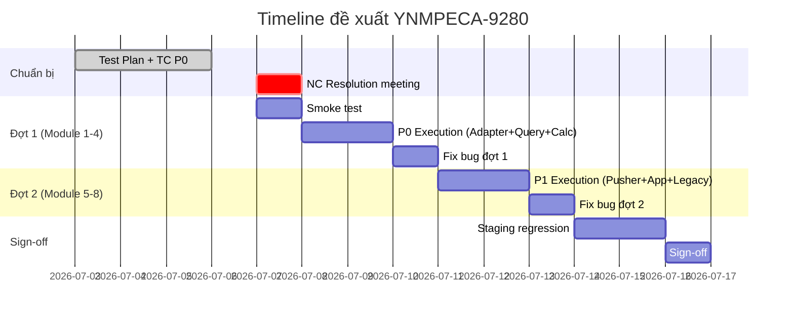

# 🔍 REVIEW TEST PLAN — YNMPECA-9280
## [ECI] Setup ClickHouseDB VN & TL — Setup database lưu trữ mới cho Product Item Histories

**Reviewer:** Senior QA Lead / Test Manager (AI-assisted)
**Ngày review:** 06/07/2026
**Tài liệu review:** [TestPlan_YNMPECA-9280_v1.0](file:///Users/tranthanhlam/YNM-testing/Ai_Agents/test_plans/local/eci_clickhouse_product_item_histories/TestPlan_YNMPECA-9280_Setup_ClickHouseDB_ECI.md)
**Jira tham chiếu:** [YNMPECA-9280](https://jira.younetco.com/browse/YNMPECA-9280)

---

## 1. Nhận xét tổng quan

> [!NOTE]
> **Đánh giá chung: 8.5/10** — Đây là một Test Plan chất lượng cao, rất chi tiết và thể hiện sự hiểu biết sâu về domain (ClickHouse engine semantics, ReplacingMergeTree, Merge timing, data parity). Cấu trúc bài bản, coverage rộng từ schema → adapter → query → pusher → App → legacy field removal. Tuy nhiên có **rủi ro timeline nghiêm trọng** và một số vấn đề cần khắc phục trước khi execute.

### Tổng kết nhanh

| Tiêu chí | Đánh giá | Ghi chú |
|---|:---:|---|
| Scope & Objective | ⭐⭐⭐⭐⭐ | Rất đầy đủ, 9 modules, 49 items |
| Test Strategy | ⭐⭐⭐⭐⭐ | 6 kỹ thuật phù hợp, có Decision Table |
| Entry/Exit Criteria | ⭐⭐⭐⭐½ | Chi tiết, chỉ thiếu rollback criteria |
| Risk Analysis | ⭐⭐⭐⭐⭐ | 10 risks, có mức độ + xác suất + mitigation |
| Timeline & Effort | ⭐⭐½ | **Timeline quá chặt, effort mâu thuẫn** |
| Test Data | ⭐⭐⭐⭐⭐ | Data Matrix (Phụ lục C) rất chuyên nghiệp |
| Need Confirms | ⭐⭐⭐⭐ | 12 NC đầy đủ, nhưng 4 NC Blocking chưa resolve |
| Deliverables | ⭐⭐⭐⭐½ | 10 deliverables rõ ràng |
| Roles & Responsibilities | ⭐⭐⭐⭐ | Có tên cụ thể, 2 vị trí cần confirm |

---

## 2. Các điểm tốt đang có

### ✅ 2.1. Hiểu biết kỹ thuật ClickHouse sâu sắc

Test Plan thể hiện kiến thức kỹ thuật vượt trội về ClickHouse — đây là yếu tố quan trọng nhất cho migration project:

- Nhận diện đúng rủi ro **ReplacingMergeTree Merge bất đồng bộ** (R1) — đây là "gotcha" nổi tiếng nhất của ClickHouse mà nhiều team bỏ sót.
- Nêu rõ cần **trigger Merge trước calculation** (items #18, #26) — strategy đúng.
- Hiểu partition semantics `toYYYYMMDD(toMonday(crawled_date))` và ORDER BY `(product_item_id, crawled_date)`.
- Materialized columns `delta_sold`, `gmv` — test plan cover cả verify auto-compute khi insert.
- Phân biệt Local table vs Distributed table, Replication vs Sharding.

### ✅ 2.2. Data Matrix (Phụ lục C) rất chuyên nghiệp

Bảng 8 case với cả `total_sold`, `last_total_sold`, `price`, `sell_price` và **Expected output rõ ràng** — đây là "gold standard" cho data-driven testing:

```
| Sold tang    | 120  | 100  | 20000 | 15000 | delta_sold = 20, gmv = 300000          |
| price = 0    | 120  | 100  | 0     | 0     | Discount percent = null/không chia 0   |
| Duplicate    | 120/130 | 100 | 20000 | 15000 | Row updated_date mới hơn thắng sau Merge |
```

→ QA có thể execute ngay mà không cần hỏi thêm expected result.

### ✅ 2.3. Smoke Checklist (Phụ lục B)

10 smoke checks cho phép QA **gate nhanh** trước khi chạy full suite. Đây là practice rất tốt cho migration project vì nếu smoke fail thì không cần phí effort chạy chi tiết.

### ✅ 2.4. Modular sign-off approach

Test Plan khôn ngoan khi ghi:
> *"Tách sign-off theo module; không close parent nếu 9286/9287/9288/9295 chưa ready/test"*

→ Cho phép release incremental thay vì all-or-nothing. Phù hợp với thực tế 4/10 sub-tasks còn `Open`.

### ✅ 2.5. Risk analysis thực tế và actionable

10 risks đều có:
- **Mức độ ảnh hưởng** (Cao/Trung bình)
- **Xác suất** (Cao/Trung bình)
- **Hướng giải quyết** cụ thể, không chung chung

Đặc biệt R1 (Merge bất đồng bộ) và R6 (sub-task Open nhưng parent cần release) là 2 risk rất sát thực tế.

### ✅ 2.6. Truy vết tốt từ Jira

- Có đầy đủ 10 sub-task với trạng thái + hướng xử lý QA riêng.
- Ghi nhận đúng Jira comments (timeline, data Q1/2026+, "Thứ 2 7/7").
- Cross-reference: Tech Wiki, reference spec, Wiki Timescale QC.

---

## 3. Các vấn đề/thiếu sót cần chỉnh sửa

### 🔴 3.1. Timeline KHÔNG KHẢ THI (Critical)

> [!CAUTION]
> Timeline hiện tại **cực kỳ rủi ro** cho data migration project 72-108 test cases.

**Phân tích:**

| Phase | Thời gian phân bổ | Nội dung cần làm | Đánh giá |
|---|:---:|---|:---:|
| Test plan + TC | 03/07 → 06/07 (4 ngày) | 72-108 TC + data prep | ⚠️ Chặt |
| **Execution** | **07/07 (1 ngày)** | **Chạy P0/P1, 72-108 TC** | **❌ Không khả thi** |
| Fix bug | 08/07 (1 ngày) | Retest + regression | ⚠️ Chặt nếu nhiều bug |
| Staging sign-off | 09-10/07 (2 ngày) | Full regression + parity | ⚠️ Chặt |

**Vấn đề cụ thể:**
1. **1 ngày execution cho 72-108 TCs** — Ngay cả chỉ P0 (~50-60 TC) cũng không thể chạy hết trong 1 ngày vì nhiều TC cần chờ job/batch xử lý, so sánh parity data, query ClickHouse + Timescale.
2. **Effort ước tính 8.5-13.5 man-days** nhưng timeline tổng chỉ có **7 ngày làm việc** (03/07 → 10/07, trừ weekend 05-06/07). Mâu thuẫn trực tiếp.
3. **4 sub-tasks còn `Open`** (9286, 9287, 9288, 9295) → Module 5, 6, 7, 8 chưa thể test.

> [!IMPORTANT]
> **Đề xuất:** Tách execution thành 2 đợt:
> - **Đợt 1 (07-08/07):** P0 — Module 1-4 (Schema, Adapter, checkInvalid, calculate) — ~40-50 TC
> - **Đợt 2 (khi sub-task ready):** P1 — Module 5-8 (Pusher, Realtime, App, Legacy) — ~30-50 TC
> - Staging sign-off chỉ cho scope đợt 1, đợt 2 có timeline riêng.

---

### 🔴 3.2. Mâu thuẫn ngày "Thứ 2 7/7" (Critical)

Test Plan đã nhận diện đúng vấn đề:
> *"Comment 'Thứ 2 7/7 dev done' nhưng ngày 07/07/2026 là thứ Ba, cần confirm lại mốc này với PM/Dev."*

**Phân tích thêm từ Jira:**
- Comment của Tai Vuong Ngoc (03/07): `"Thứ 2 7/7 dev done"` → 07/07/2026 thực sự là **Thứ Ba**.
- Nếu Dev có ý "Thứ Hai" → nghĩa là **ngày 07/07** (vẫn đúng ngày, chỉ sai tên thứ).
- Nếu Dev có ý "ngày Thứ Hai trong tuần đó" → tức **ngày 07/07** vẫn đúng (Thứ Hai tuần đó là 30/06, có lẽ không đúng ý).

→ **Khả năng cao**: Dev muốn nói ngày **07/07** bất kể tên thứ. Nhưng vẫn nên confirm vì ảnh hưởng trực tiếp đến ngày QA bắt đầu execution.

---

### 🟡 3.3. Thiếu Rollback/Fallback Strategy

Test Plan có Exit Criteria và Risk nhưng **thiếu hoàn toàn phần Rollback Plan**:

- Nếu ClickHouse calculation sai nghiêm trọng trên Staging → rollback về Timescale thế nào?
- Nếu release Production gặp vấn đề → có feature flag chuyển ngược về Timescale không?
- Thứ tự rollback deployment khi đã xóa `crawled_history`/`sold_history` là gì?

> [!WARNING]
> Đây là data migration — rollback plan là **bắt buộc** theo best practice. Nếu không có rollback, rủi ro production incident rất cao.

**Đề xuất bổ sung mục 6.1:** Rollback Plan
```markdown
### 6.1 Rollback Strategy
| Scenario | Action | Owner | Timeline |
|---|---|---|---|
| Calculation output sai > 1% parity | Switch config về Timescale query | Dev | < 1 giờ |
| Pusher insert fail hàng loạt | Revert deployment, dùng Timescale pusher | Dev + DevOps | < 2 giờ |
| App crash sau remove legacy fields | Revert App + restore fields ở resolver | App + Dev | < 2 giờ |
| ClickHouse cluster down | Service fallback về Timescale (Need Confirm feature flag) | DevOps | Need Confirm |
```

---

### 🟡 3.4. Thiếu sample SQL/Query cho QA execute parity check

Mục 3.3 (Data Migration Testing) nêu cách kiểm tra nhưng **không có sample query thực tế**. QA sẽ phải tự viết query ClickHouse (syntax khác SQL tiêu chuẩn).

**Đề xuất bổ sung Phụ lục E:** Sample Parity Queries

```sql
-- Count parity theo tuần
-- ClickHouse:
SELECT toYYYYMMDD(toMonday(crawled_date)) as week, count() as cnt
FROM eci.product_item_histories
WHERE crawled_date >= '2026-01-01' AND crawled_date < '2026-04-01'
GROUP BY week ORDER BY week;

-- Timescale:
SELECT date_trunc('week', crawled_date)::date as week, count(*) as cnt
FROM product_item_histories
WHERE crawled_date >= '2026-01-01' AND crawled_date < '2026-04-01'
GROUP BY week ORDER BY week;

-- Aggregate parity cho 1 PI
-- ClickHouse:
SELECT product_item_id,
       SUM(delta_sold) as total_delta_sold,
       SUM(gmv) as total_gmv,
       AVG(price) as avg_price
FROM eci.product_item_histories FINAL
WHERE product_item_id = 12345
  AND crawled_date >= '2026-01-01' AND crawled_date <= '2026-03-31'
  AND is_abnormal = 0 AND delta_sold > 0
GROUP BY product_item_id;
```

→ QA có thể copy-paste và execute ngay, giảm risk sai syntax.

---

### 🟡 3.5. Thiếu Test cho Concurrent Insert + Query

ClickHouse xử lý concurrent rất khác RDBMS truyền thống:
- Insert vào ReplacingMergeTree trong khi đang query có thể thấy **duplicate rows** nếu chưa merge.
- Concurrent batch insert có thể gây **out-of-order** partition.

Cần bổ sung test scenario:
- Job calculation chạy trong khi pusher đang insert batch mới → output có bị sai không?
- 2 pusher instance cùng insert cho cùng `product_item_id` → dedup hoạt động đúng không?

---

### 🟡 3.6. Module 9 (Data Quality Diagnostics) scope mơ hồ

Items #47-#49 đều kèm ghi chú "Need Confirm scope Jira riêng" hoặc "theo wiki nếu có benchmark". Điều này dễ gây confusion:
- Nếu không nằm trong scope release → nên chuyển sang Out-of-Scope với lý do rõ ràng.
- Nếu nằm trong scope → cần có Jira task riêng và expected output rõ.

**Đề xuất:** Chuyển Module 9 sang phần **"Conditional Scope"** với điều kiện kích hoạt rõ ràng:
> *"Module 9 chỉ execute nếu PM/Dev confirm items nằm trong scope release YNMPECA-9280. Nếu không, tạo task riêng."*

---

### 🟢 3.7. Encoding — Không có dấu tiếng Việt

Toàn bộ Test Plan viết **không dấu** (vd: "Mo ta", "Kiem thu", "Pham vi"). Dù vẫn đọc được, nhưng:
- Giảm tính chuyên nghiệp khi bàn giao cho BA/PM.
- Khó search keyword tiếng Việt trong Confluence/Sheet.

**Đề xuất:** Nếu có thời gian, chuyển sang UTF-8 có dấu cho ít nhất các phần: Mục tiêu, Scope, Risk, Entry/Exit Criteria.

---

## 4. Các phần nên bổ sung

### 📋 4.1. Rollback Strategy (xem mục 3.3)

### 📋 4.2. Sample Parity Queries (xem mục 3.4)

### 📋 4.3. Test cho Concurrent Behavior

| Scenario | Priority | Mô tả |
|---|:---:|---|
| Insert-while-Calculate | P0 | Pusher insert batch mới trong khi job calculation đang chạy → verify Merge/FINAL ngăn được sai số |
| Dual-Pusher same PI | P1 | 2 pusher instance cùng insert cho cùng PI → dedup đúng sau Merge |
| Query-while-Merge | P1 | Query `checkInvalidRecords` trong khi `OPTIMIZE ... FINAL` đang chạy → verify không lỗi/timeout |

### 📋 4.4. Feature Flag / Config Toggle verification

Test Plan nhắc đến `Need Confirm nếu có feature flag` (item #11) nhưng không tách thành test scenario riêng. Nếu có feature flag:

| Scenario | Priority | Mô tả |
|---|:---:|---|
| Flag OFF → query Timescale | P0 | Khi flag ClickHouse tắt, toàn bộ flow vẫn dùng Timescale, không lỗi |
| Flag ON → query ClickHouse | P0 | Khi flag bật, toàn bộ flow dùng ClickHouse |
| Toggle Flag runtime | P1 | Bật/tắt flag không cần restart service, không mất data đang xử lý |

### 📋 4.5. Data freshness SLA verification

Item #35 ghi `Need Confirm SLA final` nhưng không có test scenario cụ thể. Đề xuất:

| Scenario | Priority | Mô tả |
|---|:---:|---|
| End-to-end data freshness | P1 | Đo thời gian: Crawl event → ClickHouse insert → Product Items update → App query thấy data mới. So sánh với SLA đã chốt. |

---

## 5. Rủi ro hoặc điểm cần làm rõ

### ⚠️ 5.1. Need Confirms BLOCKING chưa resolve

Test Plan liệt kê 12 NC, trong đó **5 NC Blocking** chưa resolve tại thời điểm review:

| NC | Nội dung | Impact |
|---|---|---|
| **NC-2** | Merge trigger cụ thể: `OPTIMIZE ... FINAL`, query `FINAL`, hay mechanism khác? | **BLOCKING** — Không biết mechanism → không viết được TC dedup |
| **NC-4** | `<= endDate` vs `< endDate` intentional? | **BLOCKING** — Ảnh hưởng boundary test toàn bộ |
| **NC-5** | Timezone UTC hay Asia/Ho_Chi_Minh? TL có rule riêng? | **BLOCKING** — Sai timezone = sai partition = sai data |
| **NC-8** | Pusher queue/topic nào, ack/retry mechanism? | **BLOCKING** theo module pusher |
| **NC-11** | Data Q1/2026+ đã load vào ClickHouse chưa? | **BLOCKING** parity + App 1 năm |

> [!CAUTION]
> **5 NC Blocking** = QA có thể bị blocked ngay ngày đầu execution nếu không resolve trước.
> 
> **Đề xuất:** Tổ chức **1 buổi họp NC Resolution** (30-45 phút) với Dev + BA + PM ngay ngày **06/07 chiều** hoặc **sáng 07/07** để chốt toàn bộ NC trước khi bắt đầu execution.

---

### ⚠️ 5.2. Sub-tasks readiness gap

Từ Jira verified tại thời điểm review (06/07/2026):

| Sub-task | Status | QA Impact |
|---|:---:|---|
| YNMPECA-9282 (Adapter) | ✅ To be Tested | Test được |
| YNMPECA-9283 (checkInvalid) | ✅ To be Tested | Test được |
| YNMPECA-9284 (calculate) | ✅ To be Tested | Test được |
| YNMPECA-9285 (Pusher PW/PM) | ✅ To be Tested | Test được |
| YNMPECA-9286 (Pusher raw → CH) | ❌ Open | **KHÔNG test được** |
| YNMPECA-9287 (Realtime 10k/min) | ❌ Open | **KHÔNG test được** |
| YNMPECA-9288 (App adapter) | ❌ Open | **KHÔNG test được** |
| YNMPECA-9295 (Remove legacy) | ❌ Open | **KHÔNG test được** |

→ Chỉ **4/8 sub-tasks test được** (Module 1-4, một phần Module 5). Module 5b, 6, 7, 8 đều BLOCKED.

---

### ⚠️ 5.3. Parity threshold chưa định nghĩa

NC-3 hỏi *"Ngưỡng parity Timescale vs ClickHouse chấp nhận là 100% hay có tolerance?"*

Đây là câu hỏi **quyết định Pass/Fail** cho toàn bộ migration. Nếu:
- **100% parity** → bất kỳ sai lệch nào cũng là bug.
- **Tolerance 0.01%** → sai lệch do rounding/decimal semantics có thể chấp nhận.

→ Phải chốt **trước execution**, nếu không QA sẽ không biết report sai lệch nhỏ là bug hay expected.

---

### ⚠️ 5.4. Performance benchmark chưa rõ pass/fail criteria

| Performance item | Tiêu chí trong Test Plan | Vấn đề |
|---|---|---|
| Realtime 10k/min | Rõ ràng: `1p / 10.000 records` | ✅ |
| App 1 năm | "Không timeout" | ❌ Threshold timeout là bao nhiêu giây? |
| checkInvalidRecords | "Chạy ổn định, không timeout" | ❌ Threshold? |
| calculatePIHistories | "Trong ngưỡng job hiện tại chấp nhận" | ❌ Ngưỡng hiện tại là bao nhiêu? |

→ Cần Dev/PM confirm số liệu cụ thể (ví dụ: App API < 5s, calculation job < 30 phút cho 1000 PI).

---

## 6. Đề xuất cải thiện

### 6.1. Revised Timeline (đề xuất)



### 6.2. Bổ sung Rollback Strategy (xem mục 3.3)

### 6.3. Bổ sung Phụ lục E — Sample Parity SQL (xem mục 3.4)

### 6.4. Bổ sung Conditional Scope cho Module 9

### 6.5. Performance pass/fail criteria cần chốt

| Metric | Đề xuất threshold | Cần confirm |
|---|---|:---:|
| App API sold histories 1 năm | Response < 5 giây | ✅ |
| checkInvalidRecords batch 500 | Job < 60 giây | ✅ |
| calculatePIHistories batch 1000 | Job < 5 phút | ✅ |
| Realtime Product Items | 10.000 records / phút | Đã có |
| Parity threshold | Sai lệch < 0.01% do rounding | ✅ |

---

## Tổng kết Action Items

| # | Action | Priority | Owner | Deadline đề xuất |
|---|---|:---:|---|---|
| 1 | **Tổ chức NC Resolution meeting** — chốt 5 NC Blocking | 🔴 Critical | QA Lead + Dev + BA | 07/07 sáng |
| 2 | **Confirm lại timeline với PM** — tách 2 đợt execution | 🔴 Critical | QA Lead + PM | 06/07 chiều |
| 3 | **Bổ sung Rollback Strategy** | 🟡 High | QA + Dev + DevOps | Trước execution |
| 4 | **Bổ sung sample parity SQL** vào Phụ lục | 🟡 High | QA + Dev | Trước execution |
| 5 | Chốt **performance pass/fail threshold** | 🟡 High | PM + Dev | Trong NC meeting |
| 6 | Chốt **parity tolerance** (100% vs có tolerance) | 🟡 High | BA + Dev + PM | Trong NC meeting |
| 7 | Bổ sung **concurrent behavior test scenarios** | 🟢 Medium | QA | Trước execution |
| 8 | Clarify **Module 9 scope**: In/Out | 🟢 Medium | PM + Dev | Trong NC meeting |
| 9 | Chuyển Test Plan sang **UTF-8 có dấu** | 🟢 Low | QA | Khi có thời gian |
| 10 | Verify **sub-task readiness** ngày 07/07 | 🟢 Medium | QA Lead | 07/07 sáng |

---

*Review được thực hiện bởi Senior QA Lead/Test Manager (AI-assisted) dựa trên đối chiếu Test Plan v1.0, Jira YNMPECA-9280 (10 sub-tasks, 5 comments), Tech Wiki reference, và best practices cho Data Migration Testing.*
