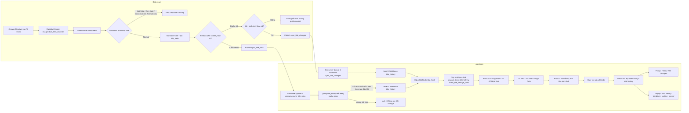

# TEST PLAN
## 01-F01 Product Management - Tracking Product Title Change

| Field | Value |
|---|---|
| Mã tài liệu | TP-01-F01-v1.4 |
| Dự án | YouNet Media - EcomHeat |
| Feature | 01-F01 Product Management - Tracking Title Change |
| Priority | P0 |
| Release | Phase 1 |
| Ngày tạo | 17/06/2026 |
| Người tạo | QA Team (AI-assisted) |
| Phiên bản | 1.4 |
| Trạng thái | Draft - Pending Review |
| Tài liệu tham chiếu | BA Spec: `/Users/tranthanhlam/product-ai-docs/EcomHeat/specs/01-product-tracking-title-change/01-F01-tracking-product-title-change.md` |
| Technical wiki tổng/App summary | `Technical Documents - Detect Title Changes` - https://wiki.younetco.com/pages/viewpage.action?pageId=307593962 |
| Technical wiki Data | `Technical Documents - Data Pusher - Detect title change` - https://wiki.younetco.com/pages/viewpage.action?pageId=310444432, version 34, kiểm tra ngày 18/06/2026 |
| Technical wiki App chi tiết | Need Confirm: chưa có link riêng cho API/UI ngoài wiki tổng và BA spec. |

---

## 1. MỤC TIÊU & TỔNG QUAN (Introduction & Objective)

### 1.1 Bối cảnh

EcomHeat có màn hình Product Management để ECI Data Team mapping Brand/Model/Label/Industry cho Product Item (PI). Vấn đề là seller có thể đổi title của một PI thay vì tạo sản phẩm mới. Ví dụ: cùng một PI hôm trước là Model A, hôm sau đổi title thành Model B.

Nếu hệ thống không phát hiện việc đổi title này, mapping cũ có thể bị sai. Khi đó sold/GMV theo tuần/tháng cũng có thể bị tính sai, kéo theo báo cáo gửi khách hàng sai.

Hiện tại ECI Data Team phải đối soát thủ công bằng Excel/VLOOKUP định kỳ. Cách này tốn thời gian, khó mở rộng và dễ bỏ sót PI đã đổi title.

### 1.2 Giải pháp

Feature này giúp hệ thống tự động phát hiện PI đổi title, sau đó hiển thị cho ECI xử lý trên Product Management:

| Nhóm chức năng | Mô tả |
|---|---|
| Detect title change | Khi có record crawl mới, hệ thống so sánh title mới với title ở record liền trước của cùng PI. Nếu title đổi thật, record mới được đánh dấu `is_change_title = TRUE` và Solr `product_items` được cập nhật `last_title_change_date`. |
| Filter Product Management | User có thể lọc PI theo `Last Title Change Date`. Filter này vẫn kết hợp được với các filter cũ như industry/brand/category. |
| View Details popup | User mở chi tiết một PI để xem sold history, marker ngày có đổi title, tooltip có title, và tab `History Title Changes`. |
| Lưu lịch sử kỹ thuật | Data Pusher đọc queue `eca.product_item_histories`, dùng Redis `title_hash` để detect và chỉ publish event sang `sync_title_changed` hoặc `sync_title_miss`. Phần consume 2 queue, verify miss, lưu ClickHouse/Redis/Solr là trách nhiệm App team. |

### 1.3 Mục tiêu kiểm thử

- Kiểm tra hệ thống detect đúng PI đổi title và không báo nhầm khi title chỉ khác chữ hoa/thường hoặc khoảng trắng.
- Kiểm tra dữ liệu đi đúng từ queue input -> Data Pusher -> 2 queue output -> App consumers -> Redis/ClickHouse/Solr -> Product Management UI.
- Kiểm tra filter `Last Title Change Date` trả đúng PI và không làm hỏng các filter cũ.
- Kiểm tra popup `View Details` hiển thị đúng lịch sử đổi title, sold history, tooltip và marker.
- Kiểm tra các SLA chính: list query P95 <= 30 giây, popup history P95 <= 3 giây, trendline P95 <= 15 giây, data freshness <= 15 phút, 50 user nội bộ filter đồng thời.

### 1.4 Assumptions & Need Confirm

| ID | Giả định / Điểm cần xác nhận | Trạng thái | Ảnh hưởng QA |
|---|---|---|---|
| AS-01 | BA spec quy định normalize gồm trim, gộp multi-space và lowercase; Dev wiki v2 mô tả normalize/hash có thêm NFKC, remove emoji, remove zero-width joiner, remove tab/newline và xóa khoảng trắng/tab. Đoạn code minh họa của Dev chưa thể hiện bước lowercase. Cần chốt rule normalize cuối cùng. | Need Confirm | Ảnh hưởng expected result cho các case title khác hoa/thường, emoji, ký tự đặc biệt, tab/newline và khoảng trắng giữa từ. |
| AS-02 | BA spec nói record đầu tiên của PI không so sánh và `is_change_title = null`; Dev wiki tổng nói cache miss không có bản ghi `title_history` thì coi là mốc lịch sử đầu tiên. Cần xác nhận mốc đầu tiên có được lưu vào `title_history` nhưng không set `is_change_title` hay không. | Need Confirm | Ảnh hưởng test data cold cache/new product. |
| AS-03 | Dev wiki Data Pusher v2.0 ghi "chỉ hỗ trợ tracking thay đổi đối với nhóm normal"; BA spec không loại trừ PI Zero Sold/Abnormal. Tạm thời QA xem Normal là happy path chính, còn Not Valid/Zero Sold/Abnormal là negative/skip path cho đến khi BA/Dev chốt scope cuối. | Need Confirm với BA/Dev | Ảnh hưởng expected result cho PI sold = 0, sold < 0, sold non-number, Shopee sold bị làm tròn. |
| AS-04 | BA spec dùng khái niệm `is_change_title = TRUE` trên record crawl và `last_title_change_date` trong Solr; Dev wiki nhấn mạnh queue `sync_title_changed/miss`, ClickHouse `title_history`, Redis `title_hash`. Cần xác nhận contract cuối cùng giữa Data Pusher output queue và App consumers, bao gồm mapping Timescale/ClickHouse/Redis/Solr. | Need Confirm | Ảnh hưởng cách QA kiểm tra DB, queue, API và cách phân owner bug. |
| AS-05 | Timezone dùng cho "ngày dương lịch" trong filter, grouping history và marker trendline chưa được nêu rõ. Giả định Product Management đang dùng timezone business của EcomHeat/ECI, cần Dev/BA confirm. | Need Confirm | Ảnh hưởng case record nằm sát 00:00 UTC/VN/TH. |
| AS-06 | Product Management là web app desktop-first; mobile app không nằm trong scope. | Need Confirm | Ảnh hưởng compatibility matrix. |

### 1.4.1 Bổ sung từ Dev wiki Data Pusher v2.0

Các điểm dưới đây cần đưa vào strategy/test cases vì ảnh hưởng trực tiếp đến cách QA setup data và đọc log:

| ID | Nội dung từ wiki Dev Data | Ý nghĩa khi test |
|---|---|---|
| TD-01 | Luồng Data Pusher có 5 giai đoạn: Consume PI -> Phân loại dữ liệu -> Biến đổi dữ liệu -> Phát hiện thay đổi -> Lưu trữ kết quả. | Khi trace bug, QA không chỉ nhìn UI mà phải xác định data đang fail ở stage nào. |
| TD-02 | Phân loại theo `sold`: Not Valid nếu `sold < 0` hoặc không phải số; Zero Sold nếu `sold = 0`; Abnormal nếu Shopee và `sold` là số tròn bị làm tròn; còn lại là Normal. | Bộ test data chính cho title change phải dùng PI Normal. Các nhóm còn lại cần test để chắc hệ thống kết thúc/skip đúng, không publish nhầm event title. |
| TD-03 | Wiki v2.0 ghi chỉ hỗ trợ tracking title change cho nhóm Normal. | Đây là điểm khác BA spec, cần confirm. Khi chưa chốt, QA không nên fail case Zero Sold/Abnormal không tạo title event nếu Dev đã thống nhất scope v2.0 là Normal only. |
| TD-04 | Title được normalize rồi hash bằng FarmHash `hash64`, output hex 16 ký tự. Normalize theo Dev gồm NFKC, remove emoji/variation selector/zero-width joiner, xử lý tab/newline/khoảng trắng và trim. | Cần thêm test normalize nâng cao và check Redis `title_hash` dài 16 ký tự. Case hoa/thường vẫn Need Confirm vì BA có lowercase nhưng code sample Dev chưa thể hiện. |
| TD-05 | Nếu cache tồn tại và `title_hash` khác `last_title_hash` thì vào nhóm Đổi title và publish `sync_title_changed`; nếu không có cache thì publish `sync_title_miss`. | Cần test đủ 2 queue downstream, không chỉ check một nhánh changed. |
| TD-06 | Theo boundary hiện tại: Data team dừng ở bước publish `sync_title_changed` / `sync_title_miss`. App team chịu trách nhiệm consume 2 queue, verify miss, cập nhật DB/Redis/Solr và phục vụ Product Management. | Cần test riêng output queue của Data và consumer/persistence của App để log bug đúng owner. |

### 1.4.2 Phân tách trách nhiệm Data team và App team

Task này có hai phần được phát triển bởi hai team khác nhau, nên QA cần tách rõ owner khi test và khi log bug.

| Team/Owner | Phạm vi chính | Thành phần QA cần check | Khi fail nên log bug cho |
|---|---|---|---|
| Data team | Consume PI, phân loại data, detect title change bằng Redis/hash, publish event ra 2 queue. Data team dừng ở bước publish `sync_title_changed` hoặc `sync_title_miss`. | Data Pusher, queue input `eca.product_item_histories`, output queue/exchange/routing key `sync_title_changed`, `sync_title_miss`, payload event, log cache hit/miss. | Data team nếu lỗi nằm trước hoặc tại bước publish event ra queue. |
| App team | Consume 2 queue output từ Data, verify cache miss, lưu history/cache/search index, và Product Management API/UI. | Consumer `sync_title_changed`, consumer `sync_title_miss`, ClickHouse `title_history`, Redis `title_hash` sau xử lý, Solr `product_items.last_title_change_date`, BE/API list/detail, FE Product Management. | App team nếu lỗi nằm sau khi event đã được Data publish đúng vào queue. |
| Handoff Data -> App | Contract giữa Data Pusher output queue và App consumers. | Payload bắt buộc: `product_item_id`, `title`, `crawled_date`; các field cần confirm: `title_hash`, `crawler_type`, `haveCache`. | Data nếu payload/route sai; App nếu payload đúng nhưng consume/verify/persist/query/display sai. |

Nguyên tắc phân loại bug nhanh:

| Dấu hiệu fail | Hướng xử lý |
|---|---|
| Message PI không được Data Pusher consume, classification sai, cache hit/miss sai, không publish hoặc route sai `sync_title_changed/miss` | Ưu tiên kiểm tra Data team. |
| Event đã vào đúng queue output nhưng consumer không insert ClickHouse, không update Redis/Solr, hoặc Product Management không hiển thị đúng | Ưu tiên kiểm tra App team. |
| Payload queue thiếu field hoặc App hiểu khác timezone/grouping/date contract | Log bug/gap dạng handoff, cần Data và App cùng confirm contract. |

### 1.4.3 Luồng tổng thể của task theo trách nhiệm Data/App

Sơ đồ dưới đây mô tả đường đi của data từ lúc có record crawl mới đến khi user nhìn thấy trên Product Management. Mục tiêu là giúp QA xác định nhanh bước nào thuộc Data team, bước nào thuộc App team, và điểm bàn giao giữa hai bên nằm ở đâu.



Nếu công cụ xem Markdown không render Mermaid, có thể đọc flow rút gọn như sau:

```text
[DATA TEAM]
Crawler/Resolver
  -> RabbitMQ eca.product_item_histories
  -> Data Pusher consume
  -> validate title/date + phân loại sold
     -> Not Valid / Zero Sold / Abnormal: skip title tracking nếu scope final là Normal only
     -> Normal: normalize title + tạo title_hash
  -> Redis cache
     -> cache hit + hash giống: không đổi title
     -> cache hit + hash khác: publish sync_title_changed
     -> cache miss: publish sync_title_miss
  -> Data team kết thúc tại đây sau khi publish đúng queue/routing key/payload

[HANDOFF DATA -> APP]
Queue output từ Data Pusher có payload đủ để App consume:
  - product_item_id
  - title
  - crawled_date
  - title_hash/crawler_type/haveCache nếu contract final yêu cầu

[APP TEAM]
Consumer sync_title_changed / sync_title_miss
  -> insert/verify ClickHouse title_history
  -> update Redis title_hash
  -> update/sync Solr product_items.current_title + last_title_change_date
Product Management List API
  -> query Solr theo Last Title Change Date + filter cũ
  -> Product Management UI list
  -> View Details popup
     -> History Title Changes tab
     -> Sold History trendline, tooltip title, marker ngày đổi title
```

#### Bảng phân nhiệm theo từng bước

| Bước | Thành phần | Owner chính | QA kiểm tra gì? | Nếu fail thường log cho |
|---|---|---|---|---|
| 1 | PI record được publish vào `eca.product_item_histories` | Data | Message có đủ `product_item_id`, `title`, `sold`, `crawled_date`. | Data |
| 2 | Data Pusher consume và validate | Data | Message được consume, title/date invalid được ack & skip đúng. | Data |
| 3 | Phân loại `sold` | Data | Not Valid/Zero Sold/Abnormal/Normal đúng theo wiki Data v2.0. | Data |
| 4 | Normalize + hash title | Data | `title_hash` đúng format 16 ký tự; rule normalize đúng requirement đã chốt. | Data |
| 5 | Redis cache hit/miss | Data | Cache hit/hash giống không tạo event; cache hit/hash khác đi changed; cache miss đi miss. | Data |
| 6 | Publish queue `sync_title_changed` | Data | Route đúng exchange/routing key/queue; payload đủ field contract. | Data |
| 7 | Publish queue `sync_title_miss` | Data | Route đúng exchange/routing key/queue; payload đủ field để App verify cache miss. | Data |
| 8 | Consumer `sync_title_changed` | App | Consume event changed, insert `title_history`, ack/retry đúng. | App |
| 9 | Consumer `sync_title_miss` | App | Query latest history, tránh false positive khi cache miss, insert nếu đổi thật. | App |
| 10 | ClickHouse/Redis/Solr sau consumer | App | ClickHouse lưu title đầy đủ; Redis có hash mới; Solr có title hiện tại và `last_title_change_date`. | App |
| 11 | Product Management List API | App | Query đúng `last_title_change_date`, không dùng nhầm `crawled_date`. | App |
| 12 | Product Management UI list | App | Filter date range, combine filter cũ, empty/error/loading state. | App |
| 13 | View Details API | App | Lấy đúng title history và full sold history, không bị giới hạn bởi date filter list. | App |
| 14 | Popup History Title Changes | App | Sort desc, 10 dòng/trang, gom 1 dòng/ngày theo record muộn nhất. | App |
| 15 | Sold History trendline | App | Full history, tooltip title đúng record đại diện, marker ngày có đổi title. | App |

### 1.5 Luồng xử lý Data Pusher và App downstream - QA cần hiểu

Đây là luồng data chính cần nắm trước khi viết test cases. Nói đơn giản: crawler đẩy PI vào queue, Data Pusher kiểm tra title và chỉ quyết định publish event sang 2 queue. Từ 2 queue đó trở đi là App team consume, verify, lưu DB/cache/search index và hiển thị lên Product Management.

```text
Crawler/Resolver
  -> queue eca.product_item_histories
  -> Data Pusher consume PI
  -> phân loại PI theo sold/source
     -> Not Valid / Zero Sold / Abnormal: kết thúc theo rule Dev v2.0, không chạy nhánh title change nếu scope là Normal only
     -> Normal: xử lý tiếp nhánh title change
  -> kiểm tra title và crawled_date/title data cần cho detect
     -> không hợp lệ: ack & skip, không tạo event đổi title
     -> hợp lệ: normalize + hash title
  -> đọc Redis cache theo product_item_id
     -> cache hit: so sánh title_hash mới với title_hash cũ
        -> giống nhau: không đổi title, không tạo event đổi title
        -> khác nhau: đổi title thật, publish sync_title_changed
     -> cache miss: chưa đủ căn cứ kết luận, publish sync_title_miss
  -> Data team kết thúc ở bước publish đúng queue/routing key/payload

App downstream
  -> consume sync_title_changed hoặc sync_title_miss
  -> với sync_title_miss: đối chiếu title_history để xác định đổi thật/giả
  -> nếu đổi thật: lưu ClickHouse title_history
  -> cập nhật Redis title_hash
  -> cập nhật/sync Solr product_items: title hiện tại và last_title_change_date
  -> Product Management đọc Solr/History để filter và hiển thị View Details
```

#### Diễn giải theo từng bước

| Bước | Data đi qua đâu? | Data Pusher làm gì? | QA cần kiểm tra gì? |
|---|---|---|---|
| 1 | `eca.product_item_histories` | Consume message PI có `product_item_id`, `title`, `crawled_date`, sold và các field liên quan. | Message test vào đúng queue, Data Pusher consume được, log có trace theo PI. |
| 2 | Data Pusher | Phân loại PI theo `sold` và `source`: Not Valid, Zero Sold, Abnormal, Normal. | Test data title change happy path phải là Normal; case Not Valid/Zero Sold/Abnormal không được publish nhầm title event nếu Dev v2.0 final là Normal only. |
| 3 | Data Pusher | Kiểm tra `title` và `crawled_date`. Title null/empty hoặc date lỗi thì bỏ qua. | Case title rỗng/date invalid phải `ack & skip`, không tạo event đổi title. |
| 4 | Redis | Normalize title, tạo `title_hash` FarmHash hex 16 ký tự, rồi đọc cache theo key PI. | Redis key đúng format, có `title_hash`; normalize/hash cho kết quả ổn định. |
| 5A | Data Pusher | Cache hit + hash mới giống hash cũ: title không đổi. | Data không publish `sync_title_changed`; App không có event cần xử lý. |
| 5B | Data Pusher | Cache hit + hash mới khác hash cũ: title đổi thật theo cache. | Data publish đúng `sync_title_changed` với payload đủ field contract. |
| 5C | Data Pusher | Cache miss: chưa đủ căn cứ kết luận. | Data publish đúng `sync_title_miss`; App consumer phải đối chiếu history để tránh false positive. |
| 6 | App consumer `sync_title_changed` | Consume event đổi title đã xác nhận. | App insert ClickHouse `title_history`, update Redis/Solr theo design, ack/retry đúng. |
| 7 | App consumer `sync_title_miss` | Consume event cache miss và verify với history mới nhất. | App chỉ insert/update nếu xác nhận đổi thật hoặc mốc đầu tiên theo rule đã chốt. |
| 8 | App storage/search index | Lưu title đầy đủ vào ClickHouse, cập nhật Redis `title_hash`, cập nhật/sync Solr `last_title_change_date`. | Query ClickHouse/Redis/Solr thấy dữ liệu đúng. |
| 9 | Product Management UI/API | Hiển thị list và popup detail từ data đã được App persist/sync. | UI/API hiển thị đúng list, History Title Changes, trendline marker và tooltip. |

#### Bảng quyết định dễ nhớ

| Tình huống | Kết quả mong đợi |
|---|---|
| Title null/empty hoặc `crawled_date` không hợp lệ | Bỏ qua message, không tạo event đổi title. |
| `sold < 0`, `sold` không phải số, `sold = 0`, hoặc Shopee sold bị làm tròn | Theo Dev wiki v2.0, các nhóm này không đi vào title tracking nếu scope final là Normal only. Cần confirm BA/Dev trước khi sign-off. |
| Title mới chỉ khác chữ hoa/thường hoặc khoảng trắng theo rule BA | Không tính là đổi title. |
| Cache hit và `title_hash` không đổi | Không publish event đổi title, không cập nhật `last_title_change_date`. |
| Cache hit và `title_hash` đổi | Data publish `sync_title_changed`; App consumer lưu history/cập nhật Redis/Solr. |
| Cache miss nhưng history cho thấy title không đổi | Data publish `sync_title_miss`; App consumer xác minh và không tạo event đổi title thật. |
| Cache miss và history cho thấy title đổi, hoặc là mốc history đầu tiên theo rule đã chốt | Data publish `sync_title_miss`; App consumer xử lý theo rule đã confirm ở AS-02. |
| Một PI đổi title nhiều lần trong cùng ngày | Backend lưu đủ event; UI History Title Changes chỉ hiển thị 1 dòng/ngày là record muộn nhất. |

---

## 2. PHẠM VI KIỂM THỬ (Scope of Testing)

### 2.1 In-Scope

#### Module 1 - Detect Title Change trong luồng ingest/Data Pusher

| STT | Hạng mục | BR/AC tham chiếu | Nội dung kiểm thử |
|---|---|---|---|
| 1 | Message đầu vào | Dev wiki Data Pusher | Data Pusher đọc đúng message PI từ `eca.product_item_histories`. QA cần có log/bằng chứng cho từng PI test. |
| 2 | Title/date không hợp lệ | Dev wiki Data Pusher | Nếu title null/rỗng hoặc `crawled_date` lỗi/future date thì hệ thống `ack & skip`, không tạo event đổi title. |
| 3 | Phân loại dữ liệu theo `sold` | Dev wiki Data Pusher v2.0 | Cover Not Valid (`sold < 0` hoặc non-number), Zero Sold (`sold = 0`), Abnormal (Shopee sold bị làm tròn), Normal. Happy path title change chạy trên Normal; các nhóm còn lại không publish nhầm title event nếu final scope là Normal only. |
| 4 | Normalize/hash title | BR-01, BR-02, BR-03, Dev wiki v2.0 | Nếu title chỉ khác chữ hoa/thường hoặc khoảng trắng dư theo BA rule thì không tính là đổi title. Bổ sung case NFKC, emoji, zero-width joiner, tab/newline theo Dev rule, nhưng expected cần chốt AS-01. |
| 5 | So sánh với record liền trước | BR-04 | Hệ thống phải so sánh với record crawl gần nhất trước đó của cùng PI, không áp ngưỡng 90 ngày. |
| 6 | Record đầu tiên của PI | BR-04 | Record đầu tiên không có record trước để so sánh nên `is_change_title = null`. Cần confirm thêm behavior lưu mốc đầu tiên vào `title_history` ở AS-02. |
| 7 | Title đổi thật | BR-04, US-03-AC-02 | Khi title sau normalize khác title liền trước, Data Pusher phải publish `sync_title_changed`; App consumer sau đó lưu history, cập nhật Solr `last_title_change_date`, filter list tìm thấy PI. |
| 8 | Một ngày đổi nhiều lần | BR-05, BR-08 | Backend lưu từng lần đổi; list hiển thị title mới nhất; tab History Title Changes chỉ hiển thị record muộn nhất của ngày đó. |
| 9 | Cache hit | Dev wiki | Cache hit + hash giống: Data không tạo event. Cache hit + hash khác: Data publish `sync_title_changed` đúng contract. |
| 10 | Cache miss | Dev wiki | Data publish `sync_title_miss`; App consumer đối chiếu với history để tránh false positive chỉ vì thiếu Redis cache. |
| 11 | ClickHouse history | Dev/App wiki | App consumer phải lưu event đổi title thật vào `title_history` với title đầy đủ, `product_item_id`, `crawled_date`; không chỉ lưu hash. |
| 12 | Solr `product_items` | BR-04, BR-07 | App consumer/sync phải cập nhật title hiện tại và `last_title_change_date` đúng để Product Management filter/list hoạt động. |

#### Module 2 - Product Management List & Filter

| STT | Hạng mục | BR/AC tham chiếu | Nội dung kiểm thử |
|---|---|---|---|
| 1 | Filter `Last Title Change Date` | BR-07, US-01-AC-01 | Chỉ trả về PI có `last_title_change_date` nằm trong `[start_date, end_date]`. |
| 2 | Chọn đúng một ngày | US-01-AC-02 | Cho phép `start_date = end_date` và trả về đúng PI đổi title trong ngày đó. |
| 3 | Kết hợp filter hiện có | BR-06, US-01-AC-03 | Kết quả đồng thời thỏa `Last Title Change Date` và filter cũ như industry/brand/category; logic filter cũ không đổi. |
| 4 | Dải ngày rộng bất kỳ | BR-09, US-01-AC-06 | Không giới hạn độ rộng date range, kể cả từ năm 2023 đến hiện tại. |
| 5 | Empty state | EC-01, US-01-AC-04 | Không có PI trong dải ngày thì list rỗng, giữ filter và hiển thị `empty.title_change_list`. |
| 6 | Error state list | EC-02, US-01-AC-05 | Timeout/lỗi query không hiển thị dữ liệu sai, hiển thị `error.title_change_list`, cho phép retry. |
| 7 | Current title trên list | BR-05 | Khi PI có nhiều lần đổi title, Product Management list hiển thị title mới nhất của PI. |

#### Module 3 - View Details Popup

| STT | Hạng mục | BR/AC tham chiếu | Nội dung kiểm thử |
|---|---|---|---|
| 1 | Popup layout và tab switcher | S5.1, US-02-AC-01 | Popup giữ kích thước hiện tại, dùng Segmented Control, có hai tab `Sold history` và `Title change history`, mặc định chọn History Title Changes. |
| 2 | Tab History Title Changes | BR-08, BR-12, US-02-AC-02 | Hiển thị toàn bộ lịch sử record `is_change_title = TRUE` của PI, không giới hạn bởi date range ở list, không hiển thị record không đổi title. |
| 3 | Gom theo ngày | BR-08 | Nếu một ngày có nhiều event đổi title, UI chỉ hiển thị một dòng là record có thời điểm muộn nhất trong ngày. |
| 4 | Sort và pagination | S5.1, US-02-AC-02 | Sort mới nhất đến cũ nhất, 10 dòng/trang, hỗ trợ next page. |
| 5 | Tab trendline sold history | BR-11, US-02-AC-03 | Hiển thị full sold history và selling price theo rule hiện có, không bị cắt bởi filter list. |
| 6 | Data point theo ngày | BR-11 | Mỗi ngày dùng record crawl có timestamp muộn nhất trong ngày làm đại diện cho Sold/Selling Price. |
| 7 | Tooltip title | BR-11 | Hover điểm trên chart hiển thị sold/selling price hiện có và bổ sung Title của record đại diện. |
| 8 | Marker ngày đổi title | BR-11 | Nếu ngày đó có ít nhất một record `is_change_title = TRUE`, UI vẽ ký hiệu nổi bật phía trên điểm dữ liệu, có label theo `ui.trendline.title_change_marker`. |
| 9 | Error state popup | EC-03, US-02-AC-04 | Lỗi/timeout khi tải title history hiển thị lỗi cục bộ trong popup, có retry, không làm mất list bên ngoài. |

#### Module 4 - Integration, Data Integrity & Observability

| STT | Hạng mục | Nội dung kiểm thử |
|---|---|---|
| 1 | Queue integration | Kiểm tra Data publish đúng output queues `app.eci.sync_title_changed`, `app.eci.sync_title_miss`, exchange `app.eci.sync_title_exchange`, routing key `cl.eca.title_changed/title_miss`; App consume được 2 queue này. |
| 2 | Redis cache | Data đọc Redis để detect cache hit/miss; App cập nhật Redis key `<source>_<product_id>` có `total_sold`, `crawled_date`, `title_hash` sau khi consume event. |
| 3 | ClickHouse `title_history` | App consumer insert title đầy đủ đúng `product_item_id`, `crawled_date`; không mất history cần audit. |
| 4 | Solr `product_items` | App consumer/sync cập nhật title hiện tại và `last_title_change_date` đúng để phục vụ list filter. |
| 5 | Timescale history | Kiểm tra record crawl vẫn được lưu để phục vụ sold history và marker trên trendline. |
| 6 | Logging/APM | Có log đủ để trace PI qua Data Pusher, queue changed/miss, DB write và API Product Management. |

### 2.2 Out-of-Scope

| Hạng mục | Lý do |
|---|---|
| Tracking thay đổi thuộc tính khác ngoài Title | BA spec ghi rõ Phase 1 chỉ tracking đổi Title. |
| Tự động quyết định Brand/Model/Label/Industry mới sau khi title đổi | Feature chỉ phát hiện và hỗ trợ ECI đối soát; re-map là nghiệp vụ xử lý sau. |
| Notification/alert tự động cho ECI khi title đổi | BA đã loại khỏi scope Phase 1. |
| Thay đổi logic auth/permission Product Management | Unauthorized được xử lý bởi platform auth, ngoài scope 01-F01. Chỉ smoke test user có/không có quyền nếu cần regression. |
| Thay đổi behavior crawler khi PI inactive/hidden và nguồn crawl không trả dữ liệu | BR-10 mô tả behavior nền ingest/crawl và không có AC cover trong scope 01-F01. |
| Tracking title change cho PI không thuộc nhóm Normal nếu Dev v2.0 được chốt là final scope | Dev wiki v2.0 ghi chỉ hỗ trợ nhóm Normal. QA vẫn smoke/negative test Not Valid/Zero Sold/Abnormal để chắc không publish sai event, nhưng không xem đây là happy path cho Phase 1 nếu BA/Dev đã approve Normal only. |
| Quyết định kỹ thuật DB/query design | BA spec ghi ngoài scope; QA chỉ kiểm tra behavior và integration theo implementation đã được Dev cung cấp. |
| Mobile app native iOS/Android | Không có requirement mobile app cho Product Management. AS-06 cần confirm. |
| Backfill toàn bộ lịch sử trước ngày release | Requirement không nêu rõ data backfill. Nếu team yêu cầu historical backfill thì cần plan riêng. |

---

## 3. CHIẾN LƯỢC KIỂM THỬ (Test Strategy & Approach)

### 3.1 Functional Testing - Trọng tâm chính

| Nhóm test | Kỹ thuật áp dụng | Nội dung |
|---|---|---|
| Sold/group classification | Equivalence Partitioning | Chia data theo Not Valid, Zero Sold, Abnormal, Normal. Dùng Normal cho happy path title change; dùng các nhóm còn lại để kiểm tra skip/no-event theo Dev v2.0. |
| Title normalization | Decision Table | Tạo bảng các cặp title: giống hoàn toàn, chỉ khác hoa/thường, chỉ khác khoảng trắng, đổi nội dung thật. Expected phải rõ: đổi hay không đổi. |
| Detect title change | State Transition | Test chuỗi record theo thời gian của cùng PI: record đầu tiên, record không đổi, record đổi thật, đổi nhiều lần, record cách nhau rất xa ngày. |
| Cache hit/miss | Branch Coverage | Test đủ 3 nhánh dễ lỗi nhất: cache hit/hash giống, cache hit/hash khác, cache miss cần đối chiếu history. |
| Date range filter | Boundary Value Analysis | Test `start_date = end_date`, inclusive start/end, range rất rộng, không có dữ liệu, record sát ranh giới ngày/timezone. |
| Existing filters combination | Regression + Pairwise | Test `Last Title Change Date` kết hợp industry, brand, category. Đồng thời kiểm tra filter cũ vẫn đúng khi không chọn filter mới. |
| View Details history | Data-driven Testing | Test PI có nhiều ngày đổi title và nhiều event trong cùng ngày để kiểm tra sort, pagination, gom một dòng/ngày. |
| Trendline behavior | UI Functional Testing | Test điểm chart lấy record cuối ngày, marker ngày có đổi title, tooltip hiển thị đúng title của record đại diện. |
| Error handling | Negative Testing | Simulate timeout/lỗi list API, detail API, queue/Redis/ClickHouse/Solr nếu staging cho phép. Expected: không hiển thị dữ liệu sai và có retry khi cần. |

#### Mapping User Stories sang nhóm test

| User Story | AC chính | Estimated Test Cases | Priority |
|---|---:|---:|---|
| US-01 - Lọc danh sách PI đổi Title theo dải ngày | 6 AC | 12-16 cases | P0 |
| US-02 - View Details: trendline sold history và title history | 4 AC | 14-18 cases | P0 |
| US-03 - Ghi nhận sự kiện đổi Title theo normalize rule | 2 AC | 12-16 cases | P0 |
| Edge Cases EC-01 to EC-03 | 3 EC | 4-6 cases | P0/P1 |
| Integration Data Pusher -> App consumers -> Redis/ClickHouse/Solr | Dev wiki + App handoff | 12-18 cases | P0 |
| Regression existing Product Management | Existing behavior | 8-12 cases | P1 |
| Tổng ước tính |  | 62-86 test cases |  |

### 3.2 UI/UX Testing

| Component | Nội dung kiểm thử |
|---|---|
| Last Title Change Date picker | Chọn date range tự do, cho phép chọn cùng một ngày, chặn `start_date > end_date` ngay tại UI, giữ filter sau empty/error state. |
| Product list | Loading state `loading.title_change_list`, empty state, error state, retry, current title hiển thị đúng. |
| View Details popup | Popup không resize bất thường khi đổi tab, Segmented Control đúng label, mặc định mở History Title Changes. |
| History Title Changes table | Header/column layout rõ ràng, sort mới đến cũ, pagination 10 dòng/trang, no data/error state cục bộ. |
| Trendline sold history | Marker không che tooltip/data point, hover hiển thị Title đủ đọc, chart không bị cắt khi có full history dài. |
| Message localization | Kiểm tra các message key EN/VN theo S5.2 nếu hệ thống hỗ trợ multi-language. |

### 3.3 API/Integration Testing

| Điểm tích hợp | Cách kiểm thử | Bằng chứng cần thu thập |
|---|---|---|
| Product Management API - list | Gọi API với `last_title_change_date` range và filter cũ; đối chiếu Solr query/result. | Request/response, query log, screenshot list. |
| Product Management API - details | Gọi API title history/trendline; đối chiếu ClickHouse/Timescale source. | Request/response, bằng chứng query DB. |
| Data Pusher input | Publish/consume message từ `eca.product_item_histories` với test PI. | Queue message, Data Pusher log. |
| Redis cache | Seed/xóa cache để tạo cache hit/miss cho Data Pusher; kiểm tra App cập nhật hash mới sau khi consume event. | Redis key trước/sau xử lý, owner rõ Data/App. |
| Queue changed/miss | Kiểm tra Data route đúng queue khi title đổi hoặc cache miss; kiểm tra App consume đúng 2 queue. | RabbitMQ queue depth/message sample/log Data và App consumer. |
| ClickHouse `title_history` | Query title history do App consumer ghi theo `product_item_id`, kiểm tra title đầy đủ và `crawled_date`. | DB result. |
| Solr `product_items` | Query `last_title_change_date`, title hiện tại và các filter fields do App consumer/sync cập nhật. | Solr result. |
| Timescale history | Query record crawl theo PI/ngày để kiểm tra trendline, marker và record cuối ngày. | DB result. |

### 3.4 Data Migration/Data Sync

| Hạng mục | Cách kiểm tra |
|---|---|
| Schema rollout | Kiểm tra field `last_title_change_date` tồn tại trong Solr `product_items`; `title_history` đã tạo trong ClickHouse; Redis schema có `title_hash`. |
| Existing PI trước release | Với PI đã có lịch sử crawl trước release, kiểm tra behavior khi record mới đến: dùng record liền kề/nguồn history đúng, không tạo event sai do thiếu cache. |
| Cache warm/cold | Test cache đã có hash, cache hết TTL/missing, cache mới tạo sau khi xử lý. |
| Duplicate/retry message | Kiểm tra retry hoặc duplicate message không tạo duplicate history hiển thị sai trên UI. |
| Data freshness | Đo thời gian từ khi record crawl vào input queue -> Data publish output queue -> App consume/persist/sync -> PI filter/view detail thấy được event, phải <= 15 phút. |

### 3.5 Non-functional Testing

| NFR | Tiêu chí đánh giá | Cách kiểm tra |
|---|---|---|
| Response Time - List Query | P95 thời gian trả danh sách PI đổi Title <= 30 giây với dải ngày bất kỳ. | APM/backend log, test các range nhỏ/rộng và filter industry lớn. |
| Response Time - View Details | P95 mở popup và tải History Title Changes trang đầu 10 dòng <= 3 giây; trendline full history <= 15 giây. | Frontend timing, API timing log. |
| Data Freshness | Dữ liệu đổi title phản ánh record crawl mới nhất trong tối đa 15 phút sau khi record vào hệ thống. | Đối chiếu timestamp ingest, Data publish output queue, App consume, DB write, Solr available. |
| Concurrent Users | Tối thiểu 50 user nội bộ chạy filter đồng thời vẫn giữ các SLA P95. | k6/JMeter hoặc tool nội bộ trên staging với workload thực tế. |
| Reliability | Lỗi ở title history popup không làm mất list bên ngoài; lỗi query không hiển thị dữ liệu sai. | Negative test bằng mock timeout/error. |
| Observability | Có log trace được PI qua Data Pusher, output queues, App consumers, DB/Solr/API. | Kiểm tra structured logs/APM theo owner Data/App. |

### 3.6 Compatibility & Regression Testing

| Nhóm | Nội dung |
|---|---|
| Browser compatibility | Chrome latest, Edge latest, Firefox latest; Safari nếu Product Management đang support. |
| Existing filters | Industry/brand/category và các filter Product Management hiện có không đổi logic khi không dùng `Last Title Change Date`. |
| Existing Product list | Sorting, pagination, search, view details entry point vẫn hoạt động như trước. |
| Existing sold history | Trendline sold/selling price giữ rule hiện tại, chỉ bổ sung title tooltip và marker. |
| Aggregate data | Smoke test `product_item_weekly/monthly` dashboard/report không bị ảnh hưởng bởi thay đổi detect title. |

---

## 4. MÔI TRƯỜNG KIỂM THỬ (Test Environment)

### 4.1 Môi trường

| Môi trường | Mục đích | Ghi chú |
|---|---|---|
| Staging | Test chính: functional, integration, UI/UX, regression và NFR cơ bản. | Cần data setup có quyền ghi/đọc Redis, queues, DB, Solr. |
| UAT | BA/ECI Data Team review behavior và kiểm tra nghiệp vụ trước release. | Dùng bộ test data đại diện, hạn chế thao tác phá dữ liệu. |
| Production | Post-release monitoring, không test phá dữ liệu trực tiếp. | Monitor logs, queue lag, Solr update và feedback từ ECI. |

### 4.2 Hạ tầng & Dependency

| Component | Yêu cầu |
|---|---|
| EcomHeat Product Management FE | Build có filter `Last Title Change Date` và popup `View Details` mới. |
| Product Management Backend/API | Endpoint list/detail đã deploy lên Staging, kết nối Solr/ClickHouse/Timescale. |
| App consumers `sync_title_changed/miss` | Consumer của App team đã deploy để xử lý 2 queue output từ Data Pusher, ghi ClickHouse/Redis/Solr đúng design. |
| Data Pusher | Consumer input `eca.product_item_histories` đã deploy; xử lý validate/classification/detect và publish đúng 2 queue output, có log theo PI. |
| RabbitMQ | Queue input `eca.product_item_histories`, output `app.eci.sync_title_changed`, `app.eci.sync_title_miss`, exchange/routing key theo Dev wiki. |
| Redis | Có thể seed/xóa key test, schema key `<source>_<product_id>` có `title_hash`. |
| ClickHouse | Bảng `title_history` sẵn sàng để query/kiểm tra. |
| TimescaleDB | Có dữ liệu crawl history theo PI, sold, selling price, title, `crawled_date`. |
| Solr | Collection `product_items` có title hiện tại, `last_title_change_date` và các field filter hiện có. |
| APM/Logging | QA có quyền xem backend logs, Data Pusher logs, query timing và queue lag. |

### 4.2.1 Deployment/Service cần quan tâm khi check task

Tài liệu Dev hiện mô tả theo component/pipeline, chưa ghi rõ tên deployment Kubernetes cụ thể. Khi Dev bàn giao staging, QA cần lấy đúng tên deployment thực tế tương ứng các component dưới đây.

| Nhóm | Deployment/Service cần check | Lý do cần quan tâm | Bằng chứng QA cần lấy |
|---|---|---|---|
| Data ingest | Data Pusher xử lý `eca.product_item_histories` | Đây là service của Data team: consume PI, phân loại sold, normalize/hash title, đọc Redis để detect và publish changed/miss. | Pod/deployment healthy, log consume theo `product_item_id`, log group classification, log cache hit/miss, log publish queue output. |
| App downstream queue 1 | Consumer/worker App của `sync_title_changed` | Xử lý PI đã xác nhận đổi title từ cache hit + hash khác. | Queue có message/được consume, log insert/update thành công, ClickHouse/Redis/Solr có data đúng. |
| App downstream queue 2 | Consumer/worker App của `sync_title_miss` | Xử lý cache miss, đối chiếu history để tránh false positive. | Queue có message/được consume, log query history, chỉ tạo history khi đổi thật hoặc mốc đầu tiên theo rule đã chốt. |
| Product Management API | Backend/API list và detail | UI filter/detail phụ thuộc API này. | Request/response filter `last_title_change_date`, detail history/trendline, API timing. |
| Product Management Web | FE Product Management | Nơi ECI thao tác filter và View Details. | UI có filter, list đúng, popup đúng tab/history/marker. |
| Infra/Data store | RabbitMQ, Redis, ClickHouse, Solr, TimescaleDB | Là nơi data đi qua và là nguồn verify bug. | Queue depth/message sample, Redis key, ClickHouse `title_history`, Solr `product_items`, Timescale crawl history; phân biệt log Data Pusher và App consumer. |

Gợi ý tìm deployment trên staging nếu QA có quyền K8s:

```bash
kubectl get deploy -A | egrep -i 'eci|eca|ecom|product|pusher|title|sync'
```

### 4.3 Nền tảng/Thiết bị

| Nền tảng | Chi tiết |
|---|---|
| Web desktop | Chrome latest là browser chính; Edge/Firefox regression; Safari nếu nằm trong support matrix. |
| Mobile web | Out-of-scope chính thức, chỉ smoke responsive nếu Product Management hiện có yêu cầu hỗ trợ. |
| DB/Tooling | DBeaver/CLI query DB, Redis CLI/UI, RabbitMQ Management UI, Solr Admin hoặc API client, Postman/cURL, k6/JMeter nếu chạy NFR. |

### 4.4 Test Data tối thiểu cần chuẩn bị

| Nhóm data | Mục đích |
|---|---|
| PI Normal theo Dev v2.0 | Dùng làm happy path cho detect title change: `sold > 0`, không phải sold tròn abnormal của Shopee, title/crawled_date hợp lệ. |
| PI Not Valid / Zero Sold / Abnormal | Kiểm tra nhánh phân loại dữ liệu: không publish nhầm title event nếu scope final là Normal only. |
| PI không đổi title | Kiểm tra không tạo event khi title giống sau normalize. |
| PI chỉ khác case/space | Kiểm tra BR-02/BR-03. |
| PI khác emoji/tab/newline/NFKC | Kiểm tra normalize nâng cao theo Dev wiki v2.0; expected cần chốt AS-01 nếu chưa đồng nhất với BA. |
| PI đổi title thật | Kiểm tra `is_change_title`, `last_title_change_date`, list filter, title history. |
| PI đổi nhiều lần trong một ngày | Kiểm tra backend lưu nhiều event nhưng UI history chỉ hiển thị record muộn nhất trong ngày. |
| PI đổi nhiều ngày khác nhau | Kiểm tra sort desc, pagination, marker theo nhiều ngày. |
| PI có full sold history dài | Kiểm tra trendline load time, record cuối ngày, tooltip title. |
| PI cache hit | Kiểm tra path `sync_title_changed`. |
| PI cache miss | Kiểm tra path `sync_title_miss` và logic đối chiếu history. |
| PI sát ranh giới ngày/timezone | Kiểm tra inclusive date range và grouping theo ngày dương lịch. |
| Dataset lớn theo industry/brand/category | Kiểm tra performance list query và concurrent users. |

---

## 5. TIÊU CHÍ ĐÁNH GIÁ (Entry & Exit Criteria)

### 5.1 Entry Criteria - Điều kiện để QA bắt đầu test

| # | Tiêu chí | Bắt buộc |
|---|---|---|
| 1 | BA spec 01-F01 đã Approved/Ready for Dev và không còn open question blocking scope. | Bắt buộc |
| 2 | Dev technical design đã chốt ít nhất các phần: normalize rule, Data output queue contract, App consumer cache miss behavior, schema `title_history`, Solr field `last_title_change_date`, API contract list/detail. | Bắt buộc |
| 3 | Code FE/BE/App consumers/Data Pusher đã merge/deploy lên Staging và pass unit test/smoke test của Dev. | Bắt buộc |
| 4 | Schema Solr/ClickHouse/Redis/queue đã được deploy/config trên Staging. | Bắt buộc |
| 5 | QA có quyền truy cập Product Management, logs, RabbitMQ, Redis, Solr, ClickHouse và Timescale để thu thập bằng chứng kiểm thử. | Bắt buộc |
| 6 | Test data đã được seed hoặc có script/setup rõ ràng cho các nhóm data tối thiểu ở mục 4.4. | Bắt buộc |
| 7 | Các dependency service như Data Pusher, App consumers, Redis, RabbitMQ, Solr, ClickHouse, Timescale hoạt động ổn định trên Staging. | Bắt buộc |
| 8 | BA/Dev đã confirm các assumption AS-01 đến AS-05, hoặc có quyết định tạm thời để QA viết expected result. | Bắt buộc cho case liên quan |
| 9 | NFR tooling đã sẵn sàng nếu cần chạy performance/concurrent test. | Khuyến khích |

### 5.2 Exit Criteria - Điều kiện để QA cho phép release

| # | Tiêu chí | Bắt buộc |
|---|---|---|
| 1 | 100% test cases P0/P1 đã được executed với trạng thái Passed/Failed/Blocked có lý do rõ ràng. | Bắt buộc |
| 2 | 0 bug Critical còn mở. | Bắt buộc |
| 3 | 0 bug High còn mở; tất cả bug High đã fix và re-test Passed. | Bắt buộc |
| 4 | Core flow pass end-to-end: record crawl đổi title -> Data Pusher detect/publish queue -> App consumer lưu history/cập nhật Solr -> filter list -> View Details hiển thị đúng. | Bắt buộc |
| 5 | Filter `Last Title Change Date` pass các case chính: single day, range rộng, combine filter cũ, empty/error state. | Bắt buộc |
| 6 | View Details pass các case chính: history all events, gom một dòng/ngày, pagination, trendline full history, marker và tooltip. | Bắt buộc |
| 7 | NFR chính đạt SLA hoặc có approval exception từ PM/Tech Lead: list query <= 30 giây P95, history <= 3 giây P95, trendline <= 15 giây P95, freshness <= 15 phút. | Bắt buộc |
| 8 | Regression Product Management không phát hiện lỗi nghiêm trọng ở list/filter/view details/sold history hiện có. | Bắt buộc |
| 9 | Bug Medium/Low còn mở đã được PM/BA/Tech Lead đánh giá và chấp nhận release. | Khuyến khích |
| 10 | Test Summary Report đã được gửi cho PM/BA/Dev Lead và có recommendation release rõ ràng. | Bắt buộc |

---

## 6. RỦI RO & HƯỚNG GIẢI QUYẾT (Risks & Mitigations)

| ID | Risk | Mức độ | Xác suất | Mitigation |
|---|---|---|---|---|
| R1 | Rule normalize giữa BA và Dev chưa khớp: BA chỉ nói trim/multi-space/lowercase, Dev wiki có NFKC, remove emoji, remove whitespace/tab/newline và hash FarmHash; code sample Dev chưa thể hiện lowercase. | Cao | Cao | Chốt rule bằng decision table trước khi QA finalize test cases. Tách test case "BA-confirmed" và "Dev-extended" nếu chưa chốt. Không sign-off nếu expected result còn mơ hồ. |
| R2 | Behavior record đầu tiên/cold cache có thể tạo false positive: BA nói record đầu tiên `is_change_title = null`, Dev wiki nói cache miss không có history thì coi là mốc lịch sử đầu tiên. | Cao | Trung bình | Confirm rõ difference giữa "lưu mốc lịch sử đầu tiên" và "đánh dấu đổi title". Chuẩn bị data mới hoàn toàn, cache miss có history giống/khác để kiểm tra. |
| R3 | Dev wiki v2 chỉ hỗ trợ nhóm Normal, trong khi BA không loại trừ Zero Sold/Abnormal. | Cao | Trung bình | BA/Dev cần xác nhận scope group classification. Nếu Zero Sold/Abnormal out-of-scope, ghi rõ trong test plan/test cases và release note; nếu in-scope, bổ sung fix/coverage trước sign-off. |
| R4 | Timezone/range boundary sai làm filter hoặc gom lịch sử theo ngày lệch, đặc biệt record gần 00:00 UTC và dữ liệu VN/TH. | Cao | Trung bình | Chốt timezone business; tạo test data sát ranh giới ngày; kiểm tra cả Solr query, UI grouping và chart marker. |
| R5 | Query range rộng không giới hạn có thể chậm hoặc timeout, ảnh hưởng NFR list query <= 30 giây. | Cao | Trung bình | Test dataset lớn theo industry/brand/category; monitor Solr query time; nếu không đạt, yêu cầu Dev tối ưu index/query hoặc có paging/async strategy trước release. |
| R6 | Full sold history/trendline của PI nhiều năm có thể vượt SLA 15 giây hoặc làm UI lag. | Trung bình | Trung bình | Chuẩn bị PI có lịch sử dài; đo API + render time; yêu cầu lazy loading/aggregation nếu vượt SLA. |
| R7 | Async pipeline Data Pusher -> output queue -> App consumer -> ClickHouse/Redis/Solr có thể gây data freshness > 15 phút hoặc list/detail không đồng bộ tạm thời. | Cao | Trung bình | Đo timestamp từng chặng, monitor queue lag, có alert/log cho failed batch. Test retry/duplicate để đảm bảo eventual consistency đúng và log bug đúng owner. |
| R8 | UI History Title Changes chỉ hiển thị một dòng/ngày nhưng backend vẫn lưu nhiều event; QA/user có thể hiểu nhầm là mất dữ liệu. | Trung bình | Trung bình | Kiểm tra DB lưu đủ event, UI gom đúng record muộn nhất. Ghi rõ expected behavior trong test cases và training note cho ECI nếu cần. |
| R9 | Error handling không cục bộ: lỗi tab history có thể làm đóng popup hoặc refresh list, gây mất context làm việc của ECI. | Trung bình | Thấp | Negative test timeout/error cho từng API trong popup; yêu cầu lỗi hiển thị trong phạm vi tab và giữ trạng thái list ngoài popup. |
| R10 | Thiếu quyền hoặc thiếu tooling trên Staging khiến QA không kiểm tra được queue/cache/DB, chỉ test UI black-box. | Trung bình | Trung bình | Confirm quyền truy cập trước Entry Criteria; nếu không có quyền DB trực tiếp, yêu cầu Dev cung cấp log/bằng chứng query hoặc endpoint debug tạm thời trên Staging. |
| R11 | App consumer có nhiều điểm ghi: ClickHouse, Redis cache, Solr. Nếu một điểm fail sau điểm khác thành công, data có thể lệch giữa cache/history/Solr/UI. | Cao | Trung bình | Theo dõi log App consumer theo transaction/batch; test lỗi Redis/Solr/ClickHouse nếu staging cho phép; kiểm tra retry và không ack mất message trước khi dependency quan trọng thành công. |
| R12 | Không có tên deployment cụ thể hoặc thiếu namespace K8s khi bàn giao, QA khó kiểm tra đúng service sau deploy. | Trung bình | Cao | Yêu cầu Dev bàn giao tên deployment/namespace cho Data Pusher, App consumers changed/miss, Product Management API/FE và dashboard log tương ứng trước khi bắt đầu test. |

---

## 7. TÀI LIỆU BÀN GIAO (Deliverables)

| # | Tài liệu | Mô tả | Thời điểm bàn giao | Người nhận |
|---|---|---|---|---|
| 1 | Test Plan | Tài liệu kế hoạch kiểm thử tổng thể: scope, strategy, environment, criteria, risks. | Trước khi bắt đầu test chính | PM, BA, Dev Lead, QA Team |
| 2 | Test Cases | Chi tiết test scenarios/test steps/test data/expected result, bao gồm functional, integration, UI, regression và NFR. | Sau khi BA/Dev confirm assumptions | PM, BA, Dev, QA |
| 3 | Test Data Checklist | Danh sách PI/test data cần seed: không đổi title, đổi thật, nhiều lần trong ngày, cache hit/miss, full history dài, timezone boundary. | Trước execution | QA, Dev |
| 4 | Bug Reports | Jira tickets cho từng bug, có steps to reproduce, expected/actual, severity, bằng chứng UI/log/DB. | Trong quá trình test | Dev Team, PM |
| 5 | Daily Test Execution Update | Trạng thái executed/pass/fail/blocked, bug mới, blocker, rủi ro môi trường. | Hằng ngày trong test window | PM, Dev Lead, BA |
| 6 | Bằng chứng Performance/NFR | Kết quả đo P95 list query, popup history, trendline, data freshness và concurrent users nếu chạy. | Trước sign-off | PM, Tech Lead |
| 7 | Test Summary Report | Tổng kết test execution, bug summary, unresolved risks, recommendation release/no-release. | Sau khi hoàn thành test | PM, BA, Dev Lead, Stakeholders |

---

## Appendix A - Checklist QA trọng tâm

| Nhóm | Checklist |
|---|---|
| Detect | Không mark đổi title với case/space-only; mark đúng khi title đổi thật; không áp ngưỡng 90 ngày; record đầu tiên đúng rule. |
| Persistence | App consumer ghi đúng `title_history`, Redis `title_hash`, Solr current title/`last_title_change_date`; Data Pusher chỉ chịu trách nhiệm publish đúng event đầu ra. |
| List | Filter date inclusive, single-day, wide range, combine filters, empty/error/retry. |
| Detail | History all events, gom một dòng/ngày, sort desc, 10 rows/page, trendline full history, tooltip title, marker ngày đổi. |
| NFR | List <= 30s P95, history <= 3s P95, trendline <= 15s P95, freshness <= 15 phút, 50 concurrent users. |
| Regression | Product Management filter/list/detail/sold history hiện có không bị thay đổi ngoài phần feature mới. |
