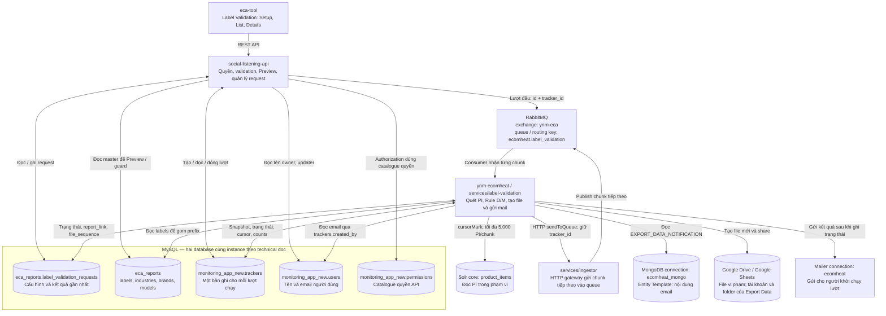
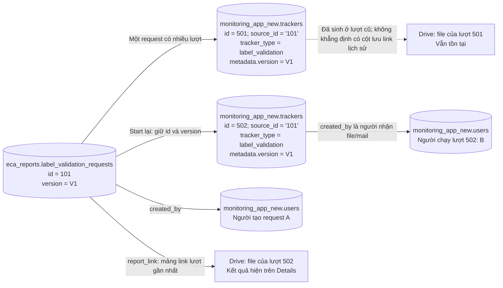
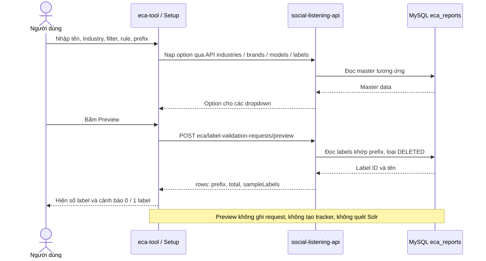
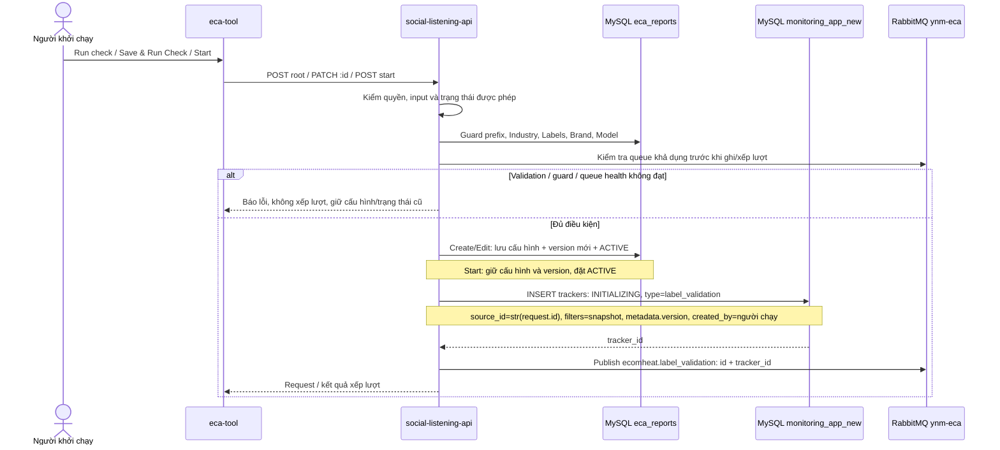
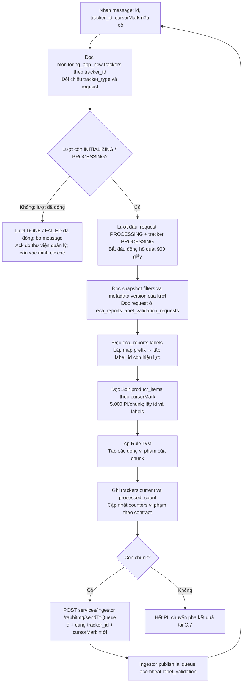
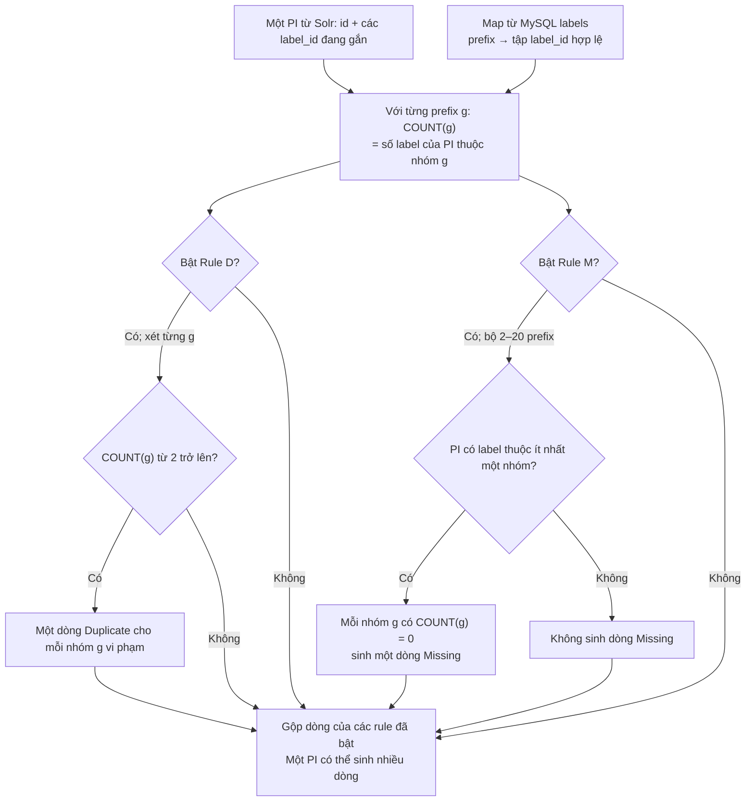
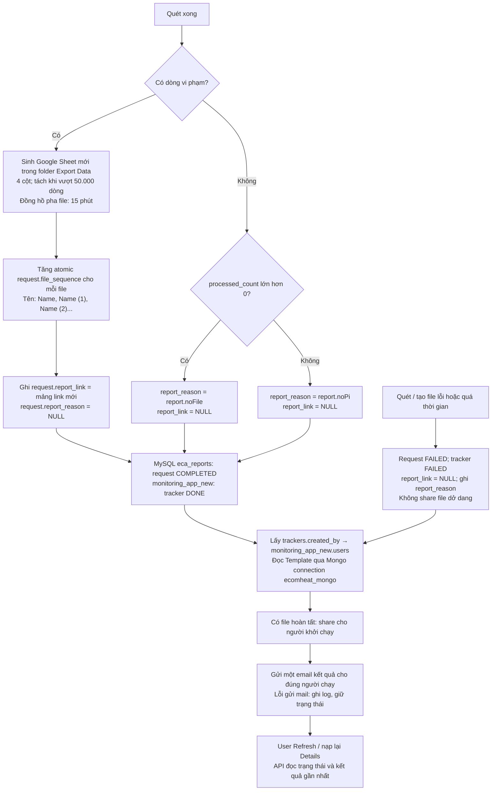
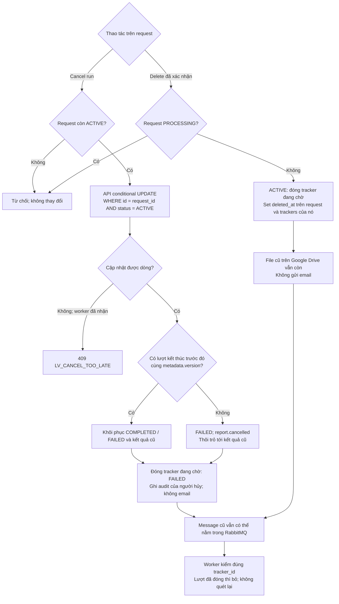
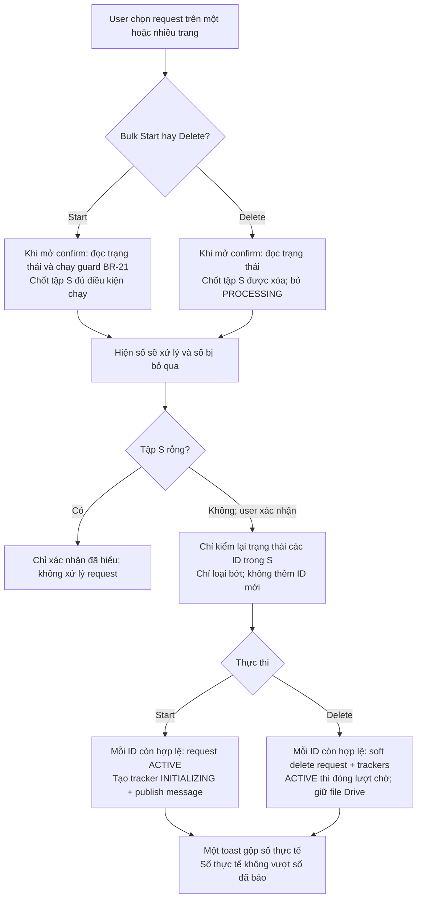

# TEST PLAN — 03-F01 Label Validation

## Thông tin tài liệu

| Field | Value |
|---|---|
| Sản phẩm | EcomHeat |
| Initiative | PRD-03 — QC Duplicate Label |
| Feature | 03-F01 — Label Validation (Đợt 1: Prefix Scanner) |
| Priority | P0 |
| Release dự kiến | 21/09/2026 |
| Trạng thái test plan | Draft — chờ đóng các Need Confirm tại mục 5.1 |
| Test owner | QA EcomHeat `[TBD - cần QA Lead xác nhận]` |
| Business owner | NhungNTC |
| Test oracle nghiệp vụ | [`03-F01-label-validation.md`](/Users/tranthanhlam/product-ai-docs/EcomHeat/specs/03-qc-duplicate-label/03-F01-label-validation.md) v3.0 và [`PRD-03-qc-duplicate-label.md`](/Users/tranthanhlam/product-ai-docs/EcomHeat/specs/03-qc-duplicate-label/PRD-03-qc-duplicate-label.md) v1.3 |
| Technical design | [`architecture.md`](/Users/tranthanhlam/product-ai-docs/EcomHeat/specs/03-qc-duplicate-label/technical-specs/03-F01-label-validation/architecture.md) và bốn spec con trong [`technical-specs/03-F01-label-validation/`](/Users/tranthanhlam/product-ai-docs/EcomHeat/specs/03-qc-duplicate-label/technical-specs/03-F01-label-validation/) |
| Prototype / evidence UI | 15 ảnh trong [`_assets/`](/Users/tranthanhlam/product-ai-docs/EcomHeat/specs/03-qc-duplicate-label/_assets/) |

### Thứ tự ưu tiên nguồn

1. PRD/FRD quyết định hành vi nghiệp vụ và expected result.
2. Technical spec quyết định điểm tích hợp, cách tạo dữ liệu và cách quan sát.
3. Prototype/ảnh dùng để đối chiếu bố cục và trạng thái UI. Prototype không ghi đè FRD.
4. Khi technical spec khác FRD, QA test theo FRD và ghi blocker để Dev cập nhật contract trước khi execute.

### Inventory nguồn đã phân tích

| Nhóm nguồn | Artifact | Vai trò |
|---|---|---|
| Business requirement | PRD-03 v1.3 | Mục tiêu, release boundary, persona, success metric, dependency |
| Feature requirement / AC | FRD 03-F01 v3.0 | Oracle chính: BR-01 → BR-51, EC, NFR, US/AC, message và email |
| Context lịch sử | `_brainstorm-duplicate-label-ver1.md` | As-Is và quyết định cũ; không dùng nội dung Phase 1 để xác định scope đợt này |
| Review artifact | `_review-03-F01-label-validation.md` | Quyết định gần nhất về guard 4 điều kiện và đóng băng tập bulk |
| Technical architecture | `architecture.md` | Luồng API → tracker → RabbitMQ → worker → Solr → Google Sheet → email |
| Frontend design | `eca-tool.md` | Route, component, API mapping, permission, state UI |
| API design | `social-listening-api.md` | Endpoint, appCode, guard, enqueue, cancel race, soft delete |
| Migration design | `sl-api-migrates.md` | Bảng `label_validation_requests`, permission catalogue, verification và rollback |
| Worker design | `ynm-ecomheat.md` | Cursor scan, Rule D/M, tracker, file, email, timeout, self-chaining |
| Data model | `_context/data-models/mysql/eca-reports/label_validation_requests.md`, `monitoring_app_new/trackers.md` | Điểm quan sát DB và ràng buộc dữ liệu |

---

## 1. MỤC TIÊU & TỔNG QUAN (Introduction & Objective)

### 1.1 Mục tiêu kiểm thử

Xác nhận ECI Data có thể thay thế script Console F12 bằng luồng Label Validation trên EcomHeat để:

- Lưu một cấu hình kiểm tra sống lâu dài và chạy lại trên toàn bộ Product Item trong phạm vi.
- Phát hiện đúng vi phạm `Duplicate` và `Missing` theo prefix tên label.
- Không bỏ sót PI do lọc sai `manual_updated`, label đã xóa hoặc cấu hình đã mất toàn vẹn.
- Vận hành lượt chạy nền an toàn qua hàng đợi, kể cả khi hủy, chạy lại, thao tác đồng thời hoặc service lỗi.
- Sinh đúng Google Sheet, share và gửi email cho đúng người khởi chạy.
- Không làm thay đổi dữ liệu Product Item, luồng Product Management, Report Sync, Auto-Labeling và Export Data hiện hữu.

### 1.2 Luồng kỹ thuật cần kiểm chứng

`eca-tool` gọi `social-listening-api` → API validate và chạy guard → ghi `eca_reports.label_validation_requests` + `monitoring_app_new.trackers` → publish RabbitMQ `ecomheat.label_validation` → worker `services/label-validation` đọc MySQL và quét Solr `product_items` theo cursor → áp Rule D/M → sinh Google Sheet nếu có vi phạm → cập nhật trạng thái → share file và gửi email.

UI không polling/realtime. User bấm `Refresh` để nạp trạng thái mới.

#### Sơ đồ tổng — kết nối và nơi lưu dữ liệu

Các mũi tên đọc/ghi thể hiện trách nhiệm của component, không khẳng định tất cả thao tác cùng một transaction. Đây là **sơ đồ thiết kế theo doc**, chưa phải kết quả kiểm tra cấu hình đang deploy. Tên connection có thể khác tên database thật; xem bảng ánh xạ và các sơ đồ chi tiết tại **Phụ lục C**.

### 1.3 Test oracle cốt lõi

| Nhóm | Oracle |
|---|---|
| Phạm vi PI | `industry_id` đã chọn AND `latest_sold > 0`; không lọc `manual_updated`; `Labels`/`Brand`/`Model` là điều kiện thu hẹp tùy chọn |
| Gom nhóm | `label_name` STARTS WITH prefix, phân biệt hoa/thường, loại label `DELETED` |
| Rule D | Mỗi PI × prefix có `COUNT ≥ 2` sinh một dòng `Duplicate` |
| Rule M | Với bộ 2–20 prefix, PI tham gia ít nhất một nhóm thì mỗi nhóm có `COUNT = 0` sinh một dòng `Missing`; PI không tham gia nhóm nào bị bỏ qua |
| Kết quả | Một vi phạm = một dòng; bật cả hai rule thì dùng cùng tập PI và cùng bộ prefix |
| Trạng thái nghiệp vụ | `Active` → `Processing` → `Completed` hoặc `Failed`; không có trạng thái thứ năm |
| Progress | `Completed = 100%`; các trạng thái còn lại = `0%` |
| Data freshness | Snapshot dữ liệu tại lúc lượt chạy bắt đầu; chạy lại quét toàn bộ phạm vi |

---

## 2. PHẠM VI KIỂM THỬ (Scope of Testing)

### 2.1 In-Scope

| Khu vực | Phạm vi kiểm thử |
|---|---|
| RBAC | Ba quyền mới trong nhóm `Label Validation`; ẩn tab khi thiếu quyền xem; disable thao tác khi thiếu quyền tạo/xóa; server-side enforcement khi gọi API trực tiếp; gỡ quyền giữa phiên |
| Danh sách request | 8 cột, empty/no-match state, default sort, single-column sort, tie-break ID, search, 5 filter, badge, server-side account option, phân trang, footer count, `Refresh` |
| Validation Setup | Create/Edit/Copy; 7 field; required, trần 120/20/100; cascade Industry → Brand → Model; Labels độc lập; inline error và auto-scroll |
| Prefix input | Gõ/chốt chip; trim; case-sensitive; bỏ trùng; dán nguyên cụm thành một chip; trần 20; xóa chip; thay đổi prefix xóa Preview cũ |
| Preview | Đếm label theo prefix; loại `DELETED`; 0 label; warning đúng 1 label với Rule D; tooltip; lỗi label service |
| Guard toàn vẹn | Bốn điều kiện BR-21 tại mọi điểm xếp lượt; cách ưu tiên message; trạng thái không đổi khi bị chặn |
| Rule engine | Rule D, Rule M, bật đồng thời; prefix giao nhau; label `DELETED`; `latest_sold = 0`; dữ liệu do Auto-Labeling gắn |
| Lifecycle | Create/Start/Edit/Copy/Cancel/Delete; version; Updated By/Date; khóa thao tác theo trạng thái; concurrent start/edit/cancel |
| Bulk | Tick cộng dồn qua trang/sort; reset tick đúng trigger; `Select All`; Start/Delete không giới hạn số dòng; confirm luôn mở; đóng băng tập đủ điều kiện; chỉ loại bớt lúc execute |
| Queue/worker | Tracker per-run, payload `{id, tracker_id}`, cursor self-chaining, queue saturation, cooperative cancel, worker/service failure, timeout |
| File | 4 cột đúng thứ tự/nội dung; 0 PI/0 vi phạm; tách trên 50.000 dòng; tên và `file_sequence`; file lượt cũ; soft delete không xóa Drive |
| Email | 4 biến thể tiếng Anh; sender; người nhận; thời điểm; N lượt bulk = N email; không email khi cancel; lỗi mail không đổi status |
| Migration | DDL 18 cột, 6 index, enum/status/version/file_sequence; 8 permission catalogue; migrate/rollback; deploy order |
| Regression | Hai tab Label Management cũ, User & Permission, Export Data, email export, Product Management, Report Sync, Auto-Labeling |
| NFR | Thời gian quét, sinh file, email, UI/API/bulk, danh sách, concurrency và data freshness theo FRD S4 |

### 2.2 Out-of-Scope

- 03-F02 Label Group và toàn bộ nội dung Phase 1 trong brainstorm.
- Lịch chạy tự động/định kỳ.
- Lịch sử nhiều lượt chạy trên UI.
- Hủy hàng loạt request `Active`.
- Gate tự động tại Report Sync hoặc hệ thống tự sửa label.
- Product Line filter, chống trùng `Validate Name`, progress trung gian, push/realtime notification.
- Security penetration test và browser/device matrix rộng. Chỉ kiểm authorization/RBAC và browser được release support xác nhận.
- Load test vượt các cỡ dữ liệu và concurrency đã nêu trong FRD, trừ khi Infra yêu cầu capacity test riêng.

### 2.3 Release boundary

Đợt này chỉ ship 03-F01 Prefix Scanner. Release không đạt nếu thiếu một trong các khối P0: permission, UI/API quản lý request, guard, worker Rule D/M, queue/cancel, Google Sheet hoặc email kết quả.

---

## 3. CHIẾN LƯỢC KIỂM THỬ (Test Strategy & Approach)

### 3.1 Loại test áp dụng

| Loại test | Mục tiêu | Evidence tối thiểu |
|---|---|---|
| Functional UI | Form, list, state, message, menu, bulk và RBAC | Screenshot/video + request ID |
| API/Integration | Validate contract, permission, appCode, guard, transaction/race, soft delete | Request/response đã che token + DB before/after |
| Data validation | Đối chiếu MySQL/Solr input với dòng output | Query/result snapshot + file Sheet |
| Async/Reliability | Queue, tracker, cancel, retry/recovery, worker/ingestor/mail/Drive failure | Tracker timeline + worker/queue/job log |
| Migration | Schema, permission catalogue, idempotency, rollback | Output migration + 6 verification SQL |
| Performance | Đo P50/P95 và timeout theo FRD S4 | k6/report timing + log mốc bắt đầu/kết thúc |
| Regression | Các dependency dùng chung không bị ảnh hưởng | Test result theo smoke suite hiện hữu |

Không lập compatibility/security suite riêng khi chưa có release matrix hoặc security requirement tương ứng.

### 3.2 Ma trận rule chính

| Rule | Dữ liệu PI | Expected |
|---|---|---|
| D | 0 hoặc 1 label hợp lệ trong prefix | Không có dòng `Duplicate` |
| D | 2+ label hợp lệ trong một prefix | Một dòng `Duplicate` cho PI × prefix |
| D | Trùng ở hai prefix | Hai dòng `Duplicate` |
| M | PI không có label thuộc bất kỳ prefix nào | Không có dòng `Missing` |
| M | PI có label ở một phần bộ 2–20 prefix | Một dòng `Missing` cho mỗi nhóm còn thiếu |
| M | PI có đủ mọi nhóm | Không có dòng `Missing` |
| D + M | Cùng PI vi phạm cả hai rule | Các dòng riêng trong cùng kết quả/file |
| D/M | Label thuộc prefix nhưng `DELETED` | Loại khỏi phép đếm |
| D/M | Prefix nằm giữa tên hoặc sai casing | Không thuộc nhóm |
| D/M | Hai prefix lồng nhau | Vẫn chạy; label chung được tính trong từng nhóm tương ứng; không cảnh báo |

### 3.3 Boundary cần phủ

| Đối tượng | Giá trị biên |
|---|---|
| Validate Name | rỗng sau trim; 1; 120; 121 ký tự qua Copy/API |
| Labels | 0; 1; 19; 20; 21 qua API |
| Brand / Model | 0; 1; 99; 100; 101 qua API |
| Prefix | 0; 1; 2; 19; 20; 21; Rule M với 1 và 2 prefix |
| PI | `latest_sold = 0`; `latest_sold > 0`; có/không `manual_updated` |
| Kết quả file | 0 PI; ≥1 PI nhưng 0 vi phạm; 1; 9.999; 10.000; 50.000; 50.001; 62.480 dòng |
| Danh sách | 0; 1; 20; 21; 50; 100; ≥500 request |
| Bulk | 1; 10; 100; 250; 500 và toàn bộ tập đang lọc |
| Concurrency | 11 và 22 lượt đồng thời; vượt trần worker được cấu hình |
| Timeout | Trước, đúng và sau 900 giây pha quét; trước, đúng và sau 15 phút pha file |

### 3.4 State transition và race condition

- Xác minh chỉ có bốn trạng thái nghiệp vụ và map đúng với tracker kỹ thuật.
- `Start` chỉ tạo tracker/lượt mới, không tăng `version`; submit Create/Edit tăng `version` kể cả không đổi field.
- `Cancel run` chỉ thành công khi request vẫn `Active`; conditional update thua race với worker phải trả `LV_CANCEL_TOO_LATE`.
- Hủy lượt cũ rồi chạy lượt mới: message cũ phải bị bỏ theo `tracker_id`; không tạo scan/file/email trùng.
- Hai member cùng Edit: last-write-wins khi cả hai submit lúc request còn sửa được.
- Edit đang mở nhưng người khác Start: submit bị từ chối, draft giữ nguyên.
- Bulk confirm: tập đủ điều kiện chốt lúc modal mở; lúc execute chỉ được loại bớt, không thêm request vừa đổi sang đủ điều kiện.
- Delete bulk: request `Processing` được hứa giữ nguyên không bị xóa nếu chuyển `Completed` trước lúc bấm OK.

### 3.5 Test data tối thiểu

| Dataset | Yêu cầu |
|---|---|
| Industry A | Có PI `latest_sold > 0`, PI `latest_sold = 0`, PI có và không có `manual_updated` |
| Prefix groups | Ít nhất 3 prefix hợp lệ; 1 prefix khớp đúng 1 label; 1 prefix khớp 0; 2 prefix lồng nhau; biến thể sai casing |
| PI rule set | PI sạch; Duplicate một nhóm; Duplicate hai nhóm; Missing một nhóm; Missing nhiều nhóm; vi phạm đồng thời D+M; PI không tham gia nhóm nào |
| Deleted masters | Industry bị xóa; toàn bộ Brand/Model được cấu hình bị xóa; một phần Brand/Model bị xóa; một trong nhiều Labels bị xóa |
| Accounts | Không quyền; chỉ view; view+create; view+delete; đủ ba quyền; hai account dùng cho concurrency |
| Requests | Đủ bốn trạng thái; chưa từng kết thúc; có lượt cũ cùng version; có lượt cũ khác version; có file cũ |
| Scale | ≥500 request; ~50.000 PI; output 62.480 dòng; tập bulk 10/100/250/500 |

Test data phải tách namespace/staging và có phương án dọn sau test. Không dùng production data chưa được ẩn thông tin.

### 3.6 Điểm quan sát và đối soát

- UI/API: HTTP status, `appCode`, payload, timestamp và request ID.
- MySQL `eca_reports.label_validation_requests`: `status`, `version`, `file_sequence`, `report_link`, `report_reason`, audit fields, `deleted_at`.
- MySQL `monitoring_app_new.trackers`: `tracker_type`, `source_id`, `status`, `filters`, `metadata.version`, cursor/count và audit fields.
- RabbitMQ: routing key, queue depth, payload `id/tracker_id/cursorMark`, số message self-chaining.
- Solr: tập PI đầu vào và field trả về; xác nhận feature chỉ đọc.
- Google Drive/Sheet: owner/share, số file, tên file, số dòng và 4 cột.
- Mail log/inbox: sender, recipient, subject, body, delivery latency và failure log.

### 3.7 Traceability mức test suite

| Suite | Requirement chính |
|---|---|
| TP-RBAC | BR-08 → BR-10; US-01 |
| TP-LIST | BR-06, BR-07, BR-39 → BR-46; US-02 |
| TP-SETUP | BR-01 → BR-05, BR-14 → BR-16; US-03/US-04 |
| TP-PREVIEW-GUARD | BR-20 → BR-22; EC-12/EC-15; US-05/US-06 |
| TP-RULE | BR-11 → BR-19; US-07 |
| TP-RUN | BR-23 → BR-31; EC-08 → EC-21; US-06/US-09 |
| TP-OUTPUT | BR-32 → BR-38; EC-05/EC-09 → EC-11; US-08 |
| TP-BULK | BR-45 → BR-51; US-10 |
| TP-MIGRATION | Technical migration §4–§8 |
| TP-NFR | FRD S4.1 và S4.2 |
| TP-REG | FRD S8 Impact Analysis |

---

## 4. MÔI TRƯỜNG KIỂM THỬ (Test Environment)

### 4.1 Môi trường và component

| Thành phần | Yêu cầu |
|---|---|
| Environment | EcomHeat staging có topology tương đương release; URL/build `[TBD - cần DevOps xác nhận]` |
| Frontend | Build `eca-tool` chứa tab Label Validation và i18n EN/VN |
| API | `social-listening-api` với 9 endpoint `eca/label-validation-requests*` |
| Worker | `@ynm/label-validation-service`, queue/deployment riêng |
| Database | MySQL `eca_reports` và `monitoring_app_new`; quyền read-only cho QA hoặc query evidence do Dev cung cấp |
| MongoDB | Connection `ecomheat_mongo`, entity `Template` cho email; tên DB/collection vật lý cần đối chiếu config môi trường (Phụ lục C.1) |
| Solr | Core `product_items` có dataset kiểm soát được |
| RabbitMQ | Exchange `ynm-eca`, routing key/queue `ecomheat.label_validation`; có quan sát queue depth/message |
| Ingestor | `services/ingestor` sẵn sàng cho self-chaining hoặc phương án kỹ thuật thay thế đã chốt |
| Google | Tài khoản/thư mục dùng chung Export Data; quota đủ cho test scale; QA có quyền mở file được share |
| Email | Sender `no-reply@youneteci.com`; inbox test và quyền xem log gửi |
| Timezone | GMT+7 cho UI, filter ngày và timestamp evidence |

### 4.2 Browser và ngôn ngữ

- Browser chính: `[TBD - cần QA Lead xác nhận theo release support matrix]`.
- Chạy smoke trên UI EN và VN cho message động; email luôn kiểm bằng tiếng Anh.
- Không mở rộng device/browser matrix khi chưa có requirement hỗ trợ tương ứng.

### 4.3 Công cụ

- API client hoặc automated integration test cho endpoint/appCode.
- SQL client read-only và Solr query tool để dựng/đối soát oracle.
- k6 cho NFR API/list/bulk/concurrency.
- Queue dashboard/log aggregation, Drive/Sheets và mail log.
- Screen recording cho race/bulk state transition khó tái hiện bằng screenshot đơn.

---

## 5. TIÊU CHÍ ĐÁNH GIÁ (Entry & Exit Criteria)

### 5.1 Entry Criteria

Chỉ bắt đầu test execution chính thức khi đạt tất cả điều kiện sau:

- PRD-03 và FRD 03-F01 v3.0 được baseline cho release; change sau baseline có impact assessment.
- Build của W1–W6 đã deploy; migration chạy trước runtime; 6 verification SQL của `sl-api-migrates.md` đều pass.
- Unit/integration test của `social-listening-api` pass; worker build/lint và smoke thủ công pass vì repo worker chưa có test suite tự động.
- Ba permission có thể cấp qua `User & Permission`; account test theo ma trận quyền đã sẵn sàng.
- Dataset chức năng, scale, deleted-master và concurrency tại mục 3.5 đã sẵn sàng.
- QA truy cập được API log, tracker/job log, queue metric, Google Sheet và mail log.
- Dev/Infra chốt `prefetchCount` test và cơ chế timeout/recovery khi worker hoặc ingestor chết.
- Các mâu thuẫn/blocker dưới đây đã có quyết định ghi vào source-of-truth hoặc release note:

| ID | Need Confirm / conflict | Tác động | Owner |
|---|---|---|---|
| NC-01 | FRD v3.0 bỏ trần bulk; `architecture.md`, `eca-tool.md` và `social-listening-api.md` còn giới hạn 20 ID | Chặn contract/API và test bulk >20. Expected theo FRD: không giới hạn số dòng, test ít nhất 10/100/250/500 | BA + FE + API |
| NC-02 | `eca-tool.md` còn mô tả tick bị xóa khi đổi trang/sort, trái BR-46; FRD yêu cầu giữ tick qua trang và sort | Chặn expected bulk selection | FE + BA |
| NC-03 | Technical docs còn dùng tracker `QUEUED` ở một số chỗ, trong khi schema chỉ có `INITIALIZING/PROCESSING/DONE/FAILED` | Có thể lỗi insert hoặc worker không nhận lượt | API + Worker |
| NC-04 | Data model `label_validation_requests.md` mô tả transition khác FRD, gồm cancel ở `Processing` và các bước `ACTIVE/PROCESSING` sai trigger | Chặn test state/Cancel nếu implementation bám model cũ | API + Worker + BA |
| NC-05 | Endpoint nạp toàn bộ option `Created By`/`Updated By` cho server-side search vẫn Open (`social-listening-api.md` F-04) | Không execute đầy đủ BR-06/US-02-AC-16 | FE + API |
| NC-06 | Cơ chế ack/requeue/DLQ, self-chaining khi `services/ingestor` lỗi, và watchdog cho worker chết vẫn Open | Chặn reliability/recovery và nguy cơ request treo | Dev + Infra |
| NC-07 | Trần concurrency thật/prefetchCount chưa chốt | Chặn kết luận capacity ở 11/22 lượt | Dev Lead + Infra |
| NC-08 | `Refresh` khi popup `Details` đang mở có cập nhật nội dung popup hay không vẫn Open | Expected UI chưa xác định | BA |
| NC-09 | Technical spec dùng `report.failedTooLong`, trong khi FRD S5 dùng `report.failed` cho cả timeout quét/file | Có thể lệch message/email và contract DB | BA + Dev |
| NC-10 | Route UI còn ghi `[TBD - Dev chốt]` | Cần chốt để test navigation/deep link và permission route guard | FE |

### 5.2 Exit Criteria

- 100% test case P0 đã execute; không còn test `Blocked` do môi trường hoặc requirement chưa chốt.
- 100% BR-01 → BR-51 và 12 EC hiện hành có ít nhất một test case traceable; các AC critical có evidence.
- Không còn defect Critical/High mở.
- Defect Medium còn mở chỉ được chấp nhận khi BA, Dev Lead và QA Lead cùng sign-off, có workaround và không ảnh hưởng tính đúng của file QC, permission, dữ liệu hoặc lifecycle.
- Rule D/M, guard 4 điều kiện, cancel race, bulk snapshot, file split/share và email recipient đều pass.
- Data integrity pass: feature không thay đổi Product Item/Label/master data; `report_link` và `report_reason` loại trừ nhau; file cũ không bị xóa ngoài ý muốn.
- Migration forward pass; rollback được diễn tập trên staging hoặc có quyết định giữ schema khi rollback app theo technical plan.
- Regression smoke của Label Management, User & Permission, Export Data, email export, Product Management, Report Sync và Auto-Labeling pass.
- NFR có báo cáo P50/P95/timeout cho toàn bộ mốc FRD S4. Mọi mốc chưa đạt có defect hoặc waiver được sign-off trước release.
- Test Summary Report được QA Lead, BA và Dev Lead xác nhận.

---

## 6. RỦI RO & HƯỚNG GIẢI QUYẾT (Risks & Mitigations)

| ID | Rủi ro | Mức | Dấu hiệu phát hiện | Hướng xử lý / Owner |
|---|---|---|---|---|
| R-01 | Technical docs cũ khiến Dev triển khai trần bulk 20 hoặc vòng đời cũ | Cao | API trả `LV_BULK_TOO_MANY`; tick bị xóa qua trang; xuất hiện `QUEUED` | Đóng NC-01→NC-04 trước SIT; BA/API/FE/Worker |
| R-02 | Prefix sai/case-sensitive hoặc label đổi tên làm file báo sạch giả | Cao | Preview count lệch; guard chỉ bắt prefix về 0, không bắt thiếu một phần | Dataset prefix biến thể; khuyến nghị Preview khi tạo mới; QA + BA |
| R-03 | Cancel rồi chạy lại tạo message/file/email trùng | Cao | Hai tracker chạy cho cùng request/version; hai file/email | Kiểm theo `tracker_id`, conditional update, race test lặp; API + Worker |
| R-04 | Worker/ingestor chết giữa self-chaining làm request treo `Processing` | Cao | Cursor không tiến, queue rỗng nhưng request chưa kết thúc | Chốt watchdog/retry/DLQ ở NC-06; Infra alert; Worker + Infra |
| R-05 | Google quota/permission hoặc mail lỗi làm mất bàn giao kết quả | Cao | `Failed`, file không share, email không tới | Fault injection; kiểm retry/log; file lỗi không share; mail lỗi không đổi status; Dev + Infra |
| R-06 | Trần concurrency không phù hợp gây quá tải Solr hoặc hàng đợi kéo dài | Cao | P95 tăng, Solr error, queue depth không giảm | Benchmark 11/22 VU, tune `prefetchCount`, theo dõi Solr/queue; Dev Lead + Infra |
| R-07 | Bulk snapshot sai làm xóa/chạy request ngoài cam kết modal | Cao | Toast > số confirm; request vừa đổi trạng thái bị thêm vào tập | Race test hai chiều BR-49; DB before/after; API + QA |
| R-08 | `file_sequence` tăng không atomic tạo tên file trùng | Trung bình | Hai file cùng hậu tố trong concurrent/retry | Atomic DB update và test parallel/retry; Worker |
| R-09 | Option người tạo/cập nhật suy từ trang hiện tại làm lọc thiếu account | Trung bình | Dropdown chỉ có account đang hiển thị | Chốt endpoint NC-05; test ≥11 account qua nhiều trang; FE + API |
| R-10 | Load test tạo nhiều file/email hoặc dữ liệu rác | Trung bình | Drive/quota/inbox bị đầy | Namespace riêng, quota monitor, kế hoạch cleanup và giới hạn recipient test; QA + Infra |

---

## 7. TÀI LIỆU BÀN GIAO (Deliverables)

| Artifact | Nội dung |
|---|---|
| Test Plan | File hiện tại |
| Test Cases | Bộ test case chi tiết theo suite TP-RBAC → TP-REG, trace BR/EC/AC |
| Test Data Pack | Script/query hoặc hướng dẫn dựng dữ liệu; danh sách request/account/prefix/PI dùng test |
| API Collection | 9 endpoint, positive/negative/permission/race scenarios; không chứa secret |
| Performance Report | P50/P95, throughput, error rate, queue/Solr metric và cấu hình `prefetchCount` |
| Migration Evidence | Output migrate, 6 verification SQL, rollback rehearsal/decision |
| Bug Reports | Jira bug có severity, environment/build, steps, evidence, request/tracker ID và log correlation |
| Test Evidence | Screenshot/video, response, DB/queue/job log, Google Sheet và mail log đã che dữ liệu nhạy cảm |
| Test Summary / Sign-off | Scope đã chạy, pass/fail/blocked, defect còn mở, NFR result, residual risk và quyết định release |

---

## Phụ lục A — Checklist release nhanh

- [ ] Permission catalogue đủ 8 dòng và không tự gán role.
- [ ] Không có trạng thái nghiệp vụ hoặc tracker ngoài enum đã chốt.
- [ ] Không còn giới hạn 20 request ở thao tác bulk theo FRD v3.0.
- [ ] Guard đủ bốn điều kiện và chạy ở mọi điểm xếp lượt.
- [ ] Bulk confirm đóng băng tập và toast không vượt số đã hứa.
- [ ] Output 0 PI khác output dữ liệu sạch.
- [ ] File trên 50.000 dòng được tách; `file_sequence` liên tục và atomic.
- [ ] Người nhận file/email là người khởi chạy, không mặc định là người tạo.
- [ ] Cancel/Delete lượt `Active` không gửi email.
- [ ] Mail lỗi không đổi trạng thái; file dở dang không được share.
- [ ] Hai đồng hồ 900 giây và 15 phút chạy độc lập.
- [ ] Product Item và các luồng hiện hữu không bị ghi thay đổi.

## Phụ lục B — Quality gate của test plan

| Hạng mục | Kết quả |
|---|---|
| Đủ đúng 7 phần bắt buộc | PASS |
| Scope/strategy/environment/criteria/risk/deliverable liên kết | PASS |
| Rule, boundary, failure path và concurrency chính có approach | PASS |
| Exact value có nguồn hoặc Need Confirm | PASS |
| Release boundary và upstream/downstream rõ | PASS |
| Không tuyên bố bao phủ 100% khi chưa có traceability test case | PASS |
| Markdown render được, không còn placeholder từ template mẫu | PASS |

## Phụ lục C — Sơ đồ chi tiết và đối soát dữ liệu

Bổ sung ngày **09/09/2026** từ bộ doc đã khôi phục. Sơ đồ nghiệp vụ theo FRD v3.0; DB, connection và luồng gọi service theo technical spec. Các đoạn technical doc còn mâu thuẫn được ghi tại C.10 và mục 5.1.

| Mã nguồn | Tài liệu đối chiếu |
|---|---|
| FRD | [03-F01-label-validation.md](/Users/tranthanhlam/product-ai-docs/EcomHeat/specs/03-qc-duplicate-label/03-F01-label-validation.md) — BR-01–BR-51, S4 |
| ARCH | [architecture.md](/Users/tranthanhlam/product-ai-docs/EcomHeat/specs/03-qc-duplicate-label/technical-specs/03-F01-label-validation/architecture.md) — §2, §4 |
| API | [social-listening-api.md](/Users/tranthanhlam/product-ai-docs/EcomHeat/specs/03-qc-duplicate-label/technical-specs/03-F01-label-validation/social-listening-api.md) — §2.3, §4–§6, §9 |
| WORKER | [ynm-ecomheat.md](/Users/tranthanhlam/product-ai-docs/EcomHeat/specs/03-qc-duplicate-label/technical-specs/03-F01-label-validation/ynm-ecomheat.md) — §2.3–§2.6, §3–§6, §8 |
| DB | [sl-api-migrates.md](/Users/tranthanhlam/product-ai-docs/EcomHeat/specs/03-qc-duplicate-label/technical-specs/03-F01-label-validation/sl-api-migrates.md) — §3–§5, §9 |
| FE | [eca-tool.md](/Users/tranthanhlam/product-ai-docs/EcomHeat/specs/03-qc-duplicate-label/technical-specs/03-F01-label-validation/eca-tool.md) — §5–§6 |
| MODEL | [label_validation_requests.md](/Users/tranthanhlam/product-ai-docs/_context/data-models/mysql/eca-reports/label_validation_requests.md), [trackers.md](/Users/tranthanhlam/product-ai-docs/_context/data-models/mysql/monitoring-app-new/trackers.md) — cột và liên kết; lifecycle của MODEL còn lệch FRD |

### C.1 Kết nối ở đâu, dữ liệu lưu ở đâu?

| Component / connection | Đích lưu trữ | Dữ liệu và cách sử dụng |
|---|---|---|
| API: `mysql.ynm_eca_reports` → `knexClientEca`; worker: `database.eca_report` | MySQL `eca_reports.label_validation_requests` | Một dòng request sống qua nhiều lượt chạy. Lưu `name`, `industry_id`, `label_ids`, `brand_ids`, `model_ids`, `rules`, `prefixes`, `version`, `status`, `file_sequence`, `report_link`, `report_reason`, audit và `deleted_at`. |
| API: model schema-qualified + `bindKnex`; worker: `database.monitoring_app_new` | MySQL `monitoring_app_new.trackers` | Mỗi lượt có `id` riêng; `tracker_type = label_validation`; `source_id` = request ID dạng **chuỗi**. Lưu snapshot cấu hình trong `filters`, phiên bản trong `metadata.version`, người chạy, cursor và counters. |
| API cross-DB; worker: `database.monitoring_app_new` | MySQL `monitoring_app_new.users` | Đọc tên hiển thị và email. Người nhận file/email lấy từ `trackers.created_by` của đúng lượt. |
| API / master services; worker: `database.eca_report` | MySQL `eca_reports.labels`, `industries`, `brands`, `models` | API đọc master để cấp option / guard. Worker đọc `labels` để lập nhóm prefix; luồng validation không sửa master. |
| Migration: Knex env `monitoring_app_new` | MySQL `monitoring_app_new.permissions` | Seed 8 dòng quyền theo root API và sub-path. Chỉ tạo catalogue; admin cấp quyền qua User & Permission. |
| Migration: Knex env `ynm_eca_reports` | MySQL `eca_reports` | Tạo bảng request; lịch sử migration nằm ở `eca_reports.knex_migrations`. Tên env `ynm_eca_reports` khác tên DB `eca_reports`. |
| Worker: `solr.product_items` | Solr core `product_items` | Đọc `id`, `labels` của PI theo filter và cursor. PI nguồn nằm ở Solr trong luồng quét này. |
| Worker: `database.ecomheat_mongo` | MongoDB, entity `Template` | Đọc template `EMAIL_TEMPLATE.EXPORT_DATA_NOTIFICATION`. `ecomheat_mongo` là **tên connection**; doc này chưa nêu tên DB/collection vật lý. |
| API producer / worker consumer | RabbitMQ exchange `ynm-eca`, queue và routing key `ecomheat.label_validation` | Message đầu `{ id, tracker_id }`; message tiếp `{ id, tracker_id, cursorMark }`. Message trỏ đến cấu hình trong DB. |
| Worker: `http.ingestor.baseURL` | HTTP `services/ingestor` → `/rabbitmq/sendToQueue` | Trung chuyển message cho chunk tiếp theo; không phải nơi lưu request. |
| Worker: `googlesheet.*` | Google Drive, folder dùng chung với Export Data | File Google Sheet chứa từng dòng vi phạm. DB request chỉ lưu mảng link của lượt mới nhất. Doc chưa nêu folder ID cụ thể. |
| Worker: `mailer.ecomheat` | Mail service và log gửi | Gửi kết quả sau khi chốt trạng thái; nơi lưu log cụ thể chưa được chốt trong doc. |
| FE: `setupDraft`, `previewRows` | State cục bộ của màn hình | Cấu hình chưa submit và kết quả Preview; Preview không tạo request/tracker. |

**Phân biệt dữ liệu trung gian:** WORKER §4.2 mô tả map `prefix → Set<label_id>` nằm trong bộ nhớ; FRD S4 mô tả danh sách vi phạm sau quét ở bộ nhớ. Doc chưa chốt cách giữ hai tập này qua các message/chunk, replica hoặc worker restart. Không coi các counter trong `trackers` là nơi lưu đầy đủ từng dòng vi phạm; xem C.10.

Host, port, tên DB vật lý của Mongo, folder ID Drive và thông tin kết nối từng môi trường phải đối chiếu config deploy. Sơ đồ không suy ra các giá trị này từ tên connection. Nguồn: API §2.3/§6, WORKER §2.3/§2.6/§3.2, DB §3–§5, FE §6.

### C.2 Quan hệ request — lượt chạy — người dùng — file

Các ID và `V1` chỉ là ví dụ. Liên kết là **logical reference**, schema không khai FK cho feature. Khi đối soát phải lọc cả `tracker_type = 'label_validation'` và `source_id = '<request_id>'`, vì bảng `trackers` được nhiều nghiệp vụ dùng chung. `Start` tạo tracker mới; submit Create/Copy tạo request mới; submit Edit giữ request ID nhưng sinh `version = Date.now()` mới. `version` dùng so bằng, không dùng làm số thứ tự lượt. Nguồn: ARCH §4, API §2.3/§4.2–§4.6, DB §4.1.

### C.3 Setup và Preview — đọc label, chưa chạy kiểm tra PI

Khớp prefix là STARTS WITH, phân biệt hoa/thường. `total` của Preview là số **label master**, không phải số PI hay số vi phạm. Prefix khớp 1 label chỉ cảnh báo khi bật Rule D; prefix 0 label sẽ bị guard chặn khi chạy. Thay đổi prefix xóa Preview cũ. Nguồn: FRD BR-11/BR-20–BR-22, API §4.4, FE §5–§6.

### C.4 Create / Edit / Start — ghi hai DB rồi gửi queue

Guard có bốn điều kiện: mỗi prefix khớp ít nhất 1 label; Industry còn hiệu lực; Brand/Model nếu khai báo phải còn ít nhất 1 giá trị hợp lệ; riêng Labels chỉ cần **1 label bị xóa** là chặn. Lỗi guard giữ trạng thái cũ, không tự chuyển `FAILED`. Không có thao tác lưu cấu hình mà không chạy. Luồng bulk có thời điểm guard riêng tại C.9.

**Điểm kiểm lỗi:** health-check thành công chưa bảo đảm publish sau đó thành công. Doc chưa mô tả đầy đủ rollback/compensation nếu đã ghi request hoặc tracker nhưng publish thất bại; cần đối soát cả hai DB và queue, không chỉ HTTP response. Nguồn: API §4.2–§4.6/§5, FRD BR-21/BR-31.

### C.5 Worker — quét nhiều chunk và ghi tiến trình

Chunk tiếp theo giữ lượt `PROCESSING` và **không reset đồng hồ 900 giây**. Cursor đầu là `trackers.start`, mặc định `*`; mỗi chunk ghi `current`. PI phải thuộc Industry đã chọn và `latest_sold > 0`; OR trong cùng field filter, AND giữa các field; không lọc `manual_updated`. Mỗi lần Start lại quét toàn bộ phạm vi.

Worker là package và deployment riêng `services/label-validation`; chỉ tham khảo cách làm của Export Data. `http.ingestor.baseURL` là dependency runtime thật. Worker chết hoặc ingestor lỗi có thể làm đứt chuỗi chunk; cơ chế phục hồi và lưu dữ liệu trung gian cần xác nhận ở C.10. Nguồn: WORKER §2–§4/§6/§8.

### C.6 Rule D và Rule M — đếm theo PI, không đếm tổng master label

Ví dụ bật D + M với `BMP_Color_` và `BMP_Size_`; giả sử mọi label dưới đây còn hiệu lực và các PI nằm trong phạm vi:

| PI | Labels đang gắn | Dòng kết quả |
|---|---|---|
| PI-01 | `BMP_Color_Red`, `BMP_Color_Blue` | Duplicate `BMP_Color_` và Missing `BMP_Size_`: **2 dòng, 1 PI vi phạm** |
| PI-02 | `BMP_Size_L` | Missing `BMP_Color_`: **1 dòng** |
| PI-03 | `BMP_Color_Red`, `BMP_Size_L` | Không vi phạm |
| PI-04 | Chỉ có label ngoài hai prefix | Không vi phạm D; bỏ qua M |

Đây là dữ liệu minh họa, không phải ID master thật. Prefix giao nhau vẫn tính độc lập; label `DELETED`, sai casing hoặc chỉ chứa prefix ở giữa tên không được tính. Cần phân biệt **số PI vi phạm** và **số dòng vi phạm** khi kiểm counters. Nguồn: FRD BR-11–BR-19, WORKER §4.2–§4.4.

### C.7 Kết quả — file lưu trên Drive, link lưu trong MySQL

File gồm `Violation type`, `Product item ID`, `Label prefix`, `Labels on product item`. Label hiển thị dạng `Tên (ID)`, nối bằng `; `; Missing để trống cột label theo ví dụ nghiệp vụ. `report_link` là mảng JSON vì một lượt có thể có nhiều file; nó thay thế link hiển thị cũ, **không ghi đè hoặc xóa file cũ trên Drive**. Không lưu từng dòng vi phạm vào bảng request.

`file_sequence` liên tục theo request, kể cả tách file và chạy lại. DB không tự cập nhật `updated_at`: tăng bộ đếm file không được làm đổi thời gian; khi lượt kết thúc, FRD BR-28 yêu cầu ghi audit với người khởi chạy và thời điểm kết thúc. Các nhánh share lỗi và timeout message còn cần xác nhận ở C.10. Nguồn: FRD BR-28/BR-32–BR-38/S4, WORKER §4.5–§6, DB §4.1.

### C.8 Cancel / Delete — đóng đúng tracker, bảo toàn file cũ

Sơ đồ mô tả điều kiện và hệ quả; không quy định thứ tự từng câu SQL khôi phục kết quả. API §9 F-03 đã chốt conditional update để xử lý race. Hủy theo `tracker_id` giúp phân biệt message cũ với lượt mới trên cùng request; không thêm enum `CANCELLED`. Khi Cancel khôi phục request `COMPLETED`, tracker vừa hủy vẫn là `FAILED` — hai trạng thái không nhất thiết giống nhau. Soft delete ẩn dữ liệu qua `deleted_at IS NULL`, không xóa vật lý bảng hoặc file Drive. Nguồn: FRD BR-24–BR-30, ARCH §2.2, API §4.3/§4.7/§9.

| Mốc | Request trong `eca_reports` | Tracker của lượt trong `monitoring_app_new` | UI |
|---|---|---|---|
| Đã xếp lượt | `ACTIVE` | `INITIALIZING` | Active, 0% |
| Worker bắt đầu | `PROCESSING` | `PROCESSING` | Processing, 0% |
| Hoàn tất, có hoặc không có file | `COMPLETED` | `DONE` | Completed, 100% |
| Lượt chạy lỗi | `FAILED` | `FAILED` | Failed, 0% |
| Hủy lượt chờ | Khôi phục kết quả cũ cùng version; nếu không có thì `FAILED` | Lượt bị hủy: `FAILED` | Theo trạng thái request sau hủy |

### C.9 Bulk Start / Delete — chốt tập trước khi thực thi

**Theo FRD BR-49, Bulk Start không chạy lại guard tại bước xác nhận**; guard đã chạy khi chốt tập. Đây là điểm khác với sơ đồ Start đơn lẻ ở C.4. FRD không đặt trần 20 request; API/FE spec vẫn còn ghi trần 20 và chưa thể hiện đủ contract chốt tập. Cần chốt nơi giữ tập S, cách truyền/kiểm tập S và chống thay đổi giữa hai bước trước khi kết luận implementation đáp ứng luồng này (NC-01). Một lần bulk xếp N lượt sẽ có N tracker và N email khi các lượt kết thúc bình thường; không có một email chung cho cả batch. Nguồn: FRD BR-45–BR-51, API §4.5/§4.8.

### C.10 Những điểm cần lưu ý khi kiểm DB và debug

| Điểm | Căn cứ / trạng thái | Cần kiểm hoặc xác nhận |
|---|---|---|
| Connection khác tên DB | `eca_report` ở worker; `ynm_eca_reports` ở API/migration; DB đều là `eca_reports` | Đối chiếu từng config môi trường; hai DB MySQL cần cùng instance và có quyền đọc/ghi cross-DB theo thiết kế. |
| Enum tracker bị lệch | ARCH §4, API §4.6 và MODEL chốt `INITIALIZING`; WORKER §3–§5 vẫn có `QUEUED` | Dùng enum schema làm căn cứ kiểm insert; cập nhật worker doc theo NC-03. |
| Lifecycle data model bị lệch | MODEL còn ghi Start chuyển thẳng PROCESSING và hủy lúc PROCESSING | Theo FRD: Start → ACTIVE; worker nhận → PROCESSING; chỉ Cancel khi ACTIVE. Giữ NC-04. |
| Audit khi kết thúc | FRD BR-28 yêu cầu cập nhật theo người chạy; API §4.6 có mô tả `updated_at` như chỉ thay đổi do người thao tác | Tách việc tăng `file_sequence` khỏi sự kiện kết thúc; kiểm audit cuối lượt theo FRD, không gán danh tính worker. |
| Dữ liệu trung gian qua nhiều chunk | WORKER §4.2 giữ map trong bộ nhớ, §3.3 gửi message mới mỗi chunk; FRD S4 có danh sách vi phạm trong bộ nhớ | **Need Confirm — Dev/Infra:** lưu hoặc tái dựng map và các dòng vi phạm ở đâu khi đổi replica/restart? Snapshot cấu hình trong `filters` không tự bảo đảm snapshot PI/master xuyên chunk. |
| Ghi DB rồi publish lỗi | API mô tả INSERT request → INSERT tracker → publish | **Need Confirm — API/Infra:** rollback/compensation/idempotency nếu lỗi giữa ba bước; tránh request ACTIVE không có message hoặc message bị publish trùng. |
| Consumer chết, ingestor lỗi, message gửi lại | WORKER §8 F-01/F-02/F-04 còn Open | Xác minh ack/requeue/DLQ, giữ dữ liệu chunk, chống đếm/ghi dòng trùng và ai chuyển lượt treo sang FAILED. Không mặc định worker chết sẽ tự bị timeout. |
| Hai timeout độc lập | Quét 900 giây từ PROCESSING; tạo file 15 phút | Không tính thời gian ACTIVE, không reset đồng hồ khi sang chunk; message timeout file vẫn lệch FRD (NC-09). |
| Số PI và số dòng | ARCH mô tả `impacted_count` = PI vi phạm, `processed_impacted_count` = dòng ghi; WORKER F-06 còn Open | Xác nhận ý nghĩa trước khi dùng counter làm oracle. Ví dụ C.6: PI-01 tạo 2 dòng nhưng chỉ là 1 PI vi phạm. |
| Share Drive thất bại | WORKER §4.6 gom share/mail trong try/catch; bảng lỗi chỉ chốt rõ lỗi email không đổi status | **Need Confirm — Dev/BA:** trạng thái, retry và thông báo nếu file tạo xong nhưng share thất bại; không suy từ chính sách lỗi mail. |
| Mongo và folder Drive | Doc chỉ nêu connection `ecomheat_mongo`, entity `Template`, và folder Export Data | Xác nhận tên DB/collection, folder ID và config account thực tế. Không dùng mặc định thư mục QA lưu testcase làm folder output của ứng dụng. |
| Link gần nhất và lịch sử | Request lưu `report_link` gần nhất; tracker lưu facts per-run; Drive giữ file cũ | Không hiểu “ghi đè kết quả” là xóa file Drive; doc chưa chốt nơi giữ link lịch sử trên từng tracker. |
| Schema migration còn đoạn cũ | ARCH W5 từng nói thêm index tracker; DB §5 chốt chỉ seed permission trên `monitoring_app_new`; MODEL tracker chỉ có PK | Kiểm migration/schema thật; không mặc định index `(tracker_type, source_id, id)` đã tồn tại. |

Các dòng **Need Confirm** ở đây là khoảng trống hoặc mâu thuẫn của thiết kế, chưa phải bug đã tái hiện. Khi trace một lượt, dùng đồng thời **request ID + tracker ID + version**, đối chiếu snapshot/cursor/counts trong tracker, trạng thái/link trên request, message/log và file Drive tương ứng.
