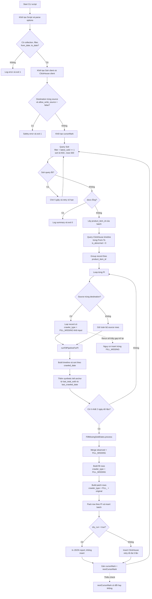
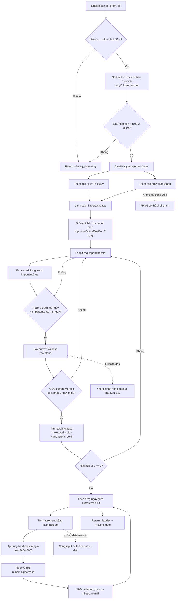
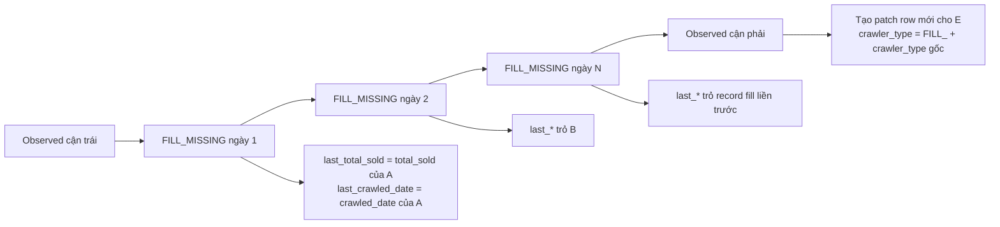
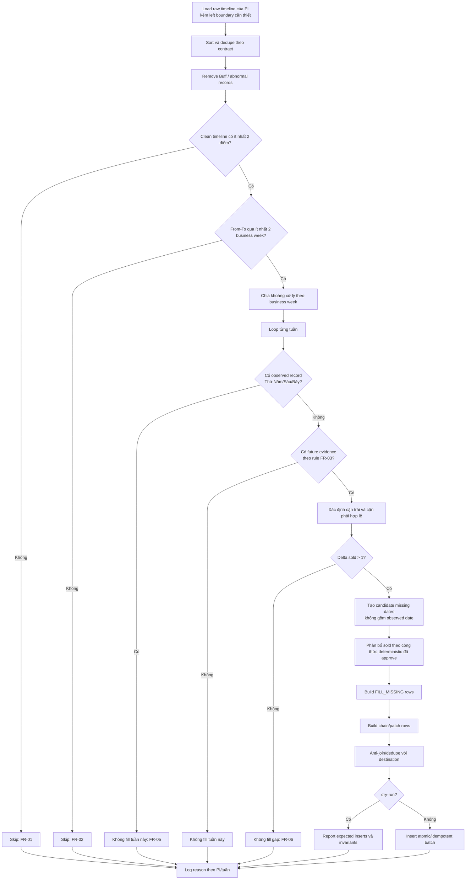

# CODE REVIEW & BUSINESS COMPLIANCE ASSESSMENT
## YNMPECA-9338 — Migrate ECA PI Missing Dates sang ClickHouse

| Thuộc tính | Nội dung |
|---|---|
| Mã tài liệu | CR-YNMPECA-9338-v1.0 |
| Ngày review | 14/08/2026 |
| Vai trò review | Senior Software Architect / Senior QA Architect |
| Loại review | Static Code Review, Business Rule Traceability, Data Integrity & Operational Risk Review |
| Jira | [YNMPECA-9338 — Thay đổi phương án rải số ở ClickHouse](https://jira.younetco.com/browse/YNMPECA-9338) |
| Technical Wiki | [[ECI][Clickhouse] - Fill missing date](https://wiki.younetco.com/display/FB/%5BECI%5D%5BClickhouse%5D+-+Fill+missing+date) |
| Test Plan | [TestPlan_YNMPECA-9338_Change_Number_Distribution_Method.md](./TestPlan_YNMPECA-9338_Change_Number_Distribution_Method.md) |
| File chính | `/Users/tranthanhlam/data-migrate/scripts/solrmaster/migrate_ECA_PI_missing_dates_clickhouse.js` |
| Kết luận | **BLOCK — Chưa đáp ứng đầy đủ business requirement, chưa nên chạy Production** |

> Tài liệu này tổng hợp kết quả review read-only. Không có source code nào được chỉnh sửa trong quá trình review.

---

## 1. EXECUTIVE SUMMARY

Script đã xây dựng được khung xử lý chính mà Jira yêu cầu:

1. Duyệt Product Item từ Solr.
2. Đọc lịch sử của từng PI từ ClickHouse.
3. Xác định ngày thiếu và sinh record `FILL_MISSING`.
4. Tạo thêm patch row để nối lại `last_total_sold` và `last_crawled_date`.
5. Ghi kết quả theo batch vào ClickHouse.

Tuy nhiên, code hiện tại **chưa thể được xem là business-compliant** vì có các lỗi/rủi ro trọng yếu:

- Khoảng `From–To` nằm trong cùng một tuần vẫn có thể bị fill khi đi qua ngày cuối tháng, vi phạm FR-02.
- Tuần đã có observed record vào Thứ Năm, Thứ Sáu hoặc Thứ Bảy vẫn có thể bị fill, vi phạm FR-05.
- Không có cơ chế idempotency; chạy lại có thể sinh duplicate `FILL_MISSING`.
- Vòng lặp Solr không dừng khi `nextCursorMark` không đổi, có nguy cơ xử lý lặp trang cuối.
- Công thức phân bổ sử dụng `Math.random()`, khiến cùng input cho output khác nhau.
- Có rule mega-sale hard-code cho các ngày năm 2024–2025 nhưng không có trong Jira/Wiki.
- Không thấy bước Remove Buff độc lập; code chỉ lọc `is_abnormal = 0`.
- Bộ offline test hiện tại chủ yếu in log, không phải automated assertion suite đủ khả năng chặn regression.

### Release recommendation

**Không sign-off và không chạy migration trên Production** trước khi xử lý các finding Critical/High và chốt các điểm `Need Confirm` với BA/Dev.

---

## 2. NGUỒN REQUIREMENT VÀ NGUYÊN TẮC ĐÁNH GIÁ

### 2.1 Mục tiêu từ Jira

Phương án cũ sử dụng `sold_history` trên Solr. Sau khi lịch sử sold của Product Item được chuyển sang ClickHouse, hệ thống cần script adhoc tương đương để:

- Đọc lịch sử PI từ ClickHouse.
- Xử lý các khoảng bị miss crawl hoặc crawler bị block.
- Sinh dữ liệu cho ngày thiếu thay cho phương án dựa trên Solr.

Jira chỉ mô tả mục tiêu tổng quan. Business rule chi tiết được lấy từ Technical Wiki.

### 2.2 Business rule chính thức từ Technical Wiki

| Rule ID | Business rule |
|---|---|
| FR-01 | Phải có ít nhất 2 điểm dữ liệu. |
| FR-02 | `From` và `To` phải đi qua tối thiểu 2 tuần. |
| FR-03 | Muốn fill dữ liệu của một tuần phải có dữ liệu của tuần sau đó. |
| FR-04 | Tuần đầu tiên chỉ fill từ điểm cận trái: điểm đầu tiên có dữ liệu trong tuần hoặc điểm gần nhất trước đó. |
| FR-05 | Nếu tuần đã có dữ liệu vào ngày cuối tuần thì không fill nữa. Ngày cuối tuần ECI được định nghĩa là Thứ Năm, Thứ Sáu, Thứ Bảy. |
| FR-06 | Giữa hai điểm dữ liệu phải có tăng trưởng sold `> 1`. |
| OR-01 | Record được rải không chứa dữ liệu buff. |
| OR-02 | Record được rải có `crawler_type = FILL_MISSING`. |
| OR-03 | Sau khi rải, các record phải được liên kết theo thứ tự thời gian để chuỗi lịch sử liên tục. |

### 2.3 Những nội dung Wiki chưa quy định đủ

Các nội dung sau không được tự xem là Acceptance Criteria nếu chưa được BA/Dev xác nhận:

- Công thức chia sold cho từng ngày.
- Cách rounding và phân bổ remainder.
- Có bắt buộc parity 100% với script Solr cũ hay không.
- Giá/metadata được copy từ cận trái, cận phải hay rule khác.
- Buff có hoàn toàn tương đương với `is_abnormal = 1` hay không.
- Cơ chế merge patch row vào source table.
- Natural key/idempotency key chính thức của record fill.

Vì vậy, review tách riêng:

- **Violation:** code cho kết quả trái trực tiếp với rule đã ghi rõ.
- **Need Confirm:** code có behavior nhưng requirement chưa chốt đủ để kết luận pass/fail.
- **Technical Risk:** có khả năng gây duplicate, loop vô hạn, partial write hoặc khó rollback.

### 2.4 Glossary — Giải thích thuật ngữ dùng trong tài liệu

| Thuật ngữ | Giải thích đơn giản | Ví dụ/cách nhận biết | Vì sao QA/Dev cần quan tâm? |
|---|---|---|---|
| Product Item / PI / PID | Một sản phẩm cụ thể trên một sàn thương mại điện tử. Trong code, PI được nhận diện bằng `product_item_id`. | `shopee_25862172801` | Mọi record trong timeline, record fill và patch row phải thuộc đúng PI; không được trộn dữ liệu giữa hai sản phẩm. |
| Solr | Search engine đang lưu danh sách Product Item và các field tìm kiếm nhanh. Script dùng Solr để tìm PI cần xử lý, không dùng Solr làm nguồn lịch sử sold mới. | Query `collection`, `filter`, `latest_sold`, `shard`. | Nếu filter hoặc cursor sai, một số PI sẽ bị bỏ sót hoặc xử lý lặp. |
| ClickHouse | Database dạng column-oriented dùng để lưu và phân tích lượng lịch sử rất lớn. Đây là nguồn timeline mới và cũng là nơi nhận kết quả migration. | Bảng `product_item_histories_distributed`. | Cần kiểm tra đúng database/table, date range, table engine và cách dedupe/merge. |
| Observed record / record gốc | Record crawler thu thập thật tại một thời điểm. Nó phản ánh dữ liệu hệ thống quan sát được, không phải dữ liệu suy đoán. | Ngày 01/02 crawler thấy `total_sold=100`. | Record gốc không được sửa/xóa ngoài cơ chế patch đã được phê duyệt. |
| Timeline | Danh sách các record của một PI được xếp tăng dần theo `crawled_date`. | `01/02:100 → 10/02:120`. | Dùng để tìm ngày bị thiếu, điểm trước/sau và nối chain. |
| `crawled_date` | Thời điểm crawler tạo record. Đây là timestamp, không chỉ là một ngày lịch. | `2026-02-01 08:15:00.000`. | Một ngày có thể có nhiều lần crawl; timezone và thứ tự timestamp ảnh hưởng chain. |
| Calendar day | Ngày lịch được suy ra từ `crawled_date`, theo timezone hệ thống. | Timestamp trên được quy về `20260201`. | Business đang fill theo ngày, trong khi database có thể có nhiều timestamp trong cùng ngày. |
| Missing date / gap | Ngày không có observed record nằm giữa hai điểm dữ liệu hợp lệ. | Có record 01/02 và 10/02 thì 02/02–09/02 là gap. | Chỉ những ngày đủ toàn bộ điều kiện FR-01…FR-06 mới được sinh record. |
| Fill / backfill / rải số | Tạo record kỹ thuật cho missing date và ước lượng `total_sold` của ngày đó. | Tạo record ngày 02/02, 03/02… với `crawler_type=FILL_MISSING`. | Đây là dữ liệu suy ra, nên phải trace được công thức và không được làm sai tổng. |
| Milestone / điểm dữ liệu | Một điểm trên timeline được core dùng làm mốc tính toán. | Observed record ngày 01/02 hoặc 10/02. | Hai milestone tạo thành cận trái/cận phải của một khoảng fill. |
| Cận trái / left anchor | Điểm dữ liệu hợp lệ gần nhất đứng trước khoảng cần fill. | 01/02 sold 100 là cận trái cho gap 02/02–09/02. | Ngày fill đầu tiên phải đứng sau cận trái; sold fill phải nối tiếp cận trái. |
| Cận phải / right anchor | Điểm dữ liệu hợp lệ đứng sau khoảng thiếu. | 10/02 sold 120 là cận phải. | Chứng minh có future evidence và tạo giới hạn trên cho sold được phân bổ. |
| Synthetic left anchor | Cận trái do code dựng lại từ `last_total_sold` và `last_crawled_date`, không phải raw row được query trực tiếp. | Row đầu range có `last_crawled_date=31/01`; code dựng một mốc 31/01. | Nếu `last_*` sai, trỏ buff hoặc thiếu metadata thì toàn bộ gap có thể được tính sai. |
| Future evidence / dữ liệu tuần sau | Dữ liệu tương lai đủ để chứng minh tuần đang xét có thể fill. | Có dữ liệu 10/02 thì có thể xem xét fill tuần trước đó. | Không có dữ liệu tương lai thì không biết sold đã tăng bao nhiêu, vì vậy không được tự suy đoán. |
| Business week | Cách nghiệp vụ chia ngày thành tuần. Wiki chưa nói rõ tuần bắt đầu Chủ Nhật hay Thứ Hai. | Nếu tuần Chủ Nhật–Thứ Bảy thì 01/02/2026–07/02/2026 là một tuần. | Phải chốt để kiểm tra FR-02, FR-03 và FR-05 chính xác. |
| Ngày cuối tuần ECI | Định nghĩa riêng của Wiki: Thứ Năm, Thứ Sáu, Thứ Bảy. Không đồng nghĩa với weekend thông thường. | Có observed record Thứ Sáu 13/02. | Tuần đã có một trong ba ngày này thì không được fill thêm cho tuần đó. |
| `total_sold` | Tổng số sản phẩm đã bán tích lũy tại thời điểm crawl. | 01/02 là 100; 10/02 là 120. | Giá trị phải không giảm trên timeline hợp lệ và không vượt cận phải. |
| Delta sold / `totalIncrease` | Chênh lệch total sold giữa hai mốc. | `120 - 100 = 20`. | FR-06 chỉ cho fill khi delta `> 1`; tổng phần phân bổ phải bảo toàn delta. |
| Daily increment | Số sold được phân cho riêng một bước/ngày. | Nếu từ 100 lên 103 thì increment của bước đó là 3. | Đây là phần chịu ảnh hưởng của rounding, remainder và công thức phân bổ. |
| Cumulative sold | Chuỗi sold tích lũy. Mỗi record chứa tổng đến thời điểm đó, không chỉ lượng bán riêng trong ngày. | `100 → 102 → 105 → 120`. | Không được cộng tất cả `total_sold` như daily sold; cần dùng chênh lệch giữa các record. |
| Rounding | Làm tròn kết quả phân bổ khi delta không chia hết cho số bước. | `10 / 4 = 2.5`. | Làm tròn sai có thể làm mất hoặc tự sinh thêm sold. |
| Remainder | Phần sold còn dư sau khi làm tròn các ngày trước. | Chia 10 cho 4 bước cần phân phần dư để tổng cuối vẫn là 10. | Phải có rule deterministic để lần chạy sau cho cùng kết quả. |
| Deterministic | Cùng input và cùng version code luôn tạo đúng cùng một output. | Chạy 5 lần đều có sold ngày 02/02 giống nhau. | Bắt buộc để retry, audit, parity và idempotency an toàn. |
| Buff data | Dữ liệu sold tăng bất thường hoặc không phản ánh bán thật, cần bị loại trước khi chọn cận. | Một record tăng vọt rồi giảm trở lại. | Nếu dùng buff làm cận, toàn bộ sold fill sẽ bị phóng đại hoặc sai chiều. |
| `is_abnormal` | Flag kỹ thuật trên ClickHouse cho biết record bất thường theo một rule nào đó. | Query hiện lọc `is_abnormal=0`. | Chưa có bằng chứng `is_abnormal` bao phủ toàn bộ khái niệm buff trong Wiki. |
| `FILL_MISSING` | Giá trị `crawler_type` đánh dấu record do script sinh cho ngày thiếu. | `crawler_type="FILL_MISSING"`. | Cho phép phân biệt dữ liệu thật và dữ liệu suy ra, kiểm tra duplicate và rollback. |
| Patch row | Bản sao của observed record được insert thêm với `last_*` mới để nối lại chain. Đây không phải missing-date row. | `crawler_type=FILL_PI_BY_SHOP` hoặc `FILL_CRAWLER`. | Cần table engine/merge rule chọn đúng version patch mà không làm mất record gốc. |
| Chain / link series | Quan hệ record hiện tại trỏ về record liền trước bằng `last_total_sold` và `last_crawled_date`. | Record 03/02 trỏ record 02/02. | Chain sai làm delta sold hoặc GMV bị tính lại, bỏ sót hoặc double-count. |
| Append-only | Chỉ insert record mới, không update/delete vật lý record gốc. | Thêm fill row và patch row. | Append-only không tự động đồng nghĩa với không duplicate; vẫn cần merge/idempotency contract. |
| Idempotency | Chạy lại cùng input không làm thay đổi kết quả và không sinh thêm bản ghi. | Count `FILL_MISSING` lần 2 bằng lần 1. | Quan trọng khi job retry, chạy overlap range hoặc operator trigger nhầm. |
| Natural key | Tập field xác định duy nhất một record nghiệp vụ. | Có thể là `product_item_id + fill_date + crawler_type`, nhưng cần Dev chốt. | Dùng để chống insert trùng và đối soát output. |
| Cursor / `cursorMark` | Con trỏ phân trang của Solr. Mỗi response trả `nextCursorMark` để lấy trang kế tiếp. | Trang 1 cursor `*`, trang sau cursor `AoE...`. | Khi next cursor bằng current cursor, job phải dừng để không xử lý lặp trang cuối. |
| Batch | Nhóm PI hoặc rows được xử lý/insert trong một lần gọi. | 500 PI từ Solr; tối đa 10.000 rows cho ClickHouse insert. | Batch giúp hiệu năng nhưng cần xử lý partial failure và retry đúng. |
| Dry-run | Chạy toàn bộ logic và in kết quả dự kiến nhưng không insert ClickHouse. | `--dry_run=1`. | QA dùng để kiểm tra PID, ngày fill, sold và row count trước khi write thật. |
| Source table | Bảng ClickHouse được đọc để lấy timeline. | `product_item_histories_distributed`. | Source sai sẽ làm timeline thiếu hoặc lấy nhầm môi trường. |
| Destination table | Bảng nhận fill row và patch row. Có thể trùng hoặc khác source. | `product_item_histories_fill_missing_tmp`. | Hai mode này có hành vi rerun/dedupe khác nhau và đều phải được test. |
| Table engine / merge semantics | Cách ClickHouse lưu nhiều row cùng key và chọn version cuối khi query/merge. | ReplacingMergeTree hoặc rule tương đương, cần Dev xác nhận. | Quyết định patch row có thật sự thay observed version đúng cách hay tạo duplicate nhìn thấy được. |
| Data conservation | Tổng sold không tự tăng/giảm chỉ vì thêm các record trung gian. | Chênh lệch từ cận trái đến cận phải vẫn bằng 20. | Đây là invariant quan trọng dù công thức chia từng ngày chưa được chốt. |
| Partial write | Một phần batch đã insert nhưng phần sau thất bại. | Batch 1 thành công, batch 2 timeout. | Retry không idempotent có thể nhân đôi phần đã ghi thành công. |

### 2.5 Ví dụ xuyên suốt — “Rải số” thực sự đang làm gì?

Giả sử ClickHouse có hai observed record của cùng một PI:

| Ngày | Loại record | `total_sold` | Ý nghĩa |
|---|---|---:|---|
| 01/02/2026 | Observed | 100 | Crawler thật sự nhìn thấy tổng sold là 100. |
| 10/02/2026 | Observed | 120 | Crawler hoạt động lại và thấy tổng sold là 120. |

Các ngày 02/02–09/02 không có dữ liệu. Hệ thống chỉ biết trong toàn khoảng này sold tăng tổng cộng:

```text
totalIncrease = 120 - 100 = 20
```

Script cần thực hiện hai việc khác nhau:

1. **Xác định có được phép fill hay không.** Đây là eligibility và phải tuân thủ FR-01…FR-06.
2. **Nếu được fill, chia 20 sold cho các bước thời gian như thế nào.** Đây là distribution formula và Wiki chưa mô tả đủ.

Một timeline sau fill có thể trông như sau, chỉ để giải thích cấu trúc chứ không khẳng định công thức:

| Ngày | Loại | `total_sold` minh họa | `last_total_sold` | `last_crawled_date` trỏ tới |
|---|---|---:|---:|---|
| 01/02 | Observed | 100 | — | — |
| 02/02 | `FILL_MISSING` | 102 | 100 | 01/02 |
| 03/02 | `FILL_MISSING` | 105 | 102 | 02/02 |
| … | … | … | … | … |
| 09/02 | `FILL_MISSING` | 118 | Record fill trước | 08/02 |
| 10/02 | Observed/Patch | 120 | 118 | 09/02 |

Ba invariant dễ hiểu nhất:

- Không tạo record cho 01/02 hoặc 10/02 vì hai ngày đó đã có dữ liệu thật.
- Chuỗi `total_sold` không được giảm: `100 ≤ 102 ≤ 105 ≤ … ≤ 118 ≤ 120`.
- Tổng tăng từ record đầu đến record cuối vẫn là 20; việc chèn record trung gian không được làm tổng sold biến thành giá trị khác.

---

## 3. PHẠM VI CODE ĐƯỢC REVIEW

| Thành phần | Vai trò |
|---|---|
| `scripts/solrmaster/migrate_ECA_PI_missing_dates_clickhouse.js` | Orchestration: parse CLI, duyệt Solr, query ClickHouse, xử lý từng PI, build row và insert. |
| `libs/ECA/fillMissingSoldDates.js` | Core business logic: xác định gap và phân bổ `total_sold` cho ngày thiếu. |
| `libs/DateUtils.js` | Xác định ngày quan trọng, tuần, tháng và chuyển đổi timezone/date. |
| `scripts/solrmaster/migrate_ECA_PI_missing_dates_clickhouse.test.js` | Offline test/debug harness cho pipeline ClickHouse. |
| `libs/ECA/fillMissingSoldDates.test.js` | Test/debug harness cho core fill logic. |

Không review toàn bộ ClickHouse cluster, schema replication, weekly/monthly downstream hoặc deployment manifest vì nằm ngoài scope thay đổi phương án rải số.

---

## 4. KIẾN TRÚC VÀ FLOW CODE HIỆN TẠI

### Trước khi đọc flow

Các sơ đồ dưới đây mô tả **code đang chạy như thế nào**, không phải toàn bộ flow đúng mong muốn của business.

Quy ước khi đọc sơ đồ:

- Hình chữ nhật: một hành động hoặc một hàm đang chạy.
- Hình thoi: một câu hỏi/điều kiện làm flow rẽ nhánh.
- Mũi tên liền: flow xử lý bình thường.
- Mũi tên nét đứt: điểm rủi ro hoặc hành vi cần chú ý.
- Nhánh “Không” không phải lúc nào cũng là lỗi; nhiều trường hợp là skip đúng nghiệp vụ.

Có thể hiểu toàn bộ script theo bốn tầng:

| Tầng | Câu hỏi mà tầng đó trả lời | Thành phần chính |
|---|---|---|
| Tầng 1 — Chọn PI | Những sản phẩm nào cần được xem xét? | Solr query, filter, shard, cursorMark. |
| Tầng 2 — Lấy timeline | Mỗi PI có các điểm sold nào trong ClickHouse? | `loadTimelines()`, group theo `product_item_id`, sort timestamp. |
| Tầng 3 — Quyết định và rải | PI/gap này có được fill không và sold mỗi ngày là bao nhiêu? | `runFillPipelineForPi()`, `FillMissingSoldDates.process()`. |
| Tầng 4 — Ghi và nối chain | Những row nào được insert và record sau gap trỏ về đâu? | `buildFillRows()`, `buildLastUpdatePatchRows()`, batching và insert. |

#### Diễn giải từng bước từ lúc chạy lệnh đến lúc kết thúc

| Bước | Code/hàm chính | Input | Code thực hiện | Output hoặc điều kiện dừng | Cách hiểu đơn giản |
|---:|---|---|---|---|---|
| 1 | `constructor()` | CLI options | Đọc collection, filter, From/To, source, destination, dry-run và batch size. | Script config. Thiếu parameter bắt buộc thì exit. | Chuẩn bị “phiếu yêu cầu” cho lần migration. |
| 2 | Safety check | Source/destination | Nếu ghi thẳng source nhưng chưa bật `allow_write_source`, script dừng. | Exit hoặc tiếp tục. | Tránh ghi nhầm vào bảng dữ liệu thật. |
| 3 | `getMentions()` | Solr filter, shard, cursor | Query tối đa 500 PI có `latest_sold >= 1`, sort `id ASC`. | Một trang danh sách PI và `nextCursorMark`. | Lấy danh sách sản phẩm cần xem xét, chưa rải gì ở bước này. |
| 4 | `searchSolr()` | Solr query | Nếu lỗi thì chờ 5 giây và gọi lại cùng query. | Solr response. | Retry đọc danh sách PI; hiện chưa có giới hạn retry. |
| 5 | `loadTimelines()` | Batch product item IDs, From/To | Query toàn bộ rows của batch trong range và lọc `is_abnormal=0`. | `Map<PI, rows[]>`. | Lấy lịch sử sold của từng sản phẩm từ ClickHouse. |
| 6 | Group + sort | Raw ClickHouse rows | Tách riêng timeline từng PI và sort tăng dần theo `crawled_date`. | Timeline độc lập cho từng PI. | Không được dùng record PI-B làm mốc cho PI-A. |
| 7 | Lọc fill cũ | Timeline và mode destination | Nếu source=destination, loại row có `crawler_type=FILL_MISSING` khỏi input. | Timeline dùng để tính lại. | Đây là nguyên nhân rerun có thể nhìn thấy gap cũ và sinh lại row. |
| 8 | `dedupeRowsByUpdatedDate()` | Timeline một PI | Nếu hai row có chính xác cùng `crawled_date`, giữ row có `updated_date` mới hơn. | Timeline đã dedupe exact timestamp. | Không phải dedupe theo calendar day; hai crawl khác giờ cùng ngày vẫn được giữ. |
| 9 | `buildFullTimelineHistories()` | Rows đã dedupe | Chuyển field database thành object đơn giản: date, sold, price, raw row. | Full timeline. | Chuẩn hóa dữ liệu cho core fill. |
| 10 | `prependLeftAnchorToFullTimeline()` | Full timeline và row đầu | Nếu row đầu có `last_*` trước ngày đầu, dựng một synthetic left anchor. | Timeline có thể có thêm cận trái. | Dùng “dấu vết record trước” thay cho query trực tiếp record trước From. |
| 11 | Kiểm tra số ngày | Timeline | Đếm số calendar day khác nhau. | Dưới 2 ngày thì skip PI. | Hai crawl cùng một ngày chưa đủ tạo khoảng fill theo ngày. |
| 12 | `filterHistoriesByRange()` | Timeline, From/To | Chọn lịch sử trong range và giữ lower anchor phù hợp. | Filtered histories. | Giữ điểm trước gap để biết bắt đầu sold từ đâu. |
| 13 | `getImportantDates()` | From/To | Sinh danh sách mọi Thứ Bảy và mọi ngày cuối tháng. | `importantDates`. | Đây là các mốc code dùng để quyết định lúc nào xem xét gap; ngày cuối tháng không có trong Wiki. |
| 14 | `fillMissingByDatePoint()` | Một important date và timeline | Tìm record đứng trước important date; nếu quá cũ thì gọi fill gap. | Skip hoặc chuyển sang distribution. | Code dùng phép so sánh `importantDate - 2 ngày` để gần tương ứng Thứ Năm. |
| 15 | `fillMissingDates()` | Current, next milestone | Kiểm tra có ngày trống và `next.sold-current.sold >= 2`. | Danh sách missing dates hoặc rỗng. | Đây là nơi enforce delta sold; nhưng chưa enforce đúng FR-02/FR-05. |
| 16 | Distribution loop | Delta và số ngày | Dùng `Math.random()`, floor, remainder và mega-sale hard-code để tạo cumulative sold mỗi ngày. | Chuỗi `date_sold_price`. | Cùng input hiện có thể ra chuỗi sold khác nhau. |
| 17 | Merge timeline | Observed + generated dates | Chèn các fill point vào đúng thứ tự thời gian. | Timeline sau fill. | Tạo nền để tính `last_*` của từng row. |
| 18 | `buildFillRows()` | Missing dates và merged timeline | Tạo row mới với `crawler_type=FILL_MISSING`, sold, price, metadata và `last_*`. | Fill rows. | Đây là các record đại diện cho ngày bị miss crawl. |
| 19 | `buildLastUpdatePatchRows()` | Merged timeline | Với observed row có predecessor thay đổi sau fill, tạo bản sao chứa `last_*` mới. | Patch rows. | Không update trực tiếp row gốc; insert thêm version để downstream merge. |
| 20 | Pack by PI | Fill + patch rows | Gom nhiều PI vào batch nhưng không cắt rows của một PI sang hai batch. | Insert batches. | Giảm số lần gọi ClickHouse và giữ một PI trong cùng batch. |
| 21 | Dry-run hoặc insert | Batch rows | Dry-run thì in JSON; write mode thì insert và retry tối đa 5 lần. | Report hoặc dữ liệu mới trong ClickHouse. | QA nên luôn đọc dry-run trước khi bật ghi thật. |
| 22 | Cursor loop | `nextCursorMark` | Gán cursor mới rồi quay lại query Solr. | Trang tiếp theo hoặc kết thúc khi docs rỗng. | Code đang thiếu check cursor không đổi nên có nguy cơ lặp trang cuối. |

### 4.1 Flow end-to-end của script



### 4.2 Flow core `FillMissingSoldDates.process()`



### 4.3 Flow build output và nối chain



Observed record không bị update trực tiếp trong code. Script tạo một bản ghi patch có cùng `crawled_date` để cơ chế merge downstream chọn phiên bản mới. Cơ chế này chỉ đúng nếu ClickHouse table engine/order key/version column xử lý patch theo đúng thiết kế; Wiki chưa mô tả chi tiết nên cần Dev cung cấp evidence.

### 4.4 Walkthrough một PI — Theo dấu dữ liệu qua từng hàm

Ví dụ này dùng input từ Wiki:

```json
{
  "product_item_id": "pi_example_001",
  "from_date": "20260201",
  "to_date": "20260216",
  "observed_timeline": [
    {
      "crawled_date": "2026-02-01 08:00:00.000",
      "total_sold": 100,
      "sell_price": 50000
    },
    {
      "crawled_date": "2026-02-10 09:00:00.000",
      "total_sold": 120,
      "sell_price": 52000
    }
  ]
}
```

#### Bước A — Solr chỉ chọn PI

Solr trả về:

```json
{"id": "pi_example_001"}
```

Ở đây Solr chưa cung cấp timeline và chưa quyết định ngày fill. Nó chỉ nói: “hãy xử lý PI này”.

#### Bước B — ClickHouse trả timeline gốc

`loadTimelines()` lấy hai observed record ngày 01/02 và 10/02, sau đó group vào:

```text
timelinesMap["pi_example_001"] = [row_01_02, row_10_02]
```

#### Bước C — Chuyển sang object mà core fill hiểu

`buildFullTimelineHistories()` tạo:

```json
[
  {
    "date": "20260201",
    "sold_total": 100,
    "sell_price": 50000,
    "isFillMissing": false
  },
  {
    "date": "20260210",
    "sold_total": 120,
    "sell_price": 52000,
    "isFillMissing": false
  }
]
```

#### Bước D — Core xác định gap

Giữa 01/02 và 10/02 có tám calendar day không có observed record:

```text
02/02, 03/02, 04/02, 05/02,
06/02, 07/02, 08/02, 09/02
```

Delta sold:

```text
120 - 100 = 20 > 1
```

Với ví dụ này, code hiện tạo đúng tập tám ngày mà Wiki mô tả.

#### Bước E — Core phân bổ sold

Core chạy vòng lặp cho từng ngày, tạo chuỗi dạng:

```text
YYYYMMDD_total_sold_sell_price_price
```

Ví dụ minh họa:

```text
20260202_102_52000_52000
20260203_105_52000_52000
...
20260209_118_52000_52000
```

Lưu ý: các con số 102, 105 và 118 ở trên chỉ giải thích format. Actual code dùng `Math.random()`, vì vậy giá trị thật có thể thay đổi giữa các lần chạy.

#### Bước F — Build fill rows

`buildFillRows()` chuyển từng string thành ClickHouse row:

```json
{
  "crawled_date": "2026-02-02 00:00:00.000",
  "product_item_id": "pi_example_001",
  "crawler_type": "FILL_MISSING",
  "total_sold": 102,
  "last_total_sold": 100,
  "last_crawled_date": "2026-02-01 08:00:00.000",
  "sell_price": 52000,
  "is_abnormal": false
}
```

Record ngày 03/02 phải trỏ ngày 02/02, ngày 04/02 phải trỏ ngày 03/02 và tiếp tục như vậy.

#### Bước G — Patch observed record cận phải

Observed record ngày 10/02 ban đầu có thể đang trỏ trực tiếp về ngày 01/02. Sau khi có fill rows, predecessor đúng của nó phải là record fill ngày 09/02.

Code không update record 10/02. Thay vào đó, `buildLastUpdatePatchRows()` tạo thêm một patch row:

```json
{
  "crawled_date": "2026-02-10 09:00:00.000",
  "product_item_id": "pi_example_001",
  "crawler_type": "FILL_<crawler_type_gốc>",
  "total_sold": 120,
  "last_total_sold": 118,
  "last_crawled_date": "2026-02-09 00:00:00.000"
}
```

ClickHouse/downstream phải chọn patch row này làm version hiệu lực. Nếu table engine không làm đúng như giả định, query có thể nhìn thấy cả observed row cũ và patch row mới.

#### Bước H — Insert và rerun risk

Lần đầu, script insert:

```text
8 FILL_MISSING rows + các patch rows cần thiết
```

Khi chạy lại, code không kiểm tra natural key ở destination. Vì vậy tám ngày này có thể bị sinh và insert thêm lần nữa. Đây là lý do F-03 được đánh giá Critical.

### 4.5 Phân biệt ba loại “không xử lý” trong flow

Người đọc log cần phân biệt ba trạng thái sau:

| Trạng thái | Ý nghĩa | Ví dụ | Kết quả mong đợi |
|---|---|---|---|
| Skip đúng nghiệp vụ | Input hợp lệ nhưng không đạt điều kiện fill. | Chỉ có một điểm; delta=1; tuần đã có Thứ Sáu. | Không insert, log rõ reason, job vẫn tiếp tục PI khác. |
| Input/data invalid | Dữ liệu không đủ tin cậy để tính. | `total_sold=null`, ngày sai format, chain `last_*` hỏng. | Reject hoặc skip có cảnh báo; tuyệt đối không tự đổi null thành sold 0 rồi fill. |
| Technical failure | Hệ thống ngoài hoặc thao tác I/O lỗi. | Solr timeout, ClickHouse insert fail. | Retry có giới hạn hoặc fail job; không báo success và không nhân đôi phần đã ghi. |

### 4.6 Dữ liệu thay đổi ở đâu và không được thay đổi ở đâu?

| Loại dữ liệu | Script có được thay đổi không? | Code hiện tại làm gì? | Điểm phải verify |
|---|---|---|---|
| Solr Product Item | Không | Chỉ đọc `id`. | Không có update/delete Solr. |
| ClickHouse observed row gốc | Không update/delete trực tiếp | Đọc row và có thể sinh patch row cùng `crawled_date`. | Snapshot observed trước/sau; xác nhận merge semantics. |
| Missing date | Có thể thêm nếu đạt toàn bộ rule | Sinh `FILL_MISSING`. | Đúng tập ngày, đúng PI, không trùng. |
| Chain fields của fill row | Có | Gán từ predecessor trong merged timeline. | `last_*` trỏ đúng record ngay trước. |
| Chain fields của observed cận phải | Chỉ qua cơ chế patch đã approve | Sinh `FILL_{original}` row. | Query downstream phải thấy version chain mới, không double-count. |
| Tổng sold tại hai cận | Không | Copy lại trong fill/patch calculation. | Cận trái/cận phải giữ nguyên, data conservation đúng. |

---

## 5. REQUIREMENT TRACEABILITY MATRIX

| Rule | Status | Code evidence | Đánh giá |
|---|---|---|---|
| FR-01 — Có ít nhất 2 điểm dữ liệu | **PASS** | `runFillPipelineForPi()` kiểm tra ít nhất 2 calendar day; core cũng kiểm tra ít nhất 2 history. | Không fill khi timeline có 0 hoặc 1 ngày dữ liệu. |
| FR-02 — From-To qua ít nhất 2 tuần | **FAIL** | Không có check số tuần. `getImportantDates()` thêm cả ngày cuối tháng. | Range cùng tuần có thể bị fill nếu đi qua cuối tháng. |
| FR-03 — Có dữ liệu tuần sau | **PARTIAL PASS** | Core chỉ fill khi có `next` milestone. Hai ví dụ Wiki 01/02→10/02 và 01/02→18/02 cho tập ngày đúng. | Cần test thêm biên future record ngoài `To`, vì query hiện chỉ đọc đến `To`. |
| FR-04 — Tuần đầu fill từ cận trái | **PARTIAL PASS** | Có synthetic anchor từ `last_total_sold` và `last_crawled_date` của row đầu tiên. | Không query trực tiếp record trước `From`; phụ thuộc chain `last_*` chính xác và đã remove buff. |
| FR-05 — Không fill tuần có Thứ Năm/Sáu/Bảy | **FAIL** | Core kiểm tra mốc `importantDate - 2 ngày` nhưng sau đó fill toàn bộ `current → next`. | Reproduce với record Thứ Sáu 13/02 cho thấy code vẫn fill 08/02–12/02. |
| FR-06 — Sold tăng > 1 | **PASS với sold nguyên** | `totalIncrease >= 2`. | Tương đương `> 1` nếu `total_sold` là Int32 và rule nói về delta. |
| OR-01 — Fill không chứa buff | **NEED CONFIRM** | Query chỉ có `is_abnormal = 0`. | Chưa có bằng chứng buff hoàn toàn tương đương abnormal. |
| OR-02 — `crawler_type=FILL_MISSING` | **PASS** | `buildFillRows()` gán trực tiếp `FILL_MISSING`. | Đúng cho fill row. Patch row dùng crawler type khác theo thiết kế riêng. |
| OR-03 — Nối chain lịch sử | **PARTIAL PASS** | Có build `last_total_sold`, `last_crawled_date` và patch observed row phía sau. | Cần Integration Test trên table engine và query downstream. |
| Append-only | **PARTIAL / NEED CONFIRM** | Code insert fill + patch, không gọi update/delete. | Patch trùng `crawled_date` chỉ an toàn nếu merge semantics được xác nhận. |
| Idempotency/no duplicate | **FAIL** | Không query hoặc anti-join record fill đã tồn tại trước insert. | Rerun hoặc cursor lặp có thể insert trùng. |

---

## 6. FINDINGS CHI TIẾT

### F-01 — Critical — Vi phạm FR-02 tại range cùng tuần đi qua cuối tháng

**Requirement**

`From` và `To` phải đi qua tối thiểu 2 tuần. Range nằm trong cùng một tuần phải skip.

**Code behavior**

`DateUtils.getImportantDates()` thêm:

- Mọi ngày Thứ Bảy.
- Mọi ngày cuối tháng.

Core không kiểm tra trực tiếp số tuần. Chỉ cần có một `importantDate`, có hai mốc và delta đủ lớn thì có thể fill.

**Reproduce đã chạy**

```json
{
  "from": "20260427",
  "to": "20260501",
  "timeline": [
    {"date": "20260427", "sold_total": 100},
    {"date": "20260501", "sold_total": 110}
  ]
}
```

27/04/2026 là Thứ Hai và 01/05/2026 là Thứ Sáu của cùng một tuần.

**Expected**

```text
missing_date = []
```

**Actual**

```text
20260428
20260429
20260430
```

**Impact**

- Over-fill dữ liệu trái business rule.
- Weekly/monthly calculation có thể ghi nhận dữ liệu nhân tạo ngoài eligibility.
- Không thể QA sign-off chỉ bằng happy path trong Wiki.

**Recommendation**

- Tách hàm kiểm tra `rangeCrossesAtLeastTwoBusinessWeeks(from, to)`.
- Chốt định nghĩa business week và timezone với BA/Dev.
- Không sử dụng ngày cuối tháng như một điều kiện thay thế cho rule hai tuần nếu chưa có requirement.

---

### F-02 — Critical — Vi phạm FR-05: fill tuần đã có record Thứ Năm/Sáu/Bảy

**Requirement**

Nếu tuần đã có observed record vào Thứ Năm, Thứ Sáu hoặc Thứ Bảy thì không fill thêm cho tuần đó.

**Reproduce theo đúng ví dụ Wiki**

```json
{
  "from": "20260201",
  "to": "20260216",
  "timeline": [
    {"date": "20260201", "sold_total": 100},
    {"date": "20260213", "sold_total": 120}
  ]
}
```

13/02/2026 là Thứ Sáu.

**Actual**

Code sinh 11 ngày:

```text
20260202 → 20260212
```

Trong đó `08/02 → 12/02` thuộc tuần đã có observed record Thứ Sáu 13/02 nên không được fill.

**Root cause**

`fillMissingByDatePoint()` chỉ kiểm tra record đứng trước mốc Thứ Bảy có cũ hơn Thứ Năm hay không. Khi điều kiện đạt, `fillMissingDates()` fill toàn bộ gap giữa `current` và `next`, không giới hạn theo tuần và không kiểm tra weekday của `next`.

**Recommendation**

- Chia candidate missing dates theo business week.
- Với mỗi tuần, kiểm tra observed record vào Thứ Năm/Sáu/Bảy trước khi tạo candidate.
- Chỉ phân bổ sold trên tập candidate date đã qua toàn bộ FR-01…FR-06.

---

### F-03 — Critical — Không idempotent, rerun có thể insert duplicate

**Code behavior khi source = destination**

```javascript
allRows.filter((r) => r.crawler_type !== 'FILL_MISSING')
```

Lần chạy sau chủ động loại record fill cũ khỏi input. Core nhìn thấy đúng gap cũ và sinh lại record mới.

**Code behavior khi source != destination**

Script chỉ đọc source timeline. Không query destination để kiểm tra `product_item_id + date` đã được insert hay chưa.

**Không thấy các cơ chế sau**

- Anti-join với destination.
- Unique key được enforce trước insert.
- Insert deduplication token.
- Run ID/checkpoint.
- Upsert contract được mô tả rõ.

**Impact**

- Duplicate `FILL_MISSING`.
- Double-count sold/GMV downstream.
- Retry sau lỗi hoặc chạy overlap range không an toàn.
- Khó rollback vì output mỗi lần có thể khác do `Math.random()`.

**Recommendation**

Chốt natural key, tối thiểu:

```text
product_item_id + toDate(crawled_date) + crawler_type
```

Trước insert phải loại record đã tồn tại hoặc sử dụng cơ chế idempotent chính thức của ClickHouse/table engine.

---

### F-04 — Critical — Thiếu điều kiện dừng Solr cursor

Vòng lặp `start()` chỉ dừng khi `docs.length === 0`. Sau mỗi batch, code luôn gán:

```javascript
this.cursorMark = res.nextCursorMark;
```

Không kiểm tra:

```javascript
!res.nextCursorMark || currentCursorMark === res.nextCursorMark
```

Trong cùng repository, `transfer_collection_to_rabbitmq.js` đã sử dụng chính điều kiện này để kết thúc cursor loop.

**Impact**

- Có nguy cơ xử lý lặp trang Solr cuối cùng.
- Job không kết thúc.
- Insert duplicate liên tục nếu destination không ngăn trùng.
- Tăng tải Solr và ClickHouse.

**Recommendation**

Lưu `currentCursorMark`, xử lý batch một lần, sau đó break nếu `nextCursorMark` rỗng hoặc không đổi.

---

### F-05 — High — Công thức phân bổ không deterministic và chứa legacy rule chưa được approve

Core sử dụng:

```javascript
Math.random()
```

Mình chạy cùng input 5 lần và thu được 5 chuỗi `total_sold` khác nhau.

Ngoài ra, core hard-code các khoảng:

```text
2024-12-14 → 2024-12-21: tăng thêm 20%
2025-01-19 → 2025-01-25: tăng thêm 20%
2025-01-26 → 2025-02-01: giảm 20%
```

Các rule này không xuất hiện trong Jira hoặc Technical Wiki của YNMPECA-9338.

**Đánh giá**

- Chưa thể kết luận công thức đúng/sai vì Wiki chưa chốt cách chia sold.
- Tuy nhiên, nondeterministic output là blocker cho retry, audit, parity và idempotency.
- Legacy rule không được trace tới requirement phải được remove hoặc có approval/documentation rõ ràng.

**Recommendation**

- BA/Dev cung cấp golden dataset và công thức tính tay.
- Thay random runtime bằng thuật toán deterministic.
- Nếu nghiệp vụ thực sự cần weighted distribution, weight phải đến từ config/versioned rule, không hard-code trong core generic.

---

### F-06 — High — Chưa chứng minh Remove Buff chạy trước Fill

Technical Wiki yêu cầu record fill không chứa buff data. Test Plan yêu cầu Remove Buff chạy trước Fill Missing Date.

Code hiện chỉ query:

```sql
AND is_abnormal = 0
```

Không thấy:

- Call Remove Buff service/library.
- Buff flag hoặc buff reason riêng.
- Log số record bị remove do buff.
- Re-evaluate cận trái/cận phải sau Remove Buff.

**Need Confirm**

Nếu `is_abnormal = 1` chính là toàn bộ định nghĩa buff của pipeline mới, Dev cần cung cấp contract/evidence. Nếu hai khái niệm khác nhau, code chưa đáp ứng OR-01.

---

### F-07 — High — Left anchor phụ thuộc `last_*`, không query record trước From

ClickHouse query hiện chỉ đọc:

```sql
crawled_date >= fromDate
AND crawled_date <= toDate
```

Record gần nhất trước `From` không được query trực tiếp. Code dựng synthetic anchor từ `last_total_sold` và `last_crawled_date` của row đầu tiên trong range.

Behavior này chỉ đúng khi:

- `last_*` luôn đầy đủ và chính xác.
- Record được trỏ tới không phải buff/abnormal.
- `last_*` không bị đứt chain qua migration.
- Metadata/price có thể lấy từ row đầu tiên thay cho anchor thật.

**Recommendation**

- Query trực tiếp một left boundary record hợp lệ cho mỗi PI, hoặc
- Chốt rõ `last_*` là nguồn dữ liệu chuẩn được phép dùng làm anchor và bổ sung validation/log.

---

### F-08 — Medium — Validation và data normalization chưa an toàn

Các vấn đề quan sát được:

- Chỉ kiểm tra `from_date`/`to_date` có rỗng; không validate `YYYYMMDD`, ngày tồn tại hoặc `From <= To`.
- `dryRun` mặc định là `false`; bỏ quên option có thể dẫn tới write thật.
- `Number(null)` biến `total_sold=null` hoặc `sell_price=null` thành `0` trong timeline.
- `anchorRow.official || null` biến `false` thành `null`.
- `anchorRow.total_rating || null` biến `0` thành `null`.
- Solr query retry vô hạn, không có max retry/backoff/fail-fast.

**Recommendation**

- Validate CLI trước khi khởi tạo client.
- Migration script nên mặc định dry-run và yêu cầu cờ write rõ ràng.
- Giữ đúng null/false/zero bằng kiểm tra `value != null` thay vì `||`.
- Loại/skip timeline có numeric field không hợp lệ và log reason.

---

### F-09 — Medium — Offline test chưa đủ khả năng chặn regression

Test hiện tại chủ yếu:

- In input/output ra console.
- In chuỗi `PASS` hoặc `FAIL` nhưng không throw assertion error.
- Không set exit code khác 0 khi một check fail.
- Return sớm nếu pipeline null, khiến assertion của fixture phía sau không chạy.

Khi chạy toàn bộ offline test, một số fixture có kỳ vọng patch nhưng trả `fillCount=0`, `patchCount=0` mà suite vẫn kết thúc thành công.

Các business case Critical còn thiếu automated assertion:

- Cùng tuần đi qua cuối tháng.
- Observed record Thứ Năm/Sáu/Bảy.
- Rerun cùng input.
- Overlap range.
- Solr `nextCursorMark` không đổi.
- Hai lần chạy phải cho cùng distributed value.
- Buff anchor bị loại.

---

## 7. KẾT QUẢ CHẠY KIỂM TRA THỰC TẾ

### 7.1 Syntax và existing offline tests

| Kiểm tra | Kết quả |
|---|---|
| `node --check migrate_ECA_PI_missing_dates_clickhouse.js` | PASS |
| `node --check fillMissingSoldDates.js` | PASS |
| Existing offline cases | Chạy được, nhưng test harness không enforce assertion/exit code đầy đủ. |

### 7.2 Business examples

| Case | Input tóm tắt | Expected | Actual | Status |
|---|---|---|---|---|
| Một tuần chuẩn | 01/02→07/02, sold 100→120 | Không fill | 0 ngày | PASS |
| Delta = 1 | 01/02→10/02, sold 100→101 | Không fill | 0 ngày | PASS |
| Future point 10/02 | 01/02→10/02, sold 100→120 | Fill 02/02→09/02 | 8 ngày đúng | PASS |
| Gap dài đến 18/02 | 01/02→18/02, sold 100→120 | Fill 02/02→17/02 | 16 ngày đúng | PASS |
| Cùng tuần qua cuối tháng | 27/04→01/05, sold 100→110 | Không fill | Fill 28/04→30/04 | **FAIL** |
| Có record Thứ Sáu | 01/02 và 13/02, sold 100→120 | Không fill tuần có 13/02 | Fill cả 08/02→12/02 | **FAIL** |
| Deterministic rerun | Cùng input chạy 5 lần | Cùng output | 5 output khác nhau | **FAIL** |

---

## 8. NHỮNG PHẦN CODE ĐANG LÀM ĐÚNG

- Có safety guard khi destination trùng source mà chưa bật `allow_write_source`.
- Query ClickHouse theo batch PI thay vì query từng PI.
- Cô lập timeline theo `product_item_id`.
- Sort timeline theo `crawled_date`.
- Có kiểm tra ít nhất hai ngày dữ liệu trước khi fill.
- Điều kiện delta `>= 2` phù hợp với `sold > 1` nếu sold là số nguyên cumulative.
- Fill row được gán đúng `crawler_type = FILL_MISSING`.
- `last_total_sold` và `last_crawled_date` của fill row được nối theo timeline merge.
- Insert batch không cắt một PI qua hai batch.
- Insert ClickHouse có retry tối đa 5 lần.
- Có dry-run report chi tiết để QA đối soát trước khi write.

Những điểm này có thể được giữ lại khi refactor core eligibility và idempotency.

---

## 9. FLOW ĐỀ XUẤT ĐÚNG THEO BUSINESS RULE



---

## 10. REQUIRED ACTIONS TRƯỚC KHI RE-REVIEW

### P0 — Bắt buộc sửa trước khi test integration

1. Thêm kiểm tra FR-02 theo business week; loại behavior dùng month-end thay cho điều kiện hai tuần nếu chưa được approve.
2. Refactor fill theo từng tuần để enforce FR-05 cho Thứ Năm/Sáu/Bảy.
3. Thêm điều kiện dừng Solr khi `nextCursorMark` rỗng hoặc không đổi.
4. Thiết kế idempotency và duplicate prevention cho cả source=destination và source!=destination.
5. Thay `Math.random()` bằng công thức deterministic được BA/Dev xác nhận.

### P1 — Bắt buộc hoàn tất trước khi UAT/Production

1. Xác nhận/triển khai Remove Buff trước Fill Missing Date.
2. Xác nhận left-anchor contract hoặc query trực tiếp boundary record trước `From`.
3. Xác nhận merge semantics của patch row `FILL_{original}`.
4. Validate date, range, table name và write mode.
5. Giữ đúng null/false/zero khi mapping output.
6. Bổ sung transaction/partial-write strategy hoặc reconciliation đủ khả năng phát hiện batch ghi dở.

### P2 — Củng cố chất lượng và vận hành

1. Chuyển offline test sang assertion framework và fail process khi assertion sai.
2. Thêm business rule matrix FR-01…FR-06 vào automated tests.
3. Thêm metric: processed PI, skipped PI theo reason, planned fill, inserted fill, duplicate skipped và failed batch.
4. Lưu run ID/config snapshot để audit và rollback.

---

## 11. ACCEPTANCE GATE CHO LẦN REVIEW TIẾP THEO

Code chỉ nên được chuyển sang trạng thái Ready for QA khi:

- Các case FR-02 và FR-05 đã có automated test fail trên code cũ và pass trên code mới.
- Chạy cùng input tối thiểu 5 lần cho output giống nhau 100%.
- Chạy lại cùng PI/range không tăng số record `FILL_MISSING`.
- Cursor loop dừng đúng khi `nextCursorMark` không đổi.
- Dev cung cấp golden dataset có expected sold từng ngày.
- BA/Dev xác nhận rule Remove Buff và evidence được ghi trong log hoặc dataset diff.
- Snapshot observed rows trước/sau chứng minh không bị thay đổi ngoài cơ chế patch đã approve.
- Chain query chứng minh `last_total_sold` và `last_crawled_date` trỏ đúng record liền trước.
- Dry-run count, insert log và ClickHouse count sau chạy khớp nhau.
- Không còn Critical/High finding chưa có approved workaround.

---

## 12. OPEN QUESTIONS — NEED CONFIRM

| ID | Câu hỏi | Owner đề xuất | Mức ảnh hưởng |
|---|---|---|---|
| NC-01 | Business week bắt đầu Chủ Nhật hay Thứ Hai? Cách tính hai tuần ở biên năm/tháng? | BA/Dev | Blocking FR-02 |
| NC-02 | Tuần có record Thứ Năm/Sáu/Bảy phải skip toàn bộ tuần hay chỉ không fill sau observed record? | BA | Blocking FR-05 |
| NC-03 | Công thức phân bổ sold chính thức là gì? | BA/Dev | Blocking expected value |
| NC-04 | Rounding/remainder được phân bổ theo ngày nào? | BA/Dev | Blocking deterministic output |
| NC-05 | Các mega-sale rule 2024–2025 có còn hiệu lực và có áp dụng cho ClickHouse migration không? | BA/Dev | High |
| NC-06 | Buff có tương đương hoàn toàn với `is_abnormal=1` không? | Dev/Data | Blocking OR-01 |
| NC-07 | Có được dùng `last_*` làm left anchor thay cho query record trước From không? | Dev/Data | High |
| NC-08 | Natural key của record fill là gì? Table engine có dedupe/upsert như thế nào? | Dev/Data | Blocking idempotency |
| NC-09 | Patch row `FILL_{original}` được merge vào observed record bằng version column nào? | Dev/Data | Blocking chain correctness |
| NC-10 | Price và metadata của record fill phải lấy từ cận trái hay cận phải? | BA/Dev | Medium |
| NC-11 | `dry_run` có bắt buộc mặc định bật đối với migration script không? | Dev/Ops | High safety |
| NC-12 | Khi một batch insert thành công và batch sau thất bại, retry/rollback contract là gì? | Dev/Ops | High data integrity |

---

## 13. FINAL ASSESSMENT

| Dimension | Đánh giá |
|---|---|
| Đúng mục tiêu kiến trúc Jira | **Đạt một phần** — đã chuyển nguồn timeline sang ClickHouse và có output fill. |
| Đúng eligibility business rule | **Không đạt** — FR-02 và FR-05 có counterexample cụ thể. |
| Đúng structural output | **Đạt một phần** — crawler type và chain có triển khai, Remove Buff/merge cần confirm. |
| Data integrity | **Không đạt** — thiếu idempotency và có nguy cơ duplicate. |
| Determinism/auditability | **Không đạt** — dùng random runtime. |
| Operational safety | **Không đạt** — cursor termination, validation và default write mode còn rủi ro. |
| Automated test confidence | **Thấp** — test harness không enforce assertion đầy đủ. |
| Release decision | **BLOCK** |

**Kết luận cuối:** Có thể giữ lại phần orchestration, batching, mapping `FILL_MISSING` và logic nối chain làm nền tảng. Tuy nhiên core eligibility và cơ chế vận hành phải được chỉnh sửa trước khi QA thực hiện sign-off hoặc chạy migration trên dữ liệu Production.
