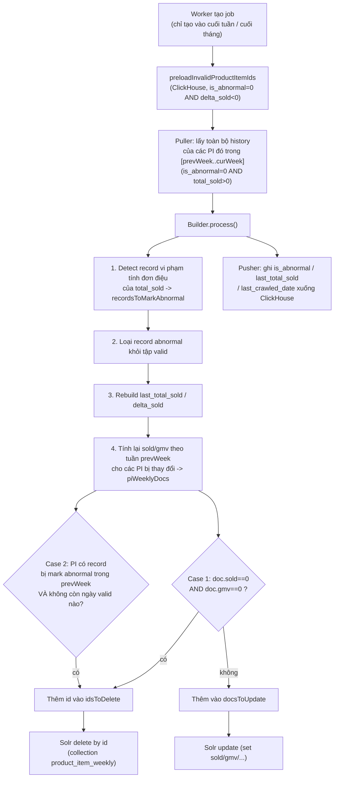

# QC Test Plan — Đồng bộ Weekly xuống Solr sau khi re-adjust (Detect Invalid Record)

Job: `jobs/detect-invalid-record`
File chính: [`detect-invalid.builder.ts`](../src/processors/detect-invalid.builder.ts)

## 1. Bối cảnh

Job `detect-invalid-record` quét ClickHouse để tìm các PI (product item) có
`total_sold` giảm bất thường theo thời gian (dấu hiệu data bẩn / crawl lỗi),
đánh dấu các record đó là `is_abnormal`, rồi **tính lại (re-adjust)** số liệu
`sold` / `gmv` tuần trước (`prevWeek`) dựa trên các record còn hợp lệ, và ghi đè
xuống Solr collection `product_item_weekly` (WS).

Sau khi verify số liệu tính bằng ClickHouse đã khớp TimeScale, phần còn lại cần
QC là bước **cập nhật xuống Solr** của tuần bị re-adjust, cụ thể là 2 case xóa
record dưới Solr.

## 2. Luồng xử lý tổng quan



## 3. Khi nào job chạy

- Chỉ tạo job mới vào **cuối tuần** (`isEndOfWeek`, dựa trên `dateRun - 2 ngày`
  là thứ Bảy) hoặc **cuối tháng** (`isEndOfMonth`).
- `prevWeek` **có thể không tồn tại** với vài trường hợp biên quanh mốc ngày 25
  hàng tháng (logic cắt trong `buildFromStartOfWeek`). Nếu `job.data.prevWeek`
  rỗng thì **toàn bộ bước đồng bộ Solr (cả 2 case) sẽ bị bỏ qua**, dù có PI bị
  đánh abnormal trong batch — đây là hành vi hiện tại của code, QC nên biết để
  không nhầm là bug khi test vào các ngày cận cuối tháng.
- Job chạy theo batch (`batchSize` PI mỗi lần, config hiện tại = 500), lặp lại
  cho tới khi hết danh sách PI abnormal. Mỗi batch tự ghi Solr riêng — không
  đợi hết toàn bộ job mới ghi 1 lần.

## 4. Cách 1 record được xác định là "abnormal" (để re-adjust)

Dữ liệu history của từng PI được sắp xếp giảm dần theo `crawled_date` (mới → cũ).
Duyệt từ ngày mới nhất về cũ nhất, giữ lại `minAllowedSold` = giá trị `total_sold`
nhỏ nhất đã gặp. Nếu một record cũ hơn có `total_sold` **lớn hơn**
`minAllowedSold` hiện tại → tức là `total_sold` đã **giảm** khi đi từ quá khứ
tới hiện tại (vi phạm tính đơn điệu tăng) → record đó (ở ngày cũ hơn) bị đánh
`is_abnormal = true`.

> Lưu ý: record chỉ được lấy vào batch nếu ở ClickHouse đang có `is_abnormal=0`
> và `total_sold>0` (xem `findHistoriesByProductItemIds`). Record đã bị đánh
> abnormal ở lần chạy trước sẽ không được kéo lại vào các lần chạy sau.

## 5. Hai case cần verify xuống Solr

### Case 1 — Tuần N-1 tính lại ra `sold = 0` và `gmv = 0`

**Điều kiện:** PI vẫn còn ít nhất 1 record hợp lệ (không abnormal) trong tuần
N-1, nhưng sau khi tính lại `last_total_sold`/`delta_sold`, tổng `sold` và
`gmv` cộng dồn của cả tuần ra đúng bằng 0 (ví dụ toàn bộ các ngày trong tuần
đều có `delta_sold` = 0 hoặc âm sau re-adjust).

**Code:** [`detect-invalid.builder.ts:82-89`](../src/processors/detect-invalid.builder.ts#L82-L89)

**Expectation:** Xóa hẳn record `product_item_weekly` của PI đó khỏi Solr
(không phải update `sold=0, gmv=0`).

### Case 2 — Tuần N-1 không còn record normal nào để tính

**Điều kiện:** Trong tuần N-1, **toàn bộ** record của PI đó bị đánh
`is_abnormal` ở lần chạy này (không còn ngày nào "sạch" để group lại thành
weekly doc). Vì không còn record nào để group, PI này **sẽ không xuất hiện**
trong `piWeeklyDocs` ở bước tính weekly — nên phải xử lý riêng, dò trực tiếp
qua danh sách `recordsToMarkAbnormal` để tìm PI không còn ngày valid nào,
tự dựng lại `id` theo đúng format Solr rồi xóa.

**Code:** [`detect-invalid.builder.ts:91-98`](../src/processors/detect-invalid.builder.ts#L91-L98)

**Expectation:** Xóa hẳn record `product_item_weekly` (tuần N-1) của PI đó
khỏi Solr.

### Format id / cách xóa (áp dụng cho cả 2 case)

- `period` = tuần-năm của `prevWeek.weekEnd`, dạng `WW-YYYY` (vd tuần 25 năm
  2026 → `25-2026`).
- Solr doc id: `W{weekNumber}{year}_{product_item_id}` → vd `W252026_PI-1001`.
- Xóa theo batch tối đa 100 id/lần, query dạng
  `id:"W252026_PI-1001" OR id:"W252026_PI-2002" OR ...` trên collection
  `product_item_weekly` (config `detectInvalid.weeklyCollection`).
- Code: [`buildWeeklyDocId`](../src/processors/detect-invalid.builder.ts#L424-L427),
  [`deleteWeeklyDocsByIds`](../src/processors/detect-invalid.builder.ts#L429-L438)

## 6. Test case đề xuất

| # | Mô tả | Chuẩn bị dữ liệu ClickHouse (`product_item_histories`, tuần N-1 = 15/06–21/06/2026) | Kết quả kỳ vọng |
|---|---|---|---|
| TC1 | Case 1 — toàn bộ ngày trong tuần re-adjust ra sold=0, gmv=0 | PI `PI-1001`: 7 record trong tuần N-1, `total_sold` giữ nguyên không đổi qua các ngày (vd luôn = 120), khiến sau khi rebuild `last_total_sold`, `delta_sold` mỗi ngày = 0. `is_abnormal=0` cho tất cả 7 record trước khi chạy job. | Sau khi chạy job: doc `W{week}{year}_PI-1001` **không còn tồn tại** trong Solr `product_item_weekly`. Trong ClickHouse, các record của PI-1001 **không** bị set `is_abnormal=true` (vì bản thân chúng không vi phạm tính đơn điệu, chỉ là gmv/sold ra 0) — chỉ có `last_total_sold`/`last_crawled_date` có thể được update. |
| TC2 | Case 1 — chỉ 1 vài ngày trong tuần có sold, phần còn lại ra 0, tổng vẫn > 0 (regression: KHÔNG được xóa) | PI `PI-1002`: 5/7 ngày có `delta_sold=0` sau re-adjust, 2 ngày còn lại `delta_sold>0` | Doc `W{week}{year}_PI-1002` vẫn tồn tại trong Solr, được **update** (không xóa) với `sold`/`gmv` > 0. |
| TC3 | Case 2 — record duy nhất trong tuần N-1 bị đánh abnormal do tuần sau đó tụt | PI `PI-2002`: chỉ có 1 record trong tuần N-1 (17/06, `total_sold=200`), và 1 record ở tuần N (22/06, `total_sold=90`, thấp hơn) → 17/06 bị đánh `is_abnormal=true` vì 200 > minAllowedSold(90). | Record `PI-2002` ngày 17/06 được set `is_abnormal=true` trong ClickHouse. Doc `W{week}{year}_PI-2002` (tuần N-1) **bị xóa** khỏi Solr — kể cả khi trước đó Solr đang có sẵn doc này với số liệu cũ. |
| TC4 | Case 2 — PI có nhiều record trong tuần N-1, tất cả đều bị đánh abnormal | PI `PI-2003`: 3 record trong tuần N-1, cả 3 đều vi phạm tính đơn điệu (do 1 record ở tuần N còn thấp hơn tất cả) | Cả 3 record được set `is_abnormal=true`. Doc weekly tuần N-1 của `PI-2003` bị xóa khỏi Solr. |
| TC5 | Case 2 — PI có 1 phần record bị abnormal, phần còn lại vẫn valid (regression: KHÔNG được xóa qua nhánh Case 2) | PI `PI-2004`: 3 record trong tuần N-1, chỉ 1 record bị đánh abnormal, 2 record còn lại vẫn valid | Doc weekly của `PI-2004` **không bị xóa qua Case 2**; nếu tổng sold/gmv của 2 ngày còn lại > 0 thì doc được update bình thường (không rơi vào Case 1 lẫn Case 2). |
| TC6 | PI không có thay đổi gì (không nằm trong `changedProductSet`) | PI `PI-9999`: không có record nào bị đánh abnormal, không có thay đổi `last_total_sold` | Solr **không có** thao tác update/delete nào cho `PI-9999`. Log: `[Solr write] skipped: no weekly docs to update` nếu không còn PI nào khác đổi trong batch. |
| TC7 | `prevWeek` không tồn tại (job chạy đúng cutoff cuối tháng) | Bất kỳ PI nào bị đánh abnormal trong batch, nhưng job được tạo với `dateRun` rơi vào window khiến `buildFromStartOfWeek` không trả `prevWeek` | **Không có** bất kỳ update/delete Solr nào được thực hiện, kể cả khi có PI bị đánh abnormal. ClickHouse vẫn được cập nhật `is_abnormal`/`last_total_sold` bình thường qua Pusher. |
| TC8 | Re-run / idempotency | Chạy lại đúng batch của TC3 lần thứ 2 (không thay đổi dữ liệu) | Lần chạy thứ 2: `preloadInvalidProductItemIds` không còn trả về `PI-2002` nữa (vì record đã có `is_abnormal=1` ở ClickHouse) → không có thao tác Solr nào lặp lại, không lỗi. |
| TC9 | Số lượng id xóa > 100 trong 1 batch | Chuẩn bị ≥ 101 PI cùng rơi vào Case 1 hoặc Case 2 trong cùng 1 batch | Toàn bộ id được xóa hết (verify qua Solr query theo `product_item_id`/`shard`), không có id nào bị bỏ sót do logic chia chunk 100. |

## 7. Cách verify thủ công

**ClickHouse** — kiểm tra trạng thái abnormal / last_total_sold:

```sql
SELECT product_item_id, crawled_date, total_sold, last_total_sold,
       last_crawled_date, delta_sold, is_abnormal, gmv, updated_date
FROM product_item_histories_distributed
WHERE product_item_id IN ('PI-1001', 'PI-2002')
ORDER BY product_item_id, crawled_date;
```

**Solr** — kiểm tra doc weekly còn/mất:

```
GET /solr/product_item_weekly/select?q=id:"W252026_PI-1001"
GET /solr/product_item_weekly/select?q=id:"W252026_PI-2002"
```

Nếu doc trả về rỗng (`numFound: 0`) → đã bị xóa đúng như kỳ vọng. Nếu vẫn còn,
kiểm tra field `sold`/`gmv` để so khớp với case tương ứng.

**Log job** — các dòng log hữu ích khi debug:

- `[Solr write] collection=... docs=... changedPiCount=...` — số doc được update.
- `[Solr delete] collection=... docs=... period=...` — số doc bị xóa (bao gồm cả Case 1 và Case 2 gộp chung).
- `[CH write] applyHistoryInserts ...` — xác nhận Pusher đã ghi `is_abnormal`/`last_total_sold` xuống ClickHouse.

## 8. Lưu ý / rủi ro cần double-check khi test

- Case 1 và Case 2 được gộp chung vào **1 set `idsToDelete`** rồi xóa 1 lượt —
  log `[Solr delete]` không phân biệt được doc bị xóa vì lý do nào; nếu cần
  audit rõ theo case, phải suy luận từ dữ liệu ClickHouse tương ứng (TC nào).
- Case 1 chỉ tính trên các PI **đã có mặt trong `piWeeklyDocs`** (tức phải
  từng có ít nhất 1 record hợp lệ trong tuần N-1 sau khi loại abnormal). Nếu
  1 PI hoàn toàn không có record nào trong tuần N-1 (không phải do bị đánh
  abnormal, mà do vốn dĩ không có data), PI đó sẽ không xuất hiện ở cả 2 case
  và **không có thao tác Solr nào xảy ra** — cần phân biệt rõ với TC3/TC4 khi
  chuẩn bị dữ liệu test.
- Nên test thêm biên `sold=0` nhưng `gmv≠0` (hoặc ngược lại) — theo code hiện
  tại, Case 1 yêu cầu **cả hai** cùng bằng 0 mới xóa; nếu chỉ 1 trong 2 = 0 thì
  doc vẫn được update bình thường.