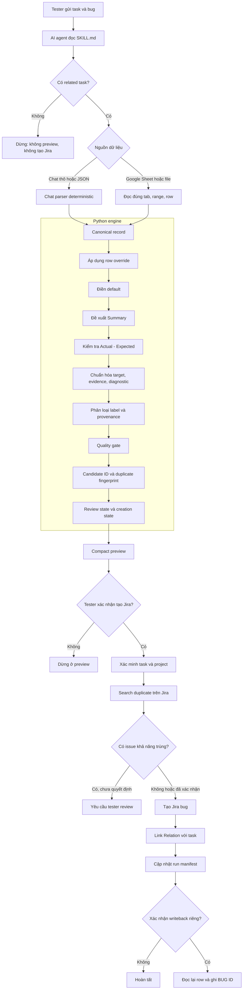
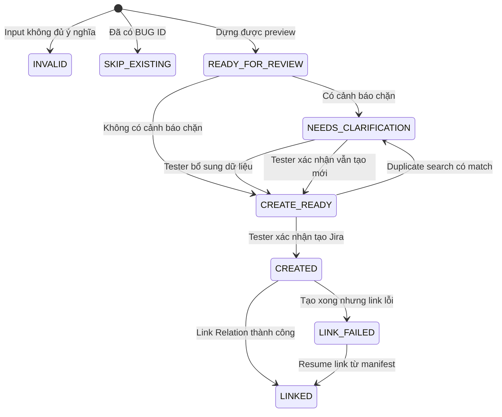

# Tổng quan luồng log bug Jira bằng AI Skill (bản V2)

Tài liệu này giải thích skill log bug Jira của QC: cách cài đặt, cách tester dùng, rule nào do máy áp dụng và dữ liệu được bảo vệ ra sao. Người đọc không cần biết AI hoặc lập trình.

Bản V2 thay thế `TONG-QUAN-LUONG-LOG-BUG-JIRA.md`. Nội dung đã được cập nhật theo engine hiện tại và bổ sung phần cài đặt MCP.

| Hạng mục | Giá trị |
| --- | --- |
| Ngày cập nhật | 2026-09-17 |
| Nguồn skill duy nhất | `/Users/tranthanhlam/product-ai-docs/.cursor/skills/ynm-qc/ynm-qc-jira-bugs` |
| Lệnh gọi trong Cursor | `/ynm-qc-jira-bugs` |
| Jira mục tiêu | Jira Server 9.12.2, REST API v2, wiki markup |
| Nguồn bug | Google Sheet, CSV/TSV/JSON/XLSX, hoặc nội dung chat |
| Chế độ mặc định | Preview, không tạo Jira |
| Unit test | 89 test, chạy local, không gọi Jira thật |
| Trạng thái Phase 2 | Tạm hoãn; chưa đọc Environment từ prefix Summary |

## 1. Hiểu nhanh trong một phút

Ba thành phần:

1. Tester cung cấp Jira task và thông tin bug, review preview, quyết định có tạo Jira hay không.
2. AI agent nhận yêu cầu, chọn đúng luồng Sheet hoặc chat, gọi chương trình Python.
3. Python engine áp dụng rule cố định để chuẩn hóa dữ liệu, kiểm tra chất lượng và dựng Jira payload.

Nguyên tắc vận hành:

> AI điều phối, Python áp dụng rule, tester quyết định external write.

Nếu tester nói "preview", "log thử", "xem thử" hoặc "đừng đẩy Jira", hệ thống chỉ hiển thị ticket nháp trong chat. Không tạo Jira issue và không sửa Google Sheet.

## 2. Thay đổi chính so với bản wiki cũ

| Hạng mục | Bản cũ | Bản V2 |
| --- | --- | --- |
| Nguồn skill | Đồng bộ 3 bản (Cursor, Codex, Document) | Chỉ `.cursor`; không đọc và không sync Codex/Claude |
| Summary từ Sheet | `[Module] Test Name - triệu chứng` | `[Module] triệu chứng - case: Test Name`, triệu chứng đứng trước |
| Actual không mô tả lỗi | Vẫn tạo được bug | Chặn bằng `actual_not_a_symptom`, Summary ghi `chưa xác định triệu chứng` |
| Chọn mệnh đề trong Actual | Lấy mệnh đề đầu | Ưu tiên mệnh đề chứa dấu hiệu lỗi (`selected_defect_clause`) |
| Priority | `Major` | Tên Jira YouNet đầy đủ: `Blocker(P1)`…`Trivial(P5)`; `High` → `Critical(P2)` |
| Issue link type | `Relates` | `Relation` (đúng tên trên Jira YouNet) |
| Auth Jira | Basic | `bearer` mặc định cho Personal Access Token của Jira Server |
| Description từ Sheet | Nhiều section metadata | Đúng 6 section, bỏ section trống |
| Selection mode mặc định | `status` | `ready` |
| Duplicate/create/link | Chạy tuần tự | Chạy song song theo `max_parallel_jira_requests` |
| Cài đặt MCP | Không có | Có mục riêng cho Google Sheets và Jira MCP |

## 3. Cài đặt

### 3.1 Yêu cầu chung

| Thành phần | Kiểm tra | Ghi chú |
| --- | --- | --- |
| Cursor | Đã đăng nhập | Skill nằm trong repo `product-ai-docs` |
| Python 3 | `python3 --version` | Engine chỉ dùng thư viện chuẩn |
| uvx | `uvx --version` | Chạy MCP Google Sheets |
| Node / npx | `npx --version` | Chạy MCP Jira |
| Quyền Jira | Tạo issue và tạo issue link trong project đích | Xin Jira admin nếu thiếu |

Engine không cần cài thêm package. Nếu đọc file XLSX mà máy chưa có `openpyxl`, hãy xuất Sheet sang CSV hoặc dùng MCP Google Sheets thay vì cài thêm.

### 3.2 File cấu hình MCP của Cursor

Tất cả MCP server khai báo trong một file:

```text
~/.cursor/mcp.json
```

Cấu trúc thực tế đang dùng:

```json
{
  "mcpServers": {
    "google-sheets": {
      "command": "/Users/<user>/.local/bin/uvx",
      "args": [
        "--with", "mcp>=1.8,<2",
        "mcp-google-sheets@latest",
        "--include-tools",
        "get_sheet_data,update_cells,list_spreadsheets,list_sheets"
      ],
      "env": {
        "SERVICE_ACCOUNT_PATH": "/Users/<user>/YNM-testing/serviceAccount.json"
      }
    },
    "jira": {
      "command": "/Users/<user>/.nvm/versions/node/v22.9.0/bin/npx",
      "args": ["-y", "@fastmcp-me/jira-mcp"],
      "env": {
        "JIRA_API_TOKEN": "<Jira Personal Access Token>",
        "JIRA_BASE_URL": "https://jira.younetco.com/",
        "JIRA_USER_EMAIL": "<email công ty>"
      }
    }
  }
}
```

Lưu ý khi khai báo:

- Dùng đường dẫn tuyệt đối cho `command`. MCP server không chạy qua shell nên không đọc được `PATH` như terminal.
- `--include-tools` giới hạn số tool được nạp, giúp giảm token mỗi lần gọi.
- Sau khi sửa file, restart Cursor để nạp lại MCP.

### 3.3 MCP Google Sheets

Mục đích: đọc dữ liệu testcase trực tiếp từ Google Sheet và ghi ngược `BUG ID` sau khi tester xác nhận.

Các bước:

1. Vào Google Cloud Console, tạo project hoặc dùng project sẵn có.
2. Bật hai API: Google Sheets API và Google Drive API.
3. Tạo service account, tạo key dạng JSON, tải file về máy.
4. Lưu file key ngoài repository, ví dụ `~/YNM-testing/serviceAccount.json`, rồi hạn quyền đọc: `chmod 600`.
5. Mở file key, lấy giá trị `client_email`. Ví dụ đang dùng: `lamtt-mcp@fiery-set-496308-d1.iam.gserviceaccount.com`.
6. Trên Google Sheet cần đọc, bấm Share và chia sẻ cho `client_email` đó. Quyền Viewer là đủ để preview; cần Editor nếu muốn writeback `BUG ID`.
7. Khai báo server `google-sheets` như mục 3.2, trỏ `SERVICE_ACCOUNT_PATH` tới file key.
8. Restart Cursor.

Kiểm tra nhanh: yêu cầu agent liệt kê tab của Sheet. Kết quả trả về danh sách tên tab là đã thông.

Bốn tool được nạp:

| Tool | Dùng để |
| --- | --- |
| `list_spreadsheets` | Liệt kê spreadsheet mà service account truy cập được |
| `list_sheets` | Liệt kê tên tab trong một spreadsheet |
| `get_sheet_data` | Đọc dữ liệu theo tab và range |
| `update_cells` | Ghi ô, dùng cho writeback `BUG ID` |

Hai lỗi thường gặp:

- `Incompatible auth server: does not support dynamic client registration`: đang dùng biến thể MCP theo OAuth. Chuyển sang `mcp-google-sheets` với `SERVICE_ACCOUNT_PATH` như trên.
- Đọc Sheet báo không có quyền: Sheet chưa share cho `client_email` của service account.

Hạn chế cần biết: link Google Sheet chứa `gid=<số>`, còn `list_sheets` chỉ trả tên tab. Muốn map `gid` sang tên tab thì gọi Sheets API với service account:

```text
GET https://sheets.googleapis.com/v4/spreadsheets/<spreadsheetId>?fields=sheets.properties
```

Trường `sheets[].properties.sheetId` chính là `gid`, `sheets[].properties.title` là tên tab cần truyền cho `get_sheet_data`.

### 3.4 MCP Jira

Mục đích: đọc task, kiểm tra issue vừa tạo, cập nhật trạng thái hoặc thêm comment.

Các bước:

1. Đăng nhập `https://jira.younetco.com`.
2. Vào Profile, mục Personal Access Tokens, tạo token mới và copy lại. Token chỉ hiện một lần.
3. Khai báo server `jira` như mục 3.2 với `JIRA_BASE_URL`, `JIRA_USER_EMAIL` và `JIRA_API_TOKEN`.
4. Restart Cursor.

Sáu tool được nạp: `jira_get_issue`, `jira_search`, `jira_create_issue`, `jira_update_issue`, `jira_transition_issue`, `jira_add_comment`.

Phân vai rõ ràng: việc tạo bug nên đi qua script của skill vì cần label, custom field `Found In Environment` và issue link `Relation` trong một lần chạy có manifest. MCP Jira dùng để đọc, verify và cập nhật issue.

### 3.5 Environment variable cho engine

Script trong skill không đọc `~/.cursor/mcp.json`; nó chỉ đọc environment variable:

```bash
export JIRA_BASE_URL="https://jira.younetco.com/"
export JIRA_EMAIL="<email công ty>"
export JIRA_AUTH_MODE="bearer"
export JIRA_FOUND_IN_ENVIRONMENT_FIELD="customfield_10962"
read -s JIRA_API_TOKEN
export JIRA_API_TOKEN
```

| Biến | Bắt buộc | Ý nghĩa |
| --- | --- | --- |
| `JIRA_BASE_URL` | Có | Base URL Jira |
| `JIRA_API_TOKEN` | Có | Personal Access Token |
| `JIRA_AUTH_MODE` | Không | `bearer` mặc định; `basic` khi dùng username/password hoặc Jira Cloud |
| `JIRA_EMAIL` | Tùy mode | Bắt buộc với `basic`; không cần với `bearer` |
| `JIRA_FOUND_IN_ENVIRONMENT_FIELD` | Không | Custom field môi trường, hiện là `customfield_10962` |

Jira Server 9.x từ chối PAT gửi bằng Basic auth và trả HTTP 401. Gặp 401 thì kiểm tra `JIRA_AUTH_MODE` trước khi đổi token.

Kiểm tra kết nối mà không tạo issue:

```bash
python3 scripts/jira_bug_generator.py --check-auth
```

Kết quả trả về deployment, version và tài khoản đang dùng.

### 3.6 Bảo mật secret

- Không commit file service account và không commit token vào repository.
- Không dán token vào chat, preview, log hay tài liệu.
- Diagnostic data được engine che token, API key, password, cookie, Authorization, session và private key trước khi dựng payload.
- Evidence URL chứa token/session/password bị chặn tạo issue.

## 4. Kiến trúc tổng thể



Chỉ ba thao tác làm thay đổi hệ thống bên ngoài, mỗi thao tác có gate riêng: tạo Jira bug, tạo link `Relation`, ghi Jira key vào Google Sheet.

## 5. Gate bắt buộc

- Mỗi yêu cầu phải có đúng một Jira task key hoặc URL. Thiếu task thì không preview và không tạo bug.
- Project bug lấy từ task. Project nhập riêng phải khớp project của task.
- Không dùng lại task của yêu cầu trước nếu tester chưa nói rõ đang tiếp tục.
- Bug tạo thật phải link `Relation` với task.
- Chỉ tạo Jira sau xác nhận rõ số lượng, project và task. Writeback Sheet cần xác nhận riêng.
- Skill không hỗ trợ chế độ chỉ có project, vì trái quy trình team đã chốt.

## 6. Hai luồng nhập bug

### 6.1 Luồng Sheet hoặc file testcase

Tester gửi: Jira task, link Sheet hoặc file testcase, và TC ID/row nếu muốn giới hạn phạm vi.

Thứ tự ưu tiên chọn dòng:

1. Row hoặc TC ID tester chỉ định.
2. Cột `READY TO JIRA` (`--selection-mode ready`, mặc định).
3. Cột `STATUS` là `BUG`, `failed`, `fail`, `error`, `errored`, `thất bại` hoặc `lỗi` (`--selection-mode status`).
4. Không có tín hiệu chọn thì chỉ đề xuất candidate (`--selection-mode candidates`) và không tạo Jira.

| Selection mode | Dùng khi |
| --- | --- |
| `ready` | Sheet có cột `READY TO JIRA`; giá trị hợp lệ: `yes`, `ready`, `true`, `1` |
| `status` | Sheet không có cột ready, chọn theo `STATUS` |
| `all` | Bug chat hoặc tập dòng đã được chọn trước |
| `candidates` | Chỉ đề xuất để review, bị chặn khi kết hợp `--create` |

Dòng đã có `BUG ID` sẽ thành `SKIP_EXISTING` để tránh log trùng.

### 6.2 Luồng nhập bug bằng chat

Template tối thiểu, bốn dòng bắt buộc:

```text
Related task: https://jira.younetco.com/browse/YNMPECA-9183

Testname: [MODULE] triệu chứng lỗi quan sát được
Step:
1.
2.
Actual Result:
Expected Result:
```

Heading chấp nhận `Name` hoặc `Summary` thay cho `Testname`. Với luồng chat, `Testname` chính là Summary trên Jira nên viết luôn triệu chứng, không viết "Kiểm tra…". Prefix `[High]` hoặc `[Negative]` được bỏ khỏi title và map sang priority/test type.

Trường tùy chọn:

```text
Priority: High
Environment: Staging
Module: Label Validation
Preconditions: Form đã có hai prefix.
Test data: Prefix = BMP_Stage_, BMP_Size_
Evidence:
- Screenshot: https://drive.google.com/...
```

Nếu chat thiếu Steps hoặc Expected: engine vẫn dựng preview khi còn Summary/Testname hoặc Actual, đặt `creation_state=NEEDS_CLARIFICATION`, liệt kê trường thiếu và không tự bịa nội dung. Chat không có cả Summary/Testname lẫn Actual thì là `INVALID`.

Mỗi draft chat có `chat_extraction` cho biết từng field lấy từ đâu:

```json
{
  "parser": "deterministic/v1",
  "input_mode": "raw_chat",
  "fields": {
    "actual": { "source": "heading", "confidence": "high", "matched_heading": "Actual Result" }
  },
  "missing_fields": [],
  "needs_ai_fallback": false
}
```

`needs_ai_fallback=true` chỉ là tín hiệu cần người hỗ trợ; Python không tự gọi API AI.

## 7. Canonical schema

Tên cột mỗi Sheet khác nhau, engine map về bộ tên chuẩn trước khi xử lý:

| Field chuẩn | Ví dụ header nguồn |
| --- | --- |
| `bug_summary` | `BUG SUMMARY`, `Bug Title`, `Jira Summary`, `Tiêu đề bug` |
| `title` | `TEST NAME`, `Testname`, `Name`, `Scenario` |
| `component` | `MODULE/FEATURE`, `Module`, `Feature` |
| `preconditions` | `PRE-CONDITION`, `Preconditions` |
| `steps` | `TEST STEPS`, `Steps to Reproduce`, `Step` |
| `test_data` | `TEST DATA`, `Data` |
| `expected` | `EXPECTED RESULT`, `Expected Outcome` |
| `actual` | `ACTUAL RESULT`, `Observed Result` |
| `environment` | `ENVIRONMENT`, `Test Environment`, `Env` |
| `severity` | `PRIORITY`, `Severity`, `Impact` |
| `test_type` | `TEST TYPE` |
| `evidence` | `EVIDENCE`, `Screenshot`, `Attachment` |
| `diagnostic_data` | `Technical Log`, `Code Snippet`, `Stack Trace` |
| `bug_id` | `BUG ID`, `Jira Key`, `Link Jira` |

## 8. Summary được tạo như thế nào

Đây là phần thay đổi nhiều nhất ở bản V2.

### 8.1 Nguồn Sheet hoặc file

Thứ tự nguồn:

1. `BUG SUMMARY` nếu là tên lỗi rõ ràng.
2. Nếu `BUG SUMMARY` trống hoặc chỉ là câu mục tiêu test ("Kiểm tra…", "Verify…"), dựng theo công thức bên dưới.

```text
[MODULE/FEATURE] <triệu chứng ngắn từ Actual> - case: <đối tượng kiểm thử từ Test Name>
```

Triệu chứng đứng trước để đọc tiêu đề là biết lỗi gì. Phần `case:` chỉ là ngữ cảnh, nên khi Summary vượt 120 ký tự thì bỏ phần này trước, chỉ cắt ký tự khi riêng triệu chứng đã quá dài.

Các phép biến đổi xác định:

- Bỏ metadata prefix và động từ mục tiêu trong Test Name.
- Bỏ tiền tố rerun kiểu `Rerun 11/09:` và từ mở đầu chung chung như "Hiện tại".
- Actual nhiều mệnh đề thì chọn mệnh đề chứa dấu hiệu lỗi, không mặc định lấy mệnh đề đầu vì mệnh đề đầu thường mô tả hành vi đúng.
- Không cắt câu bên trong đoạn code đặt trong dấu backtick.
- Chuẩn hóa thuật ngữ theo policy: `API`, `AWS`, `Airflow`, `ClickHouse`, `K8s`, `Kubernetes`, `RabbitMQ`, `Redis`, `Solr`, `UI`.

Ví dụ:

```text
[Label Validation] Model `SAMSUNG Galaxy S21` vẫn còn - case: Reset Brand và Model khi đổi Industry
[Label Validation] Ký tự thứ 121 bị chặn và không hiện lỗi 121 ký tự như expected - case: Giới hạn độ dài Validate Name
```

### 8.2 Khi Actual không mô tả được lỗi

Nếu Actual chỉ là ghi chú, câu hỏi, case chưa chạy hoặc câu chung chung, engine không ghép nội dung đó vào Summary. Draft bị chặn bằng cảnh báo `actual_not_a_symptom` và Summary ghi rõ còn thiếu:

```text
[Label Validation] Chỉ người có quyền xem mới thấy chức năng - chưa xác định triệu chứng
```

| `symptom_issue` | Dấu hiệu | Ví dụ Actual |
| --- | --- | --- |
| `review_note` | Ghi chú xử lý hoặc đánh giá | "những case phân quyền cần xem lại", "nên không cần phải đợi giới hạn" |
| `not_run` | Case chưa chạy | "NOT RUN: case lỗi dịch vụ email" |
| `question` | Câu hỏi, có dấu `?` cuối câu | "Chỗ này có phải bug không?" |
| `no_observable_symptom` | Rút gọn xong không còn triệu chứng | "Hiện tại đang bị lỗi" |

Cách gỡ chặn: bổ sung `ACTUAL RESULT` mô tả hành vi đã quan sát, hoặc điền `BUG SUMMARY`. Cờ `--allow-quality-warnings` chỉ dùng sau khi tester xác nhận rõ.

### 8.3 Nguồn chat

Dùng `Testname` làm Summary sau khi loại metadata prefix có trong policy. Không thêm module, không viết lại theo Actual, giữ nguyên prefix nghiệp vụ không nhận diện được.

Engine không thêm root cause, impact hay tần suất nếu nguồn không có.

## 9. Description

### Nguồn chat — ba section

```text
h3. Steps to reproduce
h3. Actual result
h3. Expected result
```

### Nguồn Sheet hoặc file — sáu section

```text
h3. Preconditions
h3. Steps to reproduce
h3. Actual result
h3. Expected result
h3. Test data
h3. Evidence
```

Section trống bị bỏ hẳn, không render placeholder. Heading dùng tiếng Anh, nội dung tester nhập được giữ nguyên. Định dạng là wiki markup của Jira Server, không phải ADF.

## 10. Priority

Thứ tự ưu tiên: field `PRIORITY`/`Severity` hợp lệ, rồi priority prefix trong Test Name, cuối cùng là default `Major(P3)`. Nếu field và prefix khác nhau, field thắng và preview có cảnh báo.

| Tên Jira YouNet | Giá trị nguồn được map |
| --- | --- |
| `Blocker(P1)` | `blocker`, `highest`, `P1`, `nghiêm trọng`, `rất cao` |
| `Critical(P2)` | `critical`, `high`, `cao`, `P2` |
| `Major(P3)` | `major`, `medium`, `normal`, `trung bình`, `P3` |
| `Minor(P4)` | `minor`, `low`, `thấp`, `P4` |
| `Trivial(P5)` | `trivial`, `lowest`, `P5` |

Giá trị không map được sẽ chặn tạo thay vì tự sửa theo phỏng đoán. Không gửi `High` lên Jira, vì Jira YouNet không có priority tên `High`.

## 11. Label và provenance

Engine chỉ dùng label thuộc allowlist:

| Nhóm | Label | Rule |
| --- | --- | --- |
| Detection source | `found-in-qc` | Default khi nguồn không có label nào |
| System | `sys-*` | Bắt buộc tối thiểu một với Sheet/file; với chat thiếu không chặn |
| Test Type | `test-*` | Đúng một; nhiều hơn một thì chặn để tester chọn |
| Flow | `flow-*` | Optional, chỉ khi nguồn chỉ rõ flow |
| Lifecycle | `lc-reopen` | Chỉ khi bug thật sự được mở lại |
| Root Cause | `rc-*` | Chỉ khi nguồn có field `ROOT CAUSE` hoặc người có thông tin xác nhận |

Label ngoài allowlist bị loại khỏi payload và tạo cảnh báo chặn.

Mỗi label trong preview có provenance để QC biết vì sao được gắn:

| Source | Ý nghĩa |
| --- | --- |
| `explicit_argument` | Tester truyền trực tiếp qua tham số |
| `source_field` | Lấy từ field label, Test Type hoặc Root Cause |
| `prefix` | Test Type lấy từ metadata prefix hợp lệ |
| `keyword` | System/Flow match keyword thuộc policy, kèm `matched_marker` |
| `derived` | Lifecycle suy từ trạng thái nguồn |
| `default` | `found-in-qc` từ config |

Thứ tự ưu tiên: `explicit_argument` > `source_field` > `prefix` > `keyword` > `derived` > `default`.

Về Root Cause: engine không suy `rc-*` từ triệu chứng và không dùng `rc-logic` làm default. Thiếu Root Cause chỉ tạo cảnh báo không chặn `root_cause_pending`, phải cập nhật trước khi đóng bug. Nếu muốn có `rc-*` ngay lúc log, cách đúng là AI đề xuất 1–3 khả năng kèm lý do trong preview, tester chọn đúng một, rồi truyền vào bằng tham số label. Ví dụ với bug UI hiển thị lệch: `rc-logic` nếu thiết kế đã rõ mà code render sai, `rc-requirement` nếu tài liệu không quy định cách căn chỉnh, `rc-design-system` nếu quy chuẩn component chưa phù hợp.

## 12. Evidence và Diagnostic data

| Loại | Nội dung |
| --- | --- |
| Evidence | URL ảnh, video, Drive hoặc attachment |
| Diagnostic data | Log, JSON, query, command, request/response, stack trace, code |

Diagnostic data được che secret, giới hạn số item, giới hạn dung lượng mỗi item và tổng dung lượng. Compact preview chỉ hiển thị excerpt để giảm token. Jira Server render code bằng macro `{code}`. Với nguồn Sheet/file, diagnostic data không render vào Description gọn.

## 13. Actual–Expected check

Python so sánh Actual và Expected bằng rule xác định và trả về kết quả trong preview:

```json
{
  "state": "difference_detected",
  "reason": "negation_differs",
  "similarity": 0.286,
  "containment": 0.5
}
```

| State | Ý nghĩa |
| --- | --- |
| `conflict` | Actual và Expected giống nhau |
| `review` | Hai nội dung quá giống nhau, cần tester kiểm tra |
| `difference_detected` | Nhận thấy khác biệt rõ trong câu chữ |
| `not_checked` | Thiếu một trong hai field |

Đây không phải bộ máy hiểu business logic. Trường hợp không chắc vẫn cần tester review.

## 14. Quality gate và trạng thái

Engine dùng hai field trạng thái riêng: `review_state` cho biết có dựng được preview hay không, `creation_state` cho biết có đủ điều kiện tạo Jira hay không.



`READY_FOR_REVIEW` không có nghĩa được phép tạo Jira. `CREATE_READY` chỉ có nghĩa không còn cảnh báo chặn; external write vẫn cần tester xác nhận.

### Cảnh báo chặn thường gặp

| Code | Nguyên nhân |
| --- | --- |
| `actual_not_a_symptom` | Actual là ghi chú, câu hỏi, NOT RUN hoặc câu chung chung (Sheet/file) |
| `missing_steps` | Thiếu bước tái hiện |
| `missing_chat_expected` / `missing_chat_actual` | Chat thiếu field cốt lõi |
| `candidate_actual_conflict` | Actual cho biết hệ thống đang hoạt động đúng |
| `expected_equals_actual` | Actual giống Expected (nguồn chat) |
| `unsupported_priority` | Priority nguồn không map được |
| `unmapped_found_in_environment` | Environment có giá trị nhưng không map được |
| `multiple_test_type_labels` | Nguồn cho ra nhiều Test Type trái nhau |
| `missing_system_label` | Sheet/file không xác định được `sys-*` |
| `invalid_jira_label` | Label ngoài allowlist |
| `possible_duplicate` | Jira search thấy issue khả năng trùng |

### Cảnh báo không chặn thường gặp

`default_environment_applied`, `default_priority_applied`, `default_label_applied`, `root_cause_pending`, `missing_test_type_label`, `missing_evidence`, `actual_too_vague`, `actual_needs_confirmation`, `priority_prefix_conflict`, `actual_expected_high_overlap`, `sensitive_diagnostic_redacted`, `diagnostic_data_truncated`.

Riêng nguồn Sheet/file, các dấu hiệu Actual yếu như "cần confirm", "đang lỗi" hay Actual trùng giữa các TC khác ID không chặn tạo; chúng chỉ cảnh báo. Nhưng nếu Actual không cho ra được triệu chứng để đặt tên bug thì vẫn chặn theo mục 8.2.

## 15. Chống trùng

Hai lớp:

- Trong cùng input: fingerprint từ module, Summary và Actual. Với Sheet/file, các dòng khác `TEST CASE ID` được coi là bug riêng dù Actual giống nhau.
- Trên Jira thật: trước khi tạo, engine search theo project, Summary, module và Test Case ID. Điểm số phân thành `unlikely`, `possible` và `strong`; ngưỡng lấy từ `duplicate_possible_score` (45) và `duplicate_strong_score` (75).

Engine không tự đóng, gộp hay kết luận duplicate. Muốn tạo mới khi đã có match, tester xác nhận rõ và chạy lại với `--allow-possible-duplicates`.

## 16. Jira integration

```text
Deployment: Server 9.12.2
REST API:   /rest/api/2
Description: wiki markup
Link type:  Relation
```

| Việc | Endpoint |
| --- | --- |
| Đọc task | `GET /rest/api/2/issue/{key}` |
| Search duplicate | `GET /rest/api/2/search` |
| Tạo bug | `POST /rest/api/2/issue` |
| Link task | `POST /rest/api/2/issueLink` |

Duplicate search và pipeline create + link chạy song song theo `max_parallel_jira_requests` (mặc định 3) để giảm thời gian batch. Batch tối đa `max_create_batch` (10). Adapter Jira Cloud API v3/ADF vẫn còn để mở rộng, nhưng không phải profile mặc định.

## 17. Run manifest

Tình huống lỗi một phần: bug đã tạo nhưng mất mạng trước khi link task. Nếu chạy lại toàn bộ thì có nguy cơ tạo bug thứ hai.

Manifest lưu candidate ID, payload hash, trạng thái create, Jira key đã tạo, trạng thái link và bước lỗi. Khi chạy lại, engine chỉ tiếp tục bước còn thiếu; bug đã tạo thì chỉ retry link.

Manifest là tham số bắt buộc khi `--create`. Nếu payload thay đổi so với manifest, engine dừng để tester xác nhận thay vì tạo thêm.

## 18. Ghi ngược Google Sheet

Tạo Jira và ghi Sheet là hai quyền riêng. Writeback chỉ chạy sau xác nhận riêng, và trước khi ghi engine sẽ đọc lại row, so fingerprint với thời điểm preview, dừng nếu dữ liệu đã thay đổi hoặc `BUG ID` đã có giá trị. Chỉ ghi Jira key của issue đã create và link thành công. Skill không tự đổi `STATUS` hay `BUG STATUS`.

## 19. Tham chiếu lệnh

Entry point: `scripts/jira_bug_generator.py`.

| Tham số | Ý nghĩa |
| --- | --- |
| `--input` | CSV, TSV, JSON, XLSX; dùng `-` cho JSON hoặc chat thô qua stdin |
| `--related-task` | Jira task key hoặc URL, bắt buộc |
| `--project` | Project tùy chọn để đối chiếu với task |
| `--issue-type` | Mặc định `Bug` |
| `--sheet` | Worksheet trong file XLSX |
| `--selection-mode` | `ready` (mặc định), `status`, `all`, `candidates` |
| `--ready-values` | Ghi đè giá trị hợp lệ của cột ready |
| `--include-status` | Ghi đè danh sách status coi là bug |
| `--source-kind` | `auto`, `sheet`, `file`, `chat` |
| `--labels` | Label thuộc allowlist, phân cách bằng dấu phẩy |
| `--field-map` | JSON map canonical field sang header nguồn |
| `--overrides` | JSON override theo default, row hoặc test-case ID |
| `--extra-fields` | Custom field Jira bổ sung |
| `--found-in-environment-field` | Custom field môi trường |
| `--source-url`, `--source-sheet-name` | Ghi lại nguồn Sheet đã resolve |
| `--batch-limit`, `--preview-limit` | Giới hạn batch và số candidate hiển thị |
| `--search-duplicates` | Search Jira tìm bug khả năng trùng |
| `--allow-possible-duplicates` | Xác nhận vẫn tạo mới sau khi review duplicate |
| `--allow-quality-warnings` | Tạo cả draft `NEEDS_CLARIFICATION` sau xác nhận rõ |
| `--manifest` | Run manifest, bắt buộc khi tạo thật |
| `--output`, `--output-format` | Ghi JSON ra file; `compact` hoặc `full` |
| `--create`, `--yes` | Tạo Jira thật |
| `--check-auth` | Kiểm tra kết nối và tài khoản |

Preview từ Sheet đã xuất CSV:

```bash
python3 scripts/jira_bug_generator.py \
  --input /tmp/testcases.csv \
  --source-kind sheet \
  --selection-mode status \
  --related-task https://jira.younetco.com/browse/YNMPECA-9183 \
  --preview-limit 10 \
  --output-format compact
```

Preview từ chat:

```bash
python3 scripts/jira_bug_generator.py \
  --input - --source-kind chat --selection-mode all \
  --related-task YNMPECA-9183 <<'EOF'
Testname: [Label Validation] Button option không cân xứng với test name
Step:
1. Vào màn hình Label Validation
2. Kiểm tra button option
Actual Result: Button option không cân xứng với test name
Expected Result: Button option cân xứng với test name
EOF
```

Tạo thật:

```bash
python3 scripts/jira_bug_generator.py \
  --input /tmp/selected.csv \
  --source-kind sheet --selection-mode status \
  --related-task YNMPECA-9183 \
  --search-duplicates \
  --manifest /tmp/ynmpeca-9183-manifest.json \
  --create --yes
```

## 20. Preview hiển thị gì

Preview mặc định là compact, tối đa 5 candidate, mở rộng bằng `--preview-limit` tới giới hạn batch. Nội dung gồm:

- Related task, project và link type.
- Summary, `summary_source`, `symptom_state`, `symptom_issue` và danh sách transformation.
- Preconditions, Steps, Actual, Expected, Test data, Evidence.
- Priority và nguồn priority; `Found In Environment`.
- Labels theo nhóm kèm provenance.
- Diagnostic excerpt và chat extraction metadata.
- Actual–Expected check.
- `review_state`, `creation_state` và danh sách cảnh báo.
- Kết quả duplicate nếu đã search.

`--output-format full` chỉ dùng khi cần kiểm tra Jira payload hoặc debug; xem full payload không cấp quyền tạo issue.

## 21. Vì sao kiến trúc này tiết kiệm token

- `SKILL.md` chỉ là router ngắn; rule chi tiết chỉ đọc khi tình huống cần.
- Chỉ đọc bản skill trong `.cursor`, không so sánh với bản copy ở nơi khác.
- Parser chat chạy Python trước, không gọi model mặc định.
- Default, Summary, label, Actual–Expected, fingerprint và cảnh báo do Python xử lý.
- Compact preview không chứa full config, taxonomy hay payload.
- Log dài chỉ hiển thị excerpt; Sheet chỉ đọc tab/range/row cần thiết.
- Fixture test không được nạp vào prompt runtime.

## 22. Cấu trúc thư mục

```text
.cursor/skills/ynm-qc/ynm-qc-jira-bugs/
├── SKILL.md
├── config/
│   ├── bug-candidate.schema.json
│   └── policies.json
├── rules/
│   ├── architecture.md
│   ├── bug-label-rules.md
│   ├── bug-template.md
│   ├── input-format.md
│   ├── jira-integration.md
│   ├── quality-rules.md
│   └── test-strategy.md
├── scripts/
│   ├── jira_bug_generator.py
│   └── jira_bug_skill/
│       ├── chat_parser.py
│       ├── cli.py
│       ├── common.py
│       ├── comparison.py
│       ├── config.py
│       ├── content.py
│       ├── description_renderer.py
│       ├── diagnostics.py
│       ├── duplicates.py
│       ├── evidence.py
│       ├── identity.py
│       ├── jira_adapter.py
│       ├── jira_client.py
│       ├── manifest.py
│       ├── policy.py
│       ├── presentation.py
│       ├── sheet_adapter.py
│       ├── sources.py
│       ├── summary.py
│       ├── targets.py
│       └── workflow.py
└── tests/
    ├── fixtures/
    ├── test_chat_parser_and_label_provenance.py
    ├── test_compact_output.py
    ├── test_diagnostics.py
    ├── test_engine.py
    ├── test_p1_mvp.py
    ├── test_phase6_regression.py
    ├── test_runtime_automation.py
    └── test_summary.py
```

Vai trò: `SKILL.md` hướng dẫn AI chọn luồng và giữ gate; `config/` là nguồn máy cho schema, default, mapping và allowlist; `rules/` là tài liệu nghiệp vụ cho người và agent; `scripts/` là engine Python; `tests/` là test phát triển, không phải testcase sản phẩm.

## 23. Kiểm thử

Chạy toàn bộ từ thư mục skill:

```bash
python3 -m unittest tests.test_engine tests.test_summary tests.test_p1_mvp \
  tests.test_compact_output tests.test_diagnostics tests.test_phase6_regression \
  tests.test_runtime_automation tests.test_chat_parser_and_label_provenance
```

Hiện có 89 test, bao phủ default, canonical schema, row override, Summary và gate triệu chứng, Actual–Expected check, label allowlist và provenance, Root Cause không bị suy luận, chat thô và JSON stdin, diagnostic redaction và giới hạn, Jira Server API v2 và wiki renderer, duplicate fingerprint và duplicate gate, run manifest resume, Sheet writeback conflict, related task bắt buộc. Test dùng fixture và mock, không tạo Jira thật và không sửa Sheet.

Hai test thuộc Phase 2 chưa triển khai: parse Environment từ prefix Summary, và conflict giữa Environment field với prefix Summary.

## 24. Ví dụ đã chạy thật

| Issue | Nguồn | Summary |
| --- | --- | --- |
| `YNMPECA-9413` | Sheet, TC_LV_013 | `[Label Validation] Model \`SAMSUNG Galaxy S21\` vẫn còn - case: Reset Brand và Model khi đổi Industry` |
| `YNMPECA-9414` | Chat | `[Label Validation] Lỗi button option cân xứng với testname` |

Cả hai đều link `Relation` tới task `YNMPECA-9183`, priority map từ nguồn, `Found In Environment = Testing`, label gồm `found-in-qc` cùng `sys-*` và `test-*` tương ứng. Thời gian chạy cho một bug gồm duplicate search, create và link là khoảng 3 giây.

So sánh trước và sau khi đổi rule Summary trên cùng test case:

```text
Cũ:  [Label Validation] Rerun đúng thao tác đổi lựa chọn: sau khi chọn Brand và Model,
     bỏ Brand SAMSUNG nhưng Model `SAMSUNG Galaxy S21` vẫn còn. Đổi Industry sang
     Milk Powder thì Brand và Model được xóa.      (199 ký tự)
Mới: [Label Validation] Model `SAMSUNG Galaxy S21` vẫn còn - case: Reset Brand và Model
     khi đổi Industry                              (99 ký tự)
```

## 25. Xử lý sự cố

| Hiện tượng | Nguyên nhân và cách xử lý |
| --- | --- |
| HTTP 401 khi gọi Jira | PAT gửi bằng Basic auth; đặt `JIRA_AUTH_MODE=bearer` |
| HTTP 400, priority không hợp lệ | Đang gửi tên ngoài danh sách Jira YouNet; xem mục 10 |
| HTTP 404 khi link task | Sai tên link type; Jira YouNet dùng `Relation`, không phải `Relates` |
| `Không có draft CREATE_READY để tạo` | Còn cảnh báo chặn; xem `creation_state` và danh sách warning trong preview |
| Draft bị chặn vì duplicate | Review issue match; muốn tạo mới thì thêm `--allow-possible-duplicates` |
| Summary ghi `chưa xác định triệu chứng` | Actual chưa mô tả lỗi; bổ sung Actual hoặc `BUG SUMMARY` |
| Payload khác manifest | Dữ liệu nguồn đã đổi sau preview; xác nhận lại rồi chạy manifest mới |
| MCP Sheets báo lỗi dynamic client registration | Dùng `mcp-google-sheets` với `SERVICE_ACCOUNT_PATH` thay vì biến thể OAuth |
| MCP Sheets không đọc được file | Chưa share Sheet cho `client_email` của service account |
| Không biết tab nào ứng với `gid` trong link | Gọi Sheets API `?fields=sheets.properties` để map `sheetId` sang `title` |
| Đọc XLSX báo thiếu `openpyxl` | Xuất CSV hoặc đọc qua MCP Google Sheets |

## 26. Giới hạn hiện tại

- Phase 2 chưa bật; prefix Environment trong Summary không được parse.
- Python không hiểu sâu toàn bộ business logic; preview vẫn cần tester review.
- Chat parser không tự tạo Steps hoặc Expected.
- Root Cause phải do người có thông tin xác nhận.
- Duplicate search chỉ đưa candidate, không tự kết luận hay gộp issue.
- Drive URL được giữ làm Evidence, skill chưa tự upload file.
- Nhiều Environment không tự nhân thành nhiều bug; nhiều Branch/Domain không tự tạo mọi tổ hợp.
- Google Sheet connector thực hiện đọc/ghi; Python chỉ tạo locator và writeback plan.

## 27. Trách nhiệm của từng bên

| Bên | Trách nhiệm |
| --- | --- |
| Tester | Cung cấp task và thông tin bug; review Summary, Actual, Expected, label; xác nhận create và writeback |
| AI agent | Chọn đúng luồng, đọc nguồn tối thiểu, gọi Python, tuân thủ gate |
| Python engine | Áp dụng schema, default, policy, validation, provenance, fingerprint và payload |
| Jira | Lưu issue và quan hệ `Relation` |
| Google Sheet | Lưu testcase và Jira key sau khi xác nhận writeback |

## 28. Checklist trước khi tạo Jira

- [ ] Yêu cầu hiện tại có related task và project khớp task.
- [ ] Summary mô tả triệu chứng lỗi, không phải mục tiêu test.
- [ ] Steps đủ để tái hiện.
- [ ] Actual mô tả hành vi đã quan sát, không phải ghi chú hay câu hỏi.
- [ ] Expected mô tả hành vi mong đợi.
- [ ] Environment và Priority đúng, hoặc chấp nhận default.
- [ ] Label chỉ thuộc allowlist và provenance hợp lý.
- [ ] Root Cause không bị suy đoán.
- [ ] Evidence và Diagnostic không chứa secret.
- [ ] Không còn cảnh báo chặn.
- [ ] Đã search duplicate trên Jira.
- [ ] Tester xác nhận số lượng, project và task.
- [ ] Có run manifest trước khi create.
- [ ] Writeback Sheet, nếu có, được xác nhận riêng.

## 29. Tài liệu liên quan

Tất cả nằm trong `/Users/tranthanhlam/product-ai-docs/.cursor/skills/ynm-qc/ynm-qc-jira-bugs/`:

- `SKILL.md` — router và gate bắt buộc
- `rules/input-format.md` — schema, header alias, selection mode, Summary và priority
- `rules/quality-rules.md` — quality gate, trạng thái, cảnh báo
- `rules/bug-template.md` — template Summary và Description
- `rules/bug-label-rules.md` — taxonomy label và provenance
- `rules/jira-integration.md` — credentials, endpoint, create và writeback
- `rules/architecture.md` — pipeline và vai trò từng module
- `rules/test-strategy.md` — phạm vi test hồi quy
- `config/policies.json` — nguồn máy cho default, mapping và allowlist
