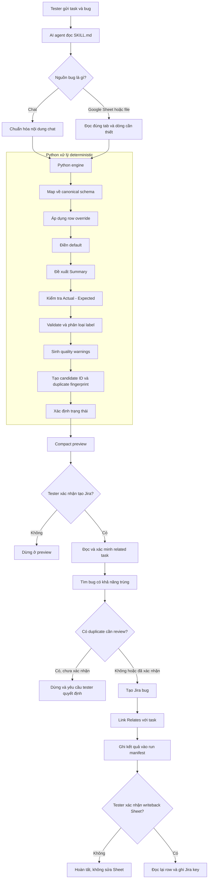
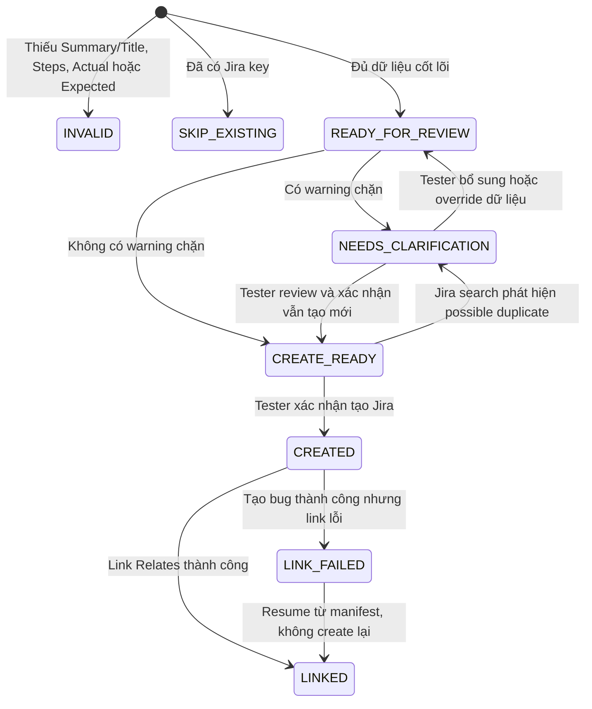
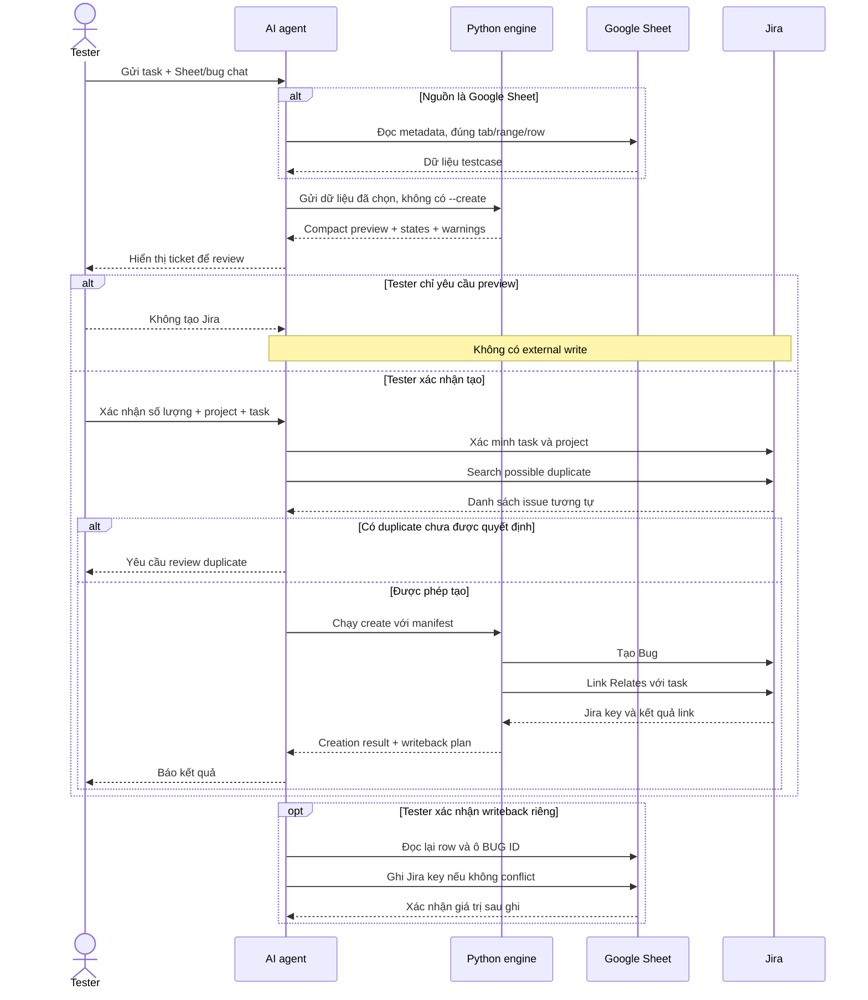

# Tổng quan luồng log bug Jira bằng AI Skill

Tài liệu này giải thích cách skill `generate-jira-bugs` được xây dựng và hoạt động. Đối tượng đọc là tester, QC hoặc thành viên trong team không cần có kiến thức về AI hay lập trình.

Phiên bản engine được mô tả: `2.4.0`.

## 1. Hiểu nhanh trong một phút

Skill này không phải một AI được phép tự do tạo bug. Có thể hình dung hệ thống gồm ba vai trò:

- **Tester** cung cấp thông tin bug, kiểm tra preview và quyết định có tạo Jira hay không.
- **AI agent** hiểu yêu cầu, chọn đúng luồng Chat/Sheet và gọi chương trình Python.
- **Python engine** áp dụng rule cố định để tạo Summary, priority, environment, label, cảnh báo và Jira payload.

Nguyên tắc quan trọng nhất:

> AI chuẩn bị, Python kiểm tra, tester quyết định.

Nếu tester chỉ nói “log thử”, “preview”, “xem thử” hoặc “đừng đẩy Jira”, hệ thống chỉ hiển thị bản nháp. Không có issue Jira nào được tạo.

## 2. Skill là gì?

Trong hệ thống này, một **skill** giống như một quy trình làm việc được đóng gói sẵn cho AI.

Skill cho AI biết:

- Khi nào cần dùng quy trình log bug.
- Tester cần cung cấp thông tin gì.
- Trường hợp nào chỉ được preview.
- Khi nào phải dừng và hỏi lại.
- Chương trình Python nào cần chạy.
- Khi nào được phép gọi Jira hoặc Google Sheet.

Skill không tự “học” từ dữ liệu Jira và không tự thay đổi rule. Rule chỉ thay đổi khi team chủ động sửa config/code và kiểm thử lại.

## 3. Kiến trúc tổng thể



Trong sơ đồ trên:

- Các bước trong khung **Python xử lý deterministic** không gọi AI để tự suy luận lại rule.
- `Compact preview` chỉ là bản xem trước, không thay đổi hệ thống bên ngoài.
- Chỉ bước `Tạo Jira bug`, `Link Relates` và `ghi Jira key` mới là external write.

## 4. Các thành phần trong thư mục skill

```text
generate-jira-bugs/
├── SKILL.md
├── agents/
│   └── openai.yaml
├── config/
│   ├── bug-candidate.schema.json
│   └── policies.json
├── rules/
│   ├── architecture.md
│   ├── bug-label-rules.md
│   ├── bug-template.md
│   ├── input-format.md
│   ├── jira-cloud.md
│   └── quality-rules.md
├── scripts/
│   ├── jira_bug_generator.py
│   └── jira_bug_skill/
└── tests/
```

### `SKILL.md` — người điều phối

Đây là file AI đọc khi skill được gọi. File này được giữ ngắn và chỉ chứa:

- Gate an toàn bắt buộc.
- Cách chọn luồng Chat, Sheet hay Create.
- Khi nào cần đọc rule chi tiết.
- Cách gọi Python engine.

AI không cần đọc tất cả tài liệu và source code trong mỗi lần log bug.

### `config/` — nơi giữ giá trị chuẩn

- `bug-candidate.schema.json` định nghĩa các field chuẩn và tên cột tương đương.
- `policies.json` chứa default, priority mapping, environment mapping, label allowlist, quality marker và batch limit.

Python đọc config trực tiếp. AI không cần nhớ hoặc viết lại những danh sách này trong prompt.

### `rules/` — tài liệu chi tiết theo tình huống

Các rule chỉ được đọc khi thật sự cần:

- Header không map được → đọc `input-format.md`.
- Thay template Jira → đọc `bug-template.md`.
- Chỉnh quality gate → đọc `quality-rules.md`.
- Chỉnh taxonomy label → đọc `bug-label-rules.md`.
- Tạo Jira, duplicate search hoặc writeback → đọc `jira-cloud.md`.
- Bảo trì code → đọc `architecture.md`.

### `scripts/` — bộ máy thực thi

Python chịu trách nhiệm xử lý dữ liệu theo rule cố định. Đây là phần giúp kết quả ổn định hơn và giảm số token AI phải dùng.

### `tests/` — bộ kiểm tra dành cho người phát triển

Các test xác nhận engine vẫn hoạt động đúng sau khi sửa code. Chúng không phải testcase sản phẩm và không chạy trong mỗi lần tester log bug.

## 5. Thông tin tester cần cung cấp

### 5.1 Thông tin bắt buộc cho mọi luồng

Mỗi yêu cầu phải có một Jira task key hoặc URL, ví dụ:

```text
https://jira.younetco.com/browse/YNMPECA-9325
```

Project bug được lấy từ task:

```text
YNMPECA-9325 → project YNMPECA
```

Nếu không có task, hệ thống không tạo preview và không tạo bug. Quy tắc này giúp tránh log bug sai project hoặc không liên kết với công việc gốc.

### 5.2 Luồng nhập bug bằng chat

Tester chỉ cần nhập bốn field:

```text
Testname: Scale pod báo lỗi khi đang chạy test

Step:
1. Chạy pod loader
2. Vào K8s để scale pod

Actual Result:
Khi scale pod, hệ thống báo lỗi "Cant scale this pod"

Expected Result:
Pod được scale thành công và hệ thống tiếp tục hoạt động bình thường.
```

Có thể nhập thêm Environment, Branch, Domain, Target URL, Evidence, Test Data hoặc Remarks nếu có.

### 5.3 Luồng Google Sheet hoặc file testcase

Tester gửi:

- Jira task.
- Link Google Sheet hoặc file.
- TC ID, row hoặc điều kiện chọn bug nếu biết.

Thứ tự chọn candidate:

1. Row hoặc TC ID tester chỉ định.
2. Cột `READY TO JIRA` nếu Sheet có cột này.
3. Status `BUG`, `failed` hoặc `error` nếu tester yêu cầu chọn theo status.
4. Nếu không có tín hiệu chọn, chỉ đề xuất candidate và không tạo Jira.

Status và Test Case ID không bắt buộc để một bug hợp lệ. Các bug exploratory hoặc edge case chưa có testcase vẫn có thể được log nếu đủ nội dung chính.

## 6. Dữ liệu được chuẩn hóa như thế nào?

Tên cột trong mỗi file có thể khác nhau. Python map chúng về một bộ field chuẩn gọi là **canonical schema**.

| Dữ liệu chuẩn | Ví dụ tên cột nguồn |
|---|---|
| `title` | `TEST NAME`, `Testname`, `Name` |
| `steps` | `TEST STEPS`, `Steps to Reproduce` |
| `actual` | `ACTUAL RESULT`, `Observed Result` |
| `expected` | `EXPECTED RESULT`, `Expected Outcome` |
| `environment` | `ENVIRONMENT`, `Test Environment` |
| `severity` | `PRIORITY`, `Severity`, `Impact` |
| `bug_id` | `BUG ID`, `Jira Key`, `Link Jira` |

Sau bước này, các module Python chỉ làm việc với tên chuẩn và không phụ thuộc format riêng của từng Sheet.

## 7. Python tự động xử lý những gì?

### 7.1 Default

Nếu tester không nhập:

| Field | Giá trị mặc định |
|---|---|
| Environment | `Testing` |
| Priority | `Major` |
| Jira label | `found-in-qc` |
| Issue type | `Bug` |
| Issue link | `Relates` |

Nếu tester đã nhập giá trị hợp lệ, Python ưu tiên dữ liệu tester và không thay bằng default.

### 7.2 Summary

Với Sheet/file, thứ tự nguồn Summary là:

1. `BUG SUMMARY` nếu mô tả hành vi lỗi.
2. `ACTUAL RESULT` nếu Bug Summary trống hoặc chỉ là mục tiêu test như “Kiểm tra...”.
3. `TEST NAME` làm fallback.

Python có thể:

- Bỏ từ mở đầu chung chung như “Hiện tại”.
- Chuẩn hóa cách viết `API`, `AWS`, `Airflow`, `K8s`, `RabbitMQ`, `Redis`, `Solr`, `UI`.
- Đổi `Khi A thì B` thành `B khi A` để triệu chứng xuất hiện trước.
- Thêm `[MODULE/FEATURE]` khi nguồn có module.

Python không tự bịa root cause, impact hoặc thông tin không có trong nguồn.

Với bug nhập từ chat, `Testname` được giữ làm Summary; chỉ metadata prefix hợp lệ như priority/test type được loại khỏi tiêu đề.

### 7.3 Kiểm tra Actual–Expected

Python trả một object `actual_expected_check`:

```json
{
  "state": "difference_detected",
  "reason": "negation_differs",
  "similarity": 0.833,
  "containment": 1.0
}
```

Ý nghĩa:

- `conflict`: Actual và Expected giống nhau sau chuẩn hóa → cảnh báo chặn.
- `review`: hai nội dung quá giống nhau → nhắc tester kiểm tra, chưa tự chặn.
- `difference_detected`: đã thấy khác biệt rõ ở mức câu chữ/dấu phủ định.
- `not_checked`: thiếu một trong hai giá trị.

Đây là phép kiểm tra deterministic. Python không hiểu toàn bộ logic nghiệp vụ như một con người, nên trường hợp không chắc chắn chỉ được đưa ra review chứ không tự kết luận.

### 7.4 Priority

Thứ tự ưu tiên:

1. Field Priority/Severity hợp lệ.
2. Priority prefix trong Testname, ví dụ `[High]`.
3. Default `Major`.

Priority không hợp lệ tạo cảnh báo chặn thay vì được AI tự sửa theo phỏng đoán.

### 7.5 Label

Python chỉ cho phép label thuộc taxonomy của team:

- Detection source: `found-in-qc`.
- System: `sys-*`.
- Test type: `test-*`.
- Flow: `flow-*`.
- Lifecycle: `lc-*`.
- Root cause: `rc-*` đã được xác nhận.

Label ngoài allowlist bị loại khỏi Jira payload và tạo cảnh báo chặn. Python không tự bịa label.

Root cause không được suy ra từ triệu chứng. Nếu chưa biết root cause, bug có thể được tạo nhưng sẽ có cảnh báo cần cập nhật trước khi đóng.

### 7.6 Quality warnings

Một số cảnh báo chặn thường gặp:

- Actual chỉ ghi “bị lỗi”, “không đúng” hoặc quá ngắn.
- Actual chứa “cần confirm”, “chưa check”, “đợi dev fix”.
- Actual và Expected giống nhau.
- Steps bị bỏ trống.
- Environment hoặc Priority có nội dung nhưng không map được.
- Label ngoài taxonomy.
- Evidence URL chứa token/session/password.

Cảnh báo không chặn thường gặp:

- Dùng Environment mặc định.
- Dùng Priority mặc định.
- Dùng label `found-in-qc` mặc định.
- Thiếu Evidence ở nguồn Sheet/file.
- Root cause chưa được xác nhận.

### 7.7 Duplicate fingerprint

Python chuẩn hóa `Module + Summary + Actual`, sau đó tạo một mã hash ổn định:

```text
dup-f7450852ae84857ac3465197
```

Fingerprint giúp phát hiện hai dòng có cùng nội dung trong một lần chạy. Trước khi tạo thật, hệ thống vẫn phải search Jira để tìm issue đã tồn tại; fingerprint không thay thế Jira duplicate search.

## 8. Trạng thái của một candidate



Phân biệt quan trọng:

- `READY_FOR_REVIEW` nghĩa là có thể hiển thị bản nháp.
- `CREATE_READY` nghĩa là không còn cảnh báo chặn.
- Cả hai trạng thái trên vẫn chưa phải quyền tạo Jira.
- Quyền tạo chỉ có sau xác nhận rõ của tester.

Trong dữ liệu thật, `review_state` và `creation_state` là hai field tồn tại đồng thời. Sơ đồ trên mô tả thứ tự đánh giá để người đọc dễ hình dung, không có nghĩa chúng là một field status duy nhất.

## 9. Preview hoạt động như thế nào?

Preview mặc định dùng format `compact` và hiển thị tối đa 5 candidate để giảm token.

Preview vẫn giữ đủ thông tin cần review:

- Related task và project.
- Summary và nguồn tạo Summary.
- Steps, Actual result, Expected result.
- Priority và nguồn priority.
- Environment, label, evidence và target.
- Actual–Expected check.
- Trạng thái và warning.
- Kết quả duplicate search nếu đã chạy.

Payload Jira dạng ADF đầy đủ chỉ được xuất khi debug hoặc dùng `--output-format full`.

## 10. Trình tự preview và tạo thật



## 11. Tại sao cần run manifest?

Tình huống có thể xảy ra:

1. Jira bug đã được tạo.
2. Kết nối bị lỗi trước khi link task hoặc trả kết quả.
3. Nếu chạy lại toàn bộ, hệ thống có thể tạo bug thứ hai.

Run manifest lưu trạng thái từng candidate:

- Chưa tạo.
- Đang tạo.
- Đã tạo và có Jira key.
- Đã link task.
- Bị lỗi ở bước nào.

Khi chạy lại, Python dùng manifest để tiếp tục bước còn thiếu. Nếu issue đã tạo nhưng link lỗi, engine chỉ retry link và không tạo issue mới.

## 12. Google Sheet writeback

Tạo Jira không tự động cấp quyền sửa Sheet.

Writeback chỉ xảy ra khi tester xác nhận riêng. Trước khi ghi, hệ thống:

1. Đọc lại toàn bộ row.
2. Đọc lại ô `BUG ID`.
3. So sánh row fingerprint với lúc preview.
4. Nếu dữ liệu đã thay đổi hoặc BUG ID đã có giá trị, dừng với `WRITEBACK_CONFLICT`.
5. Chỉ ghi Jira key/URL của issue đã tạo và link thành công.

Skill hiện không tự đổi `STATUS` hoặc `BUG STATUS`.

## 13. Template Jira hiển thị cho tester

Summary:

```text
[MODULE/FEATURE] Hành vi lỗi quan sát được
```

Description sử dụng heading tiếng Anh nhưng giữ nguyên nội dung tester nhập:

```markdown
### Steps to reproduce

1. Chạy pod loader
2. Vào K8s để scale pod

### Actual result

Khi scale pod, hệ thống báo lỗi "Cant scale this pod"

### Expected result

Pod được scale thành công và hệ thống tiếp tục hoạt động bình thường.
```

Nguồn Sheet/file có thể thêm Preconditions, Test data, Affected targets, Label classification, Evidence, Notes và Source information.

## 14. Cách tester sử dụng

### Từ Google Sheet

```text
$generate-jira-bugs

Task: https://jira.younetco.com/browse/YNMPECA-9325
Sheet: <Google Sheet URL>
TC: TC_CONFIG_001

Chỉ preview.
```

### Từ nội dung chat

```text
$generate-jira-bugs

Task: https://jira.younetco.com/browse/YNMPECA-9325

Testname: Scale pod báo lỗi khi đang chạy test
Step:
1. Chạy pod loader
2. Vào K8s để scale pod

Actual Result: Khi scale pod, hệ thống báo lỗi "Cant scale this pod"
Expected Result: Pod được scale thành công

Chỉ preview.
```

### Xác nhận tạo Jira

Sau khi review preview, tester cần xác nhận rõ, ví dụ:

```text
Tạo 1 bug thuộc project YNMPECA và relate task YNMPECA-9325.
```

Không nên dùng câu mơ hồ như “OK”, vì câu này không cho biết rõ phạm vi tạo issue.

## 15. Vì sao kiến trúc này giảm token?

Trước đây AI có thể phải đọc nhiều file rule trong mỗi lần gọi skill. Kiến trúc mới áp dụng progressive disclosure:

- `SKILL.md` chỉ đóng vai trò router ngắn.
- Rule chi tiết chỉ đọc đúng tình huống.
- Default, Summary, label, Actual–Expected, fingerprint và warnings do Python xử lý.
- Preview dùng JSON compact thay vì full Jira payload.
- Preview mặc định chỉ hiển thị tối đa 5 candidate.
- Sheet chỉ đọc đúng tab/range/row cần thiết.

Kết quả đo với một bug chat mẫu:

- `SKILL.md`: từ 828 xuống khoảng 372 từ.
- JSON preview: từ khoảng 7.428 xuống khoảng 2.291 byte trước khi bổ sung Actual–Expected metadata.

Các con số trên thể hiện kích thước nội dung, không phải cam kết chính xác về billing token cho mọi lần chạy.

## 16. Test tự động bảo vệ những gì?

Thư mục `tests/` hiện kiểm tra các nhóm chính:

- Default environment, priority và label.
- Summary normalization.
- Prefix và row override.
- Label allowlist.
- Actual–Expected check.
- Duplicate fingerprint.
- Quality warnings.
- Compact/full output.
- Evidence và target.
- Duplicate search.
- Run manifest và resume.
- Sheet writeback conflict.

Các test chạy hoàn toàn bằng dữ liệu giả hoặc mock, không tạo Jira thật và không sửa Google Sheet.

## 17. Giới hạn hiện tại

- Python không hiểu sâu toàn bộ business logic; Actual–Expected có thể cần tester review.
- Duplicate fingerprint chỉ chống trùng nội bộ; duplicate Jira thật cần kết nối Jira và search.
- Google Sheet connector do agent thực hiện việc đọc/ghi; Python chỉ tạo locator và writeback plan.
- Skill giữ Drive URL làm evidence nhưng không tự upload file lên Drive.
- Nhiều environment không tự động nhân thành nhiều bug trong MVP.
- Nhiều branch/domain được ghi vào Affected targets nhưng không tự tạo mọi tổ hợp.
- Root cause không được tự suy đoán từ triệu chứng.

## 18. Trách nhiệm của từng bên

| Bên | Trách nhiệm |
|---|---|
| Tester | Cung cấp task và thông tin bug; review Summary, Actual, Expected, label; xác nhận tạo/writeback |
| AI agent | Chọn đúng luồng, đọc nguồn tối thiểu, gọi Python, trình bày preview, tuân thủ confirmation gate |
| Python engine | Áp dụng rule, default, validation, fingerprint, quality warning và dựng payload ổn định |
| Jira | Lưu issue và quan hệ `Relates` |
| Google Sheet | Lưu testcase và Jira key nếu tester xác nhận writeback |

## 19. Checklist trước khi tạo Jira

- [ ] Có related task trong yêu cầu hiện tại.
- [ ] Project bug khớp project của task.
- [ ] Summary mô tả hành vi lỗi.
- [ ] Steps đủ để tái hiện.
- [ ] Actual mô tả hành vi quan sát được.
- [ ] Expected mô tả hành vi được mong đợi.
- [ ] Không còn cảnh báo chặn.
- [ ] Label chỉ thuộc allowlist.
- [ ] Evidence không chứa token hoặc dữ liệu nhạy cảm.
- [ ] Đã search duplicate Jira.
- [ ] Tester xác nhận rõ số lượng + project + task.
- [ ] Có run manifest trước khi create.

## 20. Tài liệu và source liên quan

- Skill dùng để review: [generate-jira-bugs-review-vi/SKILL.md](generate-jira-bugs-review-vi/SKILL.md)
- Kiến trúc engine: [generate-jira-bugs-review-vi/rules/architecture.md](generate-jira-bugs-review-vi/rules/architecture.md)
- Input format: [generate-jira-bugs-review-vi/rules/input-format.md](generate-jira-bugs-review-vi/rules/input-format.md)
- Jira workflow: [generate-jira-bugs-review-vi/rules/jira-cloud.md](generate-jira-bugs-review-vi/rules/jira-cloud.md)
- Quality rules: [generate-jira-bugs-review-vi/rules/quality-rules.md](generate-jira-bugs-review-vi/rules/quality-rules.md)
- Bug template: [generate-jira-bugs-review-vi/rules/bug-template.md](generate-jira-bugs-review-vi/rules/bug-template.md)
- Label rules: [generate-jira-bugs-review-vi/rules/bug-label-rules.md](generate-jira-bugs-review-vi/rules/bug-label-rules.md)
