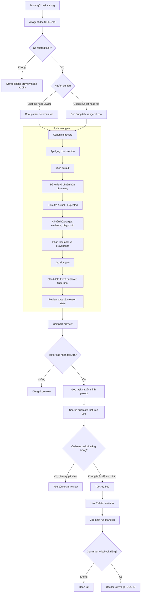
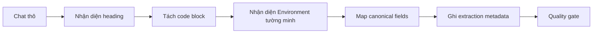
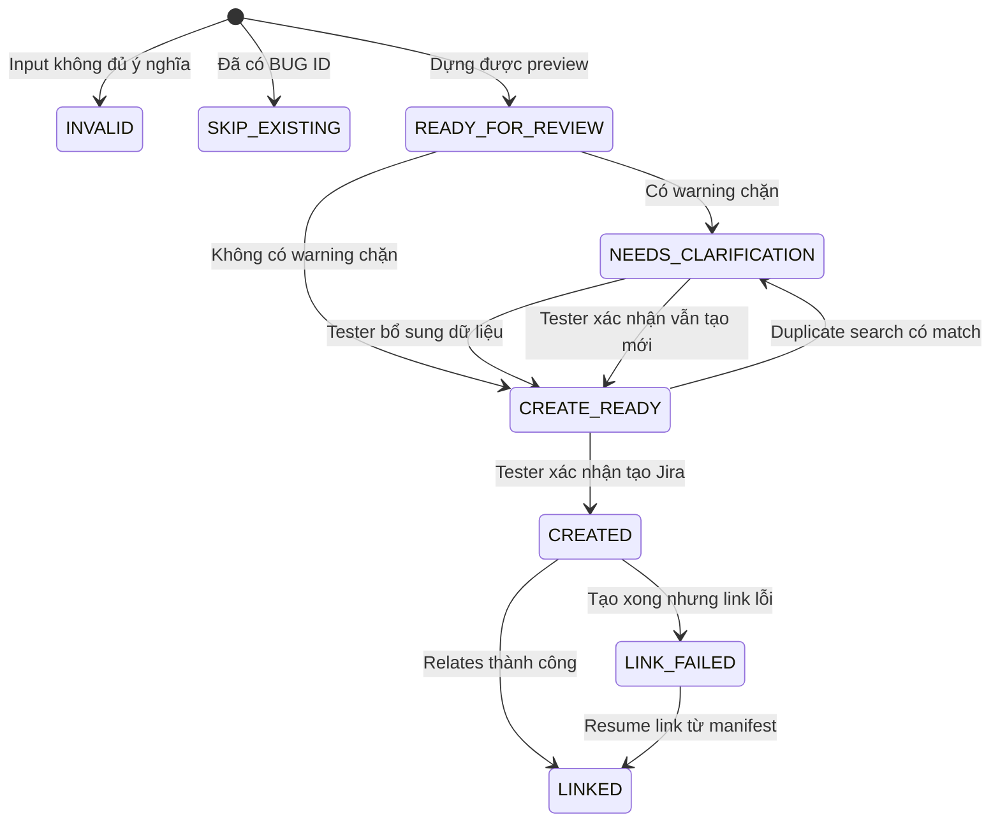
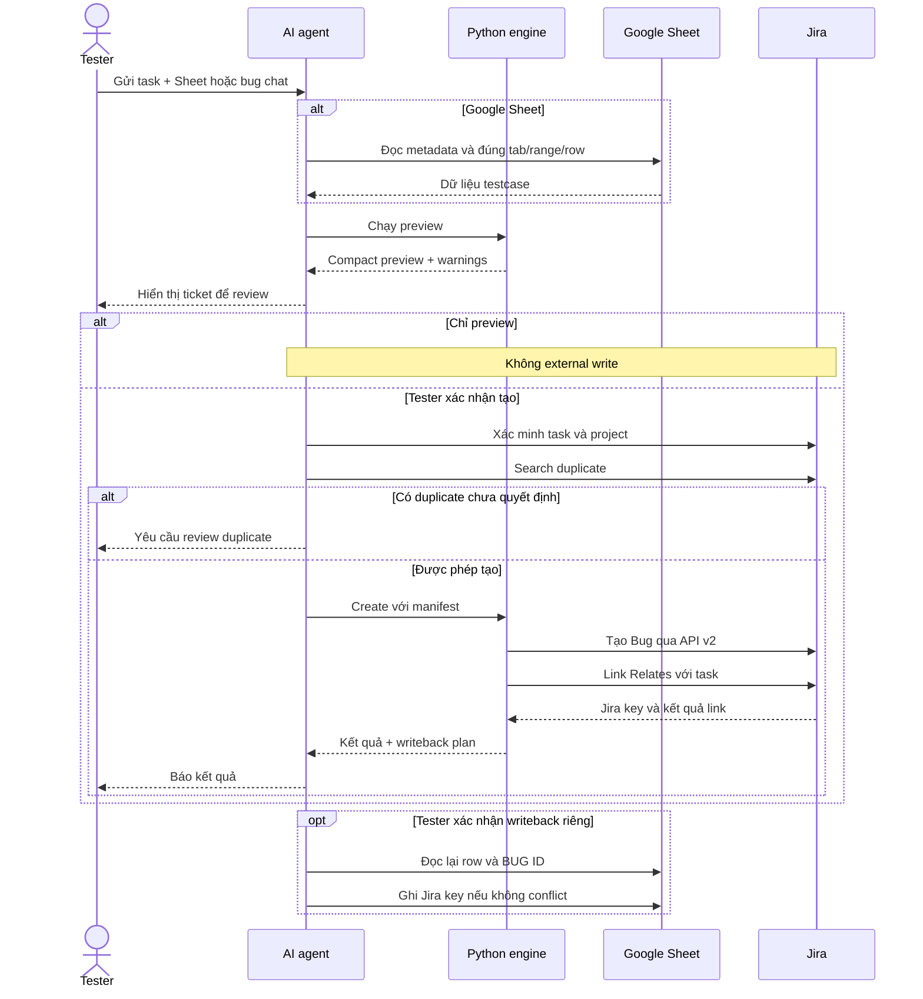

# Tổng quan luồng log bug Jira bằng AI Skill

Tài liệu này giải thích skill `generate-jira-bugs` được xây dựng như thế nào, tester sử dụng ra sao và hệ thống bảo vệ dữ liệu thế nào. Người đọc không cần biết AI hoặc lập trình.

- Phiên bản engine: `2.8.0`
- Jira mục tiêu: Jira Server `9.12.2`, REST API v2, wiki markup
- Nguồn bug: Google Sheet, CSV/TSV/JSON/XLSX hoặc nội dung chat
- Chế độ an toàn mặc định: preview, không tạo Jira
- Trạng thái Phase 2: tạm hoãn; chưa đọc Environment từ prefix Summary

## 1. Hiểu nhanh trong một phút

Skill có ba thành phần chính:

1. **Tester** cung cấp task và thông tin bug, kiểm tra preview rồi quyết định có tạo Jira hay không.
2. **AI agent** nhận yêu cầu, chọn đúng luồng Sheet/chat và gọi chương trình Python.
3. **Python engine** áp dụng các rule cố định để chuẩn hóa dữ liệu, kiểm tra chất lượng và dựng Jira payload.

Nguyên tắc vận hành:

> AI điều phối, Python áp dụng rule, tester quyết định external write.

Nếu tester nói “preview”, “log thử”, “xem thử” hoặc “đừng đẩy Jira”, hệ thống chỉ hiển thị ticket nháp trong chat. Không có Jira issue hoặc thay đổi Google Sheet nào được tạo.

## 2. Skill là gì?

Skill giống một quy trình làm việc được đóng gói sẵn cho AI. Nó cho AI biết:

- Khi nào cần dùng quy trình log bug.
- Dữ liệu nào phải lấy từ Sheet hoặc chat.
- Rule nào do Python xử lý.
- Trường hợp nào phải dừng và yêu cầu tester bổ sung.
- Khi nào được phép đọc Jira, tạo Jira hoặc ghi Google Sheet.

Skill không tự học từ Jira và không tự sửa rule. Muốn đổi default, label hoặc chất lượng đầu vào, team phải sửa config/code và chạy lại test.

## 3. Những cải tiến đã thực hiện

| Giai đoạn | Kết quả |
| --- | --- |
| P0 | Tạo canonical schema; đưa default/priority/label/batch vào config; tách module; thêm test/fixture; hỗ trợ row override; chuẩn hóa Summary; tách `READY_FOR_REVIEW` và `CREATE_READY` |
| P1 MVP | Duplicate search Jira; Sheet locator/writeback plan; branch/domain/evidence; run manifest chống tạo lại sau lỗi một phần |
| Giảm token | Python xử lý default, Summary, label allowlist, Actual–Expected, fingerprint và warning; compact preview giới hạn candidate |
| Phase 1 | Chuyển đúng Jira Server API v2 và Description wiki markup; giữ adapter Cloud dự phòng |
| Phase 2 | **Tạm hoãn**: chưa parse Environment từ prefix Summary |
| Phase 3 | Thêm Diagnostic Data cho log/JSON/query/code; che secret; giới hạn dung lượng |
| Phase 4 | Thêm parser chat deterministic; nhận chat thô hoặc JSON; lưu nguồn/độ tin cậy; chat thiếu field vẫn có draft để review |
| Phase 5 | Thêm provenance cho từng label; giữ allowlist; không suy Root Cause; không default `test-functional` |
| Phase 6 | Thêm fixture hồi quy, kiểm tra Jira v2/wiki/chat/log/redaction/label/related task và đồng bộ ba bản skill |

## 4. Kiến trúc tổng thể


```mermaid
flowchart TD
    U[Tester gửi task và bug] --> A[AI agent đọc SKILL.md]
    A --> T{Có related task?}
    T -->|Không| BLOCK[Dừng: không preview hoặc tạo Jira]
    T -->|Có| R{Nguồn dữ liệu}

    R -->|Chat thô hoặc JSON| CP[Chat parser deterministic]
    R -->|Google Sheet hoặc file| FR[Đọc đúng tab, range và row]

    CP --> C[Canonical record]
    FR --> C

    subgraph PY[Python engine]
        C --> O[Áp dụng row override]
        O --> DF[Điền default]
        DF --> SM[Đề xuất và chuẩn hóa Summary]
        SM --> AE[Kiểm tra Actual - Expected]
        AE --> TG[Chuẩn hóa target, evidence, diagnostic]
        TG --> LB[Phân loại label và provenance]
        LB --> Q[Quality gate]
        Q --> ID[Candidate ID và duplicate fingerprint]
        ID --> ST[Review state và creation state]
    end

    ST --> PV[Compact preview]
    PV --> CF{Tester xác nhận tạo Jira?}
    CF -->|Không| END[Dừng ở preview]
    CF -->|Có| VT[Đọc task và xác minh project]
    VT --> DS[Search duplicate thật trên Jira]
    DS --> DD{Có issue có khả năng trùng?}
    DD -->|Có, chưa quyết định| REVIEW[Yêu cầu tester review]
    DD -->|Không hoặc đã xác nhận| CR[Tạo Jira bug]
    CR --> RL[Link Relates với task]
    RL --> MF[Cập nhật run manifest]
    MF --> WB{Xác nhận writeback riêng?}
    WB -->|Không| DONE[Hoàn tất]
    WB -->|Có| GS[Đọc lại row và ghi BUG ID]
```

Chỉ ba thao tác sau làm thay đổi hệ thống bên ngoài:

- Tạo Jira bug.
- Tạo link `Relates` với task.
- Ghi Jira key vào Google Sheet.

Mỗi thao tác đều có gate riêng.

## 5. Hai luồng nhập bug

### 5.1 Luồng Sheet hoặc file testcase

Tester gửi:

- Jira task key hoặc URL.
- Link Google Sheet hoặc file testcase.
- TC ID, row hoặc điều kiện chọn candidate nếu có.

Thứ tự ưu tiên chọn dòng:

1. Row hoặc TC ID tester chỉ định.
2. Cột `READY TO JIRA`.
3. Status `BUG`, `failed` hoặc `error` khi tester yêu cầu lọc theo status.
4. Nếu không có tín hiệu chọn, chỉ đề xuất candidate; không tạo Jira.

Tester không bắt buộc đổi status Sheet nếu đã chỉ định rõ row/TC cần log. Exploratory hoặc edge case chưa có testcase cũng có thể dùng luồng chat.

### 5.2 Luồng nhập bug trực tiếp bằng chat

Tester có thể nhập dạng có heading:

```text
$generate-jira-bugs

Task: https://jira.younetco.com/browse/YNMPECA-9325

Name: Scale pod báo lỗi khi đang chạy test
Step:
1. Chạy pod loader
2. Vào K8s để scale pod

Actual Result:
Hệ thống báo lỗi "Cant scale this pod"

Expected Result:
Pod được scale thành công.

Environment: Staging

Chỉ preview.
```

Hoặc nhập dạng ngắn, tự do:

```text
Log bug scale pod báo lỗi khi đang chạy test.
Khi scale pod ở staging, hệ thống báo "Cant scale this pod".
```

Python parser sẽ nhận diện heading, câu mô tả, environment tường minh và code block. Parser không gọi model mặc định nên nhanh và ít tốn token.

Nếu chat thiếu Steps hoặc Expected:

- Hệ thống vẫn dựng preview nếu còn Summary/Testname hoặc Actual.
- Draft có `creation_state=NEEDS_CLARIFICATION`.
- Tester thấy rõ trường còn thiếu.
- Skill không tự bịa Steps hoặc Expected.
- Draft không thể tạo Jira cho tới khi được bổ sung, kể cả bật cờ bỏ qua quality warning.

Nếu chat không có cả Summary/Testname lẫn Actual, input là `INVALID` vì không đủ ý nghĩa để dựng bug.

## 6. Parser chat hoạt động ra sao?


```mermaid
flowchart LR
    RAW[Chat thô] --> HD[Nhận diện heading]
    HD --> CB[Tách code block]
    CB --> ENV[Nhận diện Environment tường minh]
    ENV --> MAP[Map canonical fields]
    MAP --> META[Ghi extraction metadata]
    META --> GATE[Quality gate]
```

Mỗi draft chat có `chat_extraction`, ví dụ:

```json
{
  "parser": "deterministic/v1",
  "input_mode": "raw_chat",
  "fields": {
    "actual": {
      "source": "heading",
      "confidence": "high",
      "matched_heading": "Actual Result"
    }
  },
  "missing_fields": [],
  "needs_ai_fallback": false
}
```

Thông tin này giúp biết field được lấy từ đâu. `needs_ai_fallback=true` chỉ là tín hiệu cần hỗ trợ thêm; Python không âm thầm gọi API AI.

## 7. Canonical schema

Tên cột trong mỗi Sheet có thể khác nhau. Engine map chúng về một bộ tên chuẩn:

| Field chuẩn | Ví dụ dữ liệu nguồn |
| --- | --- |
| `bug_summary` | `BUG SUMMARY`, `Bug Title`, `Jira Summary` |
| `title` | `TEST NAME`, `Testname`, `Name`, `Scenario` |
| `steps` | `TEST STEPS`, `Steps to Reproduce`, `Step` |
| `actual` | `ACTUAL RESULT`, `Observed Result`, `Actual` |
| `expected` | `EXPECTED RESULT`, `Expected Outcome`, `Expect` |
| `environment` | `ENVIRONMENT`, `Test Environment`, `Env` |
| `severity` | `PRIORITY`, `Severity`, `Impact` |
| `evidence` | `EVIDENCE`, `Screenshot`, `Attachment` |
| `diagnostic_data` | `Technical Log`, `Code Snippet`, `Stack Trace` |
| `bug_id` | `BUG ID`, `Jira Key`, `Link Jira` |

Sau bước canonicalize, các module còn lại không cần biết format riêng của từng Sheet.

## 8. Related task và project

Mọi yêu cầu đều phải có Jira task key hoặc URL:

```text
YNMPECA-9325
```

Project bug được lấy từ issue key:

```text
YNMPECA-9325 → project YNMPECA
```

Rule bắt buộc:

- Không có task → không preview và không tạo bug.
- Không dùng lại task từ yêu cầu trước nếu tester chưa xác nhận đang tiếp tục.
- Project nhập riêng phải khớp project của task.
- Trước khi tạo thật, hệ thống đọc Jira để xác minh task tồn tại và project đúng.
- Bug được tạo phải link `Relates` với task.

Skill không hỗ trợ `project-only` vì trái quy trình team đã chốt.

## 9. Default và thứ tự ưu tiên

Nếu tester không nhập:

| Field | Default |
| --- | --- |
| Found In Environment | `Testing` |
| Priority | `Major` |
| Jira label | `found-in-qc` |
| Issue type | `Bug` |
| Issue link type | `Relates` |

Nếu tester đã nhập giá trị hợp lệ, dữ liệu tester được ưu tiên.

Environment hiện chỉ lấy từ:

- Field/cột Environment.
- Heading `Environment:` hoặc `Env:` trong chat.
- Câu chat tường minh như “chạy ở staging”.

### Phase 2 đang tạm hoãn

Prefix trong Summary chưa được xem là Environment:

```text
[Staging] API trả lỗi 500
```

Nếu không có field/câu Environment riêng, bug trên vẫn dùng default `Testing`. Prefix `[Staging]` được giữ trong Summary. Engine cũng chưa kiểm tra conflict giữa Environment field và prefix Summary.

## 10. Summary được tạo như thế nào?

### Sheet/file

Thứ tự nguồn:

1. `BUG SUMMARY` nếu mô tả lỗi.
2. `ACTUAL RESULT` nếu Bug Summary trống hoặc chỉ mô tả mục tiêu test.
3. `TEST NAME` làm fallback.

Python có thể:

- Bỏ từ mở đầu chung chung như “Hiện tại”.
- Chuẩn hóa `API`, `AWS`, `Airflow`, `ClickHouse`, `K8s`, `RabbitMQ`, `Redis`, `Solr`, `UI`.
- Đưa triệu chứng lên trước trigger khi thông tin đã có trong nguồn.
- Thêm `[MODULE/FEATURE]` khi Sheet có module.
- Giới hạn Summary tối đa theo policy.

### Chat

Ưu tiên `Summary/Bug Summary`, sau đó `Testname/Name`. Chỉ loại metadata prefix được policy công nhận như Priority hoặc Test Type. Prefix nghiệp vụ không biết phải được giữ nguyên.

Engine không tự thêm root cause, impact, tần suất hoặc dữ liệu không có trong nguồn.

## 11. Priority

Thứ tự ưu tiên:

1. Field `Priority/Severity` hợp lệ.
2. Priority prefix trong Testname, ví dụ `[High]`.
3. Default `Major`.

Nếu field và prefix khác nhau, field thắng và preview có warning. Priority không map được sẽ chặn tạo thay vì tự sửa theo phỏng đoán.

## 12. Actual–Expected check

Python so sánh Actual và Expected bằng rule xác định:

```json
{
  "state": "difference_detected",
  "reason": "negation_differs",
  "similarity": 0.286,
  "containment": 0.5
}
```

Các trạng thái chính:

- `conflict`: Actual và Expected giống nhau → chặn tạo.
- `review`: hai nội dung quá giống nhau → nhắc tester kiểm tra.
- `difference_detected`: nhận thấy khác biệt rõ trong câu chữ.
- `not_checked`: thiếu một trong hai field.

Đây không phải bộ máy hiểu toàn bộ business logic. Trường hợp không chắc chắn vẫn cần tester review.

## 13. Label và provenance

Engine chỉ dùng label thuộc allowlist của team:

- Detection source: `found-in-qc`.
- System: `sys-*`.
- Test Type: `test-*`.
- Flow: `flow-*`.
- Lifecycle: `lc-*`.
- Root Cause: `rc-*` đã được xác nhận.

Label ngoài allowlist bị loại khỏi payload và tạo warning chặn. Engine không tự bịa label.

Mỗi label trong preview có provenance:

| Source | Ý nghĩa |
| --- | --- |
| `explicit_argument` | Tester truyền trực tiếp trong lệnh |
| `source_field` | Lấy từ field label/Test Type/Root Cause |
| `prefix` | Test Type lấy từ metadata prefix hợp lệ |
| `keyword` | System/Flow được match từ keyword trong field nguồn |
| `derived` | Lifecycle lấy từ trạng thái như reopen |
| `default` | `found-in-qc` lấy từ config mặc định |

Ví dụ:

```json
{
  "label": "sys-infra",
  "category": "system",
  "source": "keyword",
  "source_field": "steps",
  "matched_marker": "k8s"
}
```

Thứ tự ưu tiên provenance:

```text
explicit_argument > source_field > prefix > keyword > derived > default
```

Các nguyên tắc quan trọng:

- Không tự suy Root Cause từ triệu chứng.
- Không dùng `rc-logic` làm default.
- Không tự thêm `test-functional` khi chưa biết hoạt động test.
- System và Flow chỉ được suy khi có keyword thuộc policy.
- Root Cause trống tạo warning không chặn và cần cập nhật trước khi đóng bug.

## 14. Evidence và Diagnostic Data

Hai loại dữ liệu này được tách riêng:

| Loại | Nội dung |
| --- | --- |
| Evidence | URL ảnh, video, Drive hoặc attachment |
| Diagnostic Data | Log, JSON, query, command, request/response, stack trace hoặc code |

Ví dụ chat:

````text
Diagnostic Data:
```json
{"status": 500, "message": "Internal error"}
```

Evidence: https://drive.google.com/file/d/...
````

Diagnostic Data được bảo vệ bằng Python:

- Che token, API key, password, cookie, Authorization, session và private key.
- Giới hạn tối đa số item.
- Giới hạn kích thước mỗi item và tổng dữ liệu.
- Compact preview chỉ hiển thị excerpt để giảm token.
- Jira Server render code bằng wiki macro `{code}`.

Không đưa raw secret đã bị che trở lại Summary, Actual, Evidence hoặc Notes.

## 15. Quality gate và trạng thái

Engine dùng hai field trạng thái riêng:

- `review_state`: có dựng được preview hay không.
- `creation_state`: có đủ điều kiện để tạo Jira hay không.


```mermaid
stateDiagram-v2
    [*] --> INVALID: Input không đủ ý nghĩa
    [*] --> SKIP_EXISTING: Đã có BUG ID
    [*] --> READY_FOR_REVIEW: Dựng được preview

    READY_FOR_REVIEW --> NEEDS_CLARIFICATION: Có warning chặn
    READY_FOR_REVIEW --> CREATE_READY: Không có warning chặn

    NEEDS_CLARIFICATION --> CREATE_READY: Tester bổ sung dữ liệu
    CREATE_READY --> NEEDS_CLARIFICATION: Duplicate search có match
    NEEDS_CLARIFICATION --> CREATE_READY: Tester xác nhận vẫn tạo mới

    CREATE_READY --> CREATED: Tester xác nhận tạo Jira
    CREATED --> LINKED: Relates thành công
    CREATED --> LINK_FAILED: Tạo xong nhưng link lỗi
    LINK_FAILED --> LINKED: Resume link từ manifest
```

Phân biệt:

- `READY_FOR_REVIEW` không có nghĩa được phép tạo Jira.
- `CREATE_READY` chỉ có nghĩa không còn warning chặn.
- External write vẫn cần tester xác nhận rõ số lượng, project và task.

### Warning chặn thường gặp

- Chat thiếu Steps, Actual hoặc Expected.
- Actual chỉ ghi “lỗi”, “bị lỗi”, “không đúng” hoặc quá ngắn.
- Actual chứa “cần confirm”, “chưa check”, “đợi dev fix”.
- Actual và Expected giống nhau.
- Environment hoặc Priority có giá trị nhưng không map được.
- Label ngoài allowlist.
- Evidence URL chứa token/session/password.
- Jira duplicate search tìm thấy issue có khả năng trùng.

### Warning không chặn thường gặp

- Dùng Environment mặc định.
- Dùng Priority mặc định.
- Dùng `found-in-qc` mặc định.
- Root Cause chưa được xác nhận.
- Thiếu Test Type.
- Sheet/file không có Evidence.

## 16. Duplicate detection

Engine có hai lớp chống trùng.

### Trong cùng input

Python tạo fingerprint từ Module, Summary và Actual để phát hiện các candidate giống nhau trong cùng batch.

### Trên Jira thật

Trước khi tạo, engine gọi Jira Server API v2 để search issue theo project, Summary, module và Test Case ID nếu có. Kết quả được chấm điểm:

- `unlikely`: ít khả năng trùng.
- `possible`: cần tester review.
- `strong`: khả năng trùng cao.

Engine không tự đóng, gộp hoặc kết luận duplicate. Tester phải xác nhận rõ nếu vẫn muốn tạo issue mới.

## 17. Jira Server integration

Runtime hiện tại dùng:

```text
Jira deployment: Server
Version: 9.12.2
REST API: /rest/api/2
Description: wiki markup
```

Các endpoint chính:

- Đọc/tạo issue: `/rest/api/2/issue/...`
- Search duplicate: `/rest/api/2/search`
- Tạo issue link: `/rest/api/2/issueLink`

Adapter Jira Cloud API v3/ADF vẫn tồn tại để mở rộng sau này, nhưng không phải profile mặc định của team.

## 18. Run manifest chống tạo bug lần hai

Tình huống lỗi một phần:

1. Jira bug đã được tạo.
2. Mạng lỗi trước khi link task hoặc trả kết quả.
3. Nếu chạy lại toàn bộ, có nguy cơ tạo thêm bug thứ hai.

Run manifest lưu:

- Candidate ID và payload hash.
- Trạng thái create.
- Jira key đã tạo.
- Trạng thái link task.
- Lỗi xảy ra ở bước nào.

Khi chạy lại, engine tiếp tục bước còn thiếu. Nếu bug đã tạo nhưng link lỗi, engine chỉ retry link và không gọi create lần nữa.

## 19. Google Sheet writeback

Tạo Jira và ghi Sheet là hai quyền riêng.

Writeback chỉ xảy ra khi tester xác nhận riêng. Trước khi ghi, hệ thống:

1. Đọc lại row và ô `BUG ID`.
2. So sánh row fingerprint với thời điểm preview.
3. Dừng nếu dữ liệu thay đổi hoặc BUG ID đã có giá trị.
4. Chỉ ghi Jira key/URL của issue đã tạo và link thành công.

Skill không tự đổi `STATUS` hoặc `BUG STATUS`.

## 20. Preview và template Jira

Preview mặc định là compact, tối đa 5 candidate. Nó vẫn hiển thị:

- Related task, project và link type.
- Summary, nguồn Summary và transformation.
- Steps, Actual result và Expected result.
- Priority và nguồn Priority.
- Found In Environment.
- Labels và provenance.
- Evidence và Diagnostic excerpt.
- Chat extraction metadata.
- Actual–Expected check.
- Review/creation state và warning.
- Duplicate result nếu đã search.

Description Jira dùng heading tiếng Anh nhưng giữ nguyên nội dung tester nhập:

```text
h3. Steps to reproduce

1. Chạy pod loader
2. Vào K8s để scale pod

h3. Actual result

Hệ thống báo lỗi "Cant scale this pod"

h3. Expected result

Pod được scale thành công.
```

Đây là wiki markup phù hợp Jira Server, không phải ADF.

## 21. Trình tự preview và tạo thật


```mermaid
sequenceDiagram
    actor Tester
    participant Agent as AI agent
    participant Python as Python engine
    participant Sheet as Google Sheet
    participant Jira

    Tester->>Agent: Gửi task + Sheet hoặc bug chat
    alt Google Sheet
        Agent->>Sheet: Đọc metadata và đúng tab/range/row
        Sheet-->>Agent: Dữ liệu testcase
    end

    Agent->>Python: Chạy preview
    Python-->>Agent: Compact preview + warnings
    Agent-->>Tester: Hiển thị ticket để review

    alt Chỉ preview
        Note over Agent,Jira: Không external write
    else Tester xác nhận tạo
        Agent->>Jira: Xác minh task và project
        Agent->>Jira: Search duplicate
        alt Có duplicate chưa quyết định
            Agent-->>Tester: Yêu cầu review duplicate
        else Được phép tạo
            Agent->>Python: Create với manifest
            Python->>Jira: Tạo Bug qua API v2
            Python->>Jira: Link Relates với task
            Jira-->>Python: Jira key và kết quả link
            Python-->>Agent: Kết quả + writeback plan
            Agent-->>Tester: Báo kết quả
        end
    end

    opt Tester xác nhận writeback riêng
        Agent->>Sheet: Đọc lại row và BUG ID
        Agent->>Sheet: Ghi Jira key nếu không conflict
    end
```

## 22. Vì sao kiến trúc này giảm token?

- `SKILL.md` chỉ là router ngắn.
- Rule chi tiết chỉ được đọc khi tình huống yêu cầu.
- Parser chat chạy Python trước, không gọi AI mặc định.
- Default, Summary, label, Actual–Expected, fingerprint và warning do Python xử lý.
- Compact preview không chứa full config/taxonomy/payload.
- Diagnostic log dài chỉ hiển thị excerpt.
- Preview mặc định giới hạn 5 candidate.
- Fixture test không được đưa vào runtime prompt.
- Sheet chỉ đọc tab/range/row cần thiết.

Điều này vừa giảm token vừa làm kết quả ổn định hơn vì cùng input sẽ đi qua cùng rule.

## 23. Cấu trúc thư mục hiện tại

```text
generate-jira-bugs/
├── SKILL.md
├── agents/
│   └── openai.yaml
├── config/
│   ├── bug-candidate.schema.json
│   └── policies.json
├── rules/
│   ├── architecture.md
│   ├── bug-label-rules.md
│   ├── bug-template.md
│   ├── input-format.md
│   ├── jira-integration.md
│   ├── quality-rules.md
│   └── test-strategy.md
├── scripts/
│   ├── jira_bug_generator.py
│   └── jira_bug_skill/
│       ├── chat_parser.py
│       ├── config.py
│       ├── description_renderer.py
│       ├── diagnostics.py
│       ├── jira_adapter.py
│       ├── policy.py
│       ├── presentation.py
│       ├── workflow.py
│       └── ...
└── tests/
    ├── fixtures/
    ├── test_chat_parser_and_label_provenance.py
    ├── test_diagnostics.py
    ├── test_phase6_regression.py
    └── ...
```

Vai trò từng khu vực:

- `SKILL.md`: hướng dẫn AI chọn luồng và giữ gate an toàn.
- `config/`: nguồn máy cho schema, default, mapping và allowlist.
- `rules/`: tài liệu nghiệp vụ chi tiết cho người/agent.
- `scripts/`: engine Python deterministic.
- `tests/`: test phát triển, không phải testcase sản phẩm và không chạy mỗi lần log bug.

## 24. Kiểm thử tự động

Phiên bản `2.8.0` có `75` unit test, bao phủ:

- Default Environment, Priority và label.
- Canonical schema và row override.
- Summary normalization và metadata prefix.
- Actual–Expected check.
- Label allowlist và provenance.
- Root Cause không bị tự suy luận.
- Chat thô, JSON stdin và chat thiếu Expected.
- Code/log/query và secret redaction.
- Jira Server API v2 và wiki renderer.
- Duplicate fingerprint và Jira duplicate gate.
- Evidence, branch, domain và target.
- Run manifest và partial-failure resume.
- Google Sheet writeback conflict.
- Related task bắt buộc.

Test dùng fixture/mock, không tạo Jira thật và không sửa Google Sheet.

Hai test thuộc Phase 2 chưa được triển khai:

- Parse Environment từ Summary prefix.
- Conflict giữa Environment field và Summary prefix.

## 25. Ba bản skill được đồng bộ

| Bản | Mục đích | Đường dẫn |
| --- | --- | --- |
| Cursor | Source chính trong repository | `/Users/tranthanhlam/product-ai-docs/.cursor/skills/ynm-qc/ynm-qc-jira-bugs` |
| Codex | Bản dùng trực tiếp bằng `$generate-jira-bugs` | `/Users/tranthanhlam/.codex/skills/generate-jira-bugs` |
| Document | Bản để team xem/review | `/Users/tranthanhlam/YNM-testing/Document/generate-jira-bugs-review-vi` |

Khi thay đổi skill:

1. Sửa bản Cursor.
2. Chạy toàn bộ unit test.
3. Chạy skill validator.
4. Đồng bộ sang Codex và Document.
5. Kiểm tra lại ba bản.

Tên frontmatter của bản Codex vẫn là `generate-jira-bugs`; các nội dung runtime còn lại phải khớp bản nguồn.

## 26. Giới hạn hiện tại

- Phase 2 chưa được bật; Environment prefix không được parse.
- Python không hiểu sâu toàn bộ business logic.
- Chat parser không tự tạo Steps/Expected từ phỏng đoán.
- Root Cause phải do người có thông tin xác nhận.
- Duplicate search chỉ đưa candidate; không tự kết luận hoặc gộp issue.
- Drive URL được giữ làm Evidence nhưng skill chưa tự upload file.
- Nhiều Environment không tự nhân nhiều bug.
- Nhiều Branch/Domain được ghi vào Affected targets nhưng không tự tạo mọi tổ hợp.
- Google Sheet connector thực hiện đọc/ghi; Python chỉ tạo locator/writeback plan.

## 27. Trách nhiệm của từng bên

| Bên | Trách nhiệm |
| --- | --- |
| Tester | Cung cấp task và thông tin bug; review Summary, Actual, Expected, label; xác nhận create/writeback |
| AI agent | Chọn đúng luồng, đọc nguồn tối thiểu, gọi Python và tuân thủ gate |
| Python engine | Áp dụng schema, default, policy, validation, provenance, fingerprint và payload |
| Jira | Lưu issue và quan hệ `Relates` |
| Google Sheet | Lưu testcase và Jira key sau xác nhận writeback |

## 28. Checklist trước khi tạo Jira

- [ ] Yêu cầu hiện tại có related task.
- [ ] Project bug khớp project của task.
- [ ] Summary mô tả hành vi lỗi.
- [ ] Steps đủ để tái hiện.
- [ ] Actual mô tả hành vi đã quan sát.
- [ ] Expected mô tả hành vi mong đợi.
- [ ] Environment và Priority đúng hoặc chấp nhận default.
- [ ] Label chỉ thuộc allowlist và provenance hợp lý.
- [ ] Root Cause không bị suy đoán.
- [ ] Evidence/Diagnostic không chứa secret.
- [ ] Không còn warning chặn.
- [ ] Đã search duplicate Jira.
- [ ] Tester xác nhận số lượng + project + task.
- [ ] Có run manifest trước khi create.
- [ ] Writeback Sheet, nếu có, được xác nhận riêng.

## 29. Ví dụ sử dụng nhanh

### Preview từ Sheet

```text
$generate-jira-bugs

Task: https://jira.younetco.com/browse/YNMPECA-9325
Sheet: <Google Sheet URL>
TC: TC_CONFIG_001

Chỉ preview.
```

### Preview từ chat

```text
$generate-jira-bugs

Task: https://jira.younetco.com/browse/YNMPECA-9325

Testname: Scale pod báo lỗi khi đang chạy test
Step:
1. Chạy pod loader
2. Vào K8s để scale pod
Actual Result: Hệ thống báo "Cant scale this pod"
Expected Result: Pod được scale thành công

Chỉ preview.
```

### Xác nhận tạo Jira

```text
Tạo 1 bug thuộc project YNMPECA và relate task YNMPECA-9325.
```

Không nên chỉ nói “OK” vì không xác định rõ số lượng và phạm vi external write.

## 30. Tài liệu liên quan

- [Skill dùng để review](generate-jira-bugs-review-vi/SKILL.md)
- [Kiến trúc engine](generate-jira-bugs-review-vi/rules/architecture.md)
- [Input format](generate-jira-bugs-review-vi/rules/input-format.md)
- [Jira integration](generate-jira-bugs-review-vi/rules/jira-integration.md)
- [Quality rules](generate-jira-bugs-review-vi/rules/quality-rules.md)
- [Bug template](generate-jira-bugs-review-vi/rules/bug-template.md)
- [Label rules](generate-jira-bugs-review-vi/rules/bug-label-rules.md)
- [Test strategy](generate-jira-bugs-review-vi/rules/test-strategy.md)
